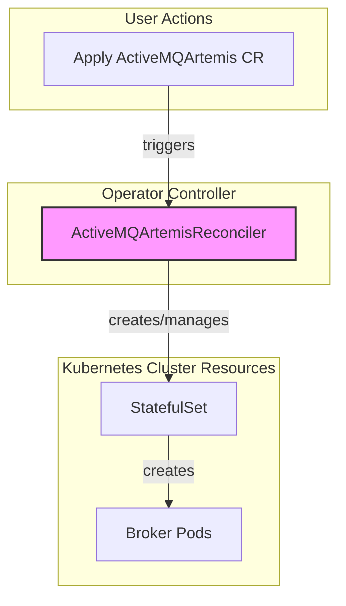
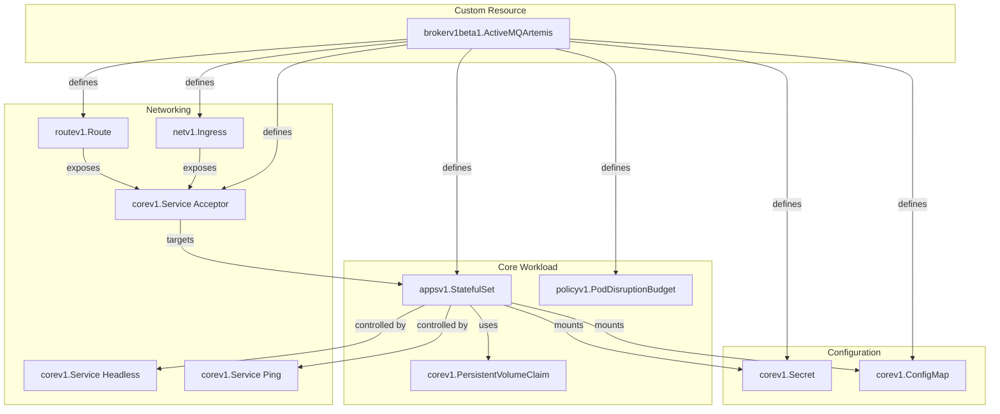
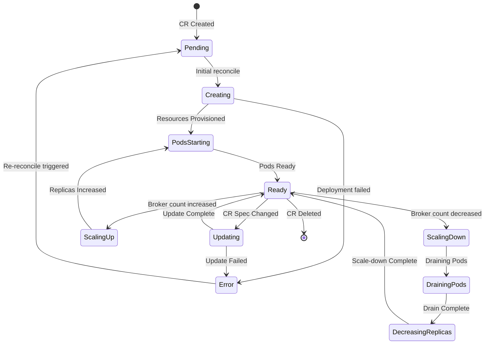

---
ai_metadata:
  doc_type: "architecture_reference"
  primary_audience: ["developers", "ai_assistants"]
  key_topics: ["reconciliation", "statefulset", "validation", "ha", "networking", "storage"]
  answers_questions:
    - "How does the operator work?"
    - "What is the reconciliation loop?"
    - "How are StatefulSets managed?"
    - "How does validation work?"
  concepts_defined: 120
  code_links: 481
  sections: 22
  complexity: "comprehensive"
  related_docs: ["operator_conventions.md", "contribution_guide.md"]
---

> **Code Reference Notice**
> 
> This document contains precise source code references accurate as of **October 9, 2025** (commit [`4acadb95`](https://github.com/arkmq-org/activemq-artemis-operator/commit/4acadb95603c38b82d5d7f63fb538c37ed855662)).
> 
> All code links use GitHub permalinks to ensure accuracy. As the codebase evolves:
> - Links will always point to the code as it existed at this commit
> - To see current implementation, replace `/blob/4acadb95...` with `/blob/main` in any link
> - Function/symbol names in link text help locate code in current versions
> - For architectural changes, update both code and documentation together

This document provides a comprehensive technical overview of the ActiveMQ Artemis Operator's architecture and implementation details, intended for developers who need to understand how the operator works internally.

**Table of Contents**

1.  [High-Level Architecture](#1-high-level-architecture)
    *   [Reconciler Interaction](#reconciler-interaction)
2.  [Reconciler Logic and Flow](#2-reconciler-logic-and-flow)
    *   [Main Reconciliation Flow](#main-reconciliation-flow)
    *   [Managed Resources](#managed-resources)
    *   [Acceptor and Connector Configuration](#acceptor-and-connector-configuration)
3.  [Reconciler State Machine](#3-reconciler-state-machine)
4.  [Deprecated Custom Resources](#4-deprecated-custom-resources)
5.  [Configuring Broker Properties](#5-configuring-broker-properties)
    *   [How it Works](#how-it-works)
    *   [Unit Tests Related to Broker Properties](#unit-tests-related-to-broker-properties)
6.  [Restricted (Locked-Down) Mode](#6-restricted-locked-down-mode)
    *   [Overview](#overview)
    *   [Implementation Details](#implementation-details)
    *   [Configuration Example](#configuration-example)
7.  [StatefulSet Management and Resource Reconciliation](#7-statefulset-management-and-resource-reconciliation)
    *   [StatefulSet Creation and Updates](#statefulset-creation-and-updates)
    *   [Resource Templates and Strategic Merge Patches](#resource-templates-and-strategic-merge-patches)
    *   [Message Migration on Scale-Down](#message-migration-on-scale-down)
8.  [Metrics Implementation](#8-metrics-implementation)
    *   [Metrics Plugin Selection Logic](#metrics-plugin-selection-logic)
    *   [Legacy Mode Implementation (Artemis Metrics Plugin)](#legacy-mode-implementation-artemis-metrics-plugin)
    *   [Restricted Mode Implementation (JMX Exporter)](#restricted-mode-implementation-jmx-exporter)
    *   [Service Discovery and Port Naming](#service-discovery-and-port-naming)
9.  [Version Management and Upgrade System](#9-version-management-and-upgrade-system)
    *   [Version Resolution Algorithm](#version-resolution-algorithm)
    *   [Image Selection Precedence](#image-selection-precedence)
    *   [Upgrade Policy Management](#upgrade-policy-management)
    *   [Version Validation Workflow](#version-validation-workflow)
10. [Validation Architecture](#10-validation-architecture)
    *   [Validation Chain Pattern](#validation-chain-pattern)
    *   [Individual Validation Functions](#individual-validation-functions)
    *   [Validation Error Handling](#validation-error-handling)
11. [Multi-Namespace Deployment](#11-multi-namespace-deployment)
    *   [Namespace Watching Modes](#namespace-watching-modes)
    *   [WATCH_NAMESPACE Configuration](#watch_namespace-configuration)
    *   [Manager Configuration](#manager-configuration)
12. [High Availability and Resilience](#12-high-availability-and-resilience)
    *   [PodDisruptionBudget Configuration](#poddisruptionbudget-configuration)
    *   [Affinity and Anti-Affinity](#affinity-and-anti-affinity)
    *   [Tolerations and Node Selection](#tolerations-and-node-selection)
    *   [TopologySpreadConstraints](#topologyspreadconstraints)
13. [Probe Configuration](#13-probe-configuration)
    *   [Default Probe Configurations](#default-probe-configurations)
    *   [Probe Override Mechanism](#probe-override-mechanism)
    *   [Probe Types and Use Cases](#probe-types-and-use-cases)
14. [Logging Configuration](#14-logging-configuration)
    *   [Custom Logging Properties](#custom-logging-properties)
    *   [Protected Environment Variables](#protected-environment-variables)
    *   [Logging Validation](#logging-validation)
15. [Certificate Management](#15-certificate-management)
    *   [cert-manager Integration](#cert-manager-integration)
    *   [Certificate Lifecycle](#certificate-lifecycle)
    *   [TLS Configuration Patterns](#tls-configuration-patterns)
16. [Operational Controls](#16-operational-controls)
    *   [Block Reconcile Annotation](#block-reconcile-annotation)
    *   [Resource Tracking and Adoption](#resource-tracking-and-adoption)
    *   [Recovery Patterns](#recovery-patterns)
17. [Console and Web UI Architecture](#17-console-and-web-ui-architecture)
    *   [Console Exposure Mechanisms](#console-exposure-mechanisms)
    *   [Jolokia Integration and Metrics Ports](#jolokia-integration-and-metrics-ports)
    *   [Console SSL Configuration](#console-ssl-configuration)
18. [Networking and Exposure Architecture](#18-networking-and-exposure-architecture)
    *   [Acceptor Architecture](#acceptor-architecture)
    *   [Connector Architecture](#connector-architecture)
    *   [Expose Mode Selection](#expose-mode-selection)
19. [Credential and Secret Management](#19-credential-and-secret-management)
    *   [User Credential Generation](#user-credential-generation)
    *   [Console Secret Lifecycle](#console-secret-lifecycle)
    *   [Secret Persistence and Stability](#secret-persistence-and-stability)
20. [Resource Metadata Management](#20-resource-metadata-management)
    *   [Custom Annotations Propagation](#custom-annotations-propagation)
    *   [Custom Labels Management](#custom-labels-management)
    *   [Operator-Managed Labels](#operator-managed-labels)
21. [Storage and Persistence Architecture](#21-storage-and-persistence-architecture)
    *   [PVC Creation and Management](#pvc-creation-and-management)
    *   [PVC Retention and Persistence](#pvc-retention-and-persistence)
    *   [PVC Adoption for Upgrades](#pvc-adoption-for-upgrades)
    *   [Dynamic Persistence Toggle](#dynamic-persistence-toggle)
22. [Error Handling and Status Management](#22-error-handling-and-status-management)
    *   [Error Detection and Reporting](#error-detection-and-reporting)
    *   [Status Condition Management](#status-condition-management)
    *   [Pod Status Tracking](#pod-status-tracking)

## 1. High-Level Architecture

The operator is composed of a core controller that works to manage ActiveMQ Artemis clusters. The [`ActiveMQArtemisReconciler`](https://github.com/arkmq-org/activemq-artemis-operator/blob/4acadb95603c38b82d5d7f63fb538c37ed855662/controllers/activemqartemis_controller.go#L110) is the core component, responsible for the main broker deployment.

The operator's entry point is [`main.go`](https://github.com/arkmq-org/activemq-artemis-operator/blob/4acadb95603c38b82d5d7f63fb538c37ed855662/main.go), which sets up the controller manager and registers all reconcilers.

### Reconciler Interaction

The diagram below shows the primary relationship between user actions and the controller.



## 2. Reconciler Logic and Flow

The controller has a reconciliation loop that is triggered by changes to the `ActiveMQArtemis` Custom Resource. The following diagrams illustrate the internal logic of the loop.

### Main Reconciliation Flow

The [`Process` function](https://github.com/arkmq-org/activemq-artemis-operator/blob/4acadb95603c38b82d5d7f63fb538c37ed855662/controllers/activemqartemis_reconciler.go#L151) is the main entry point for the reconciliation loop. It orchestrates a series of steps to converge the actual state of the cluster with the desired state defined in the CR. The high-level flow is as follows:

**🧪 Tested in**: [`activemqartemis_controller_test.go`](https://github.com/arkmq-org/activemq-artemis-operator/blob/4acadb95603c38b82d5d7f63fb538c37ed855662/controllers/activemqartemis_controller_test.go) - 200+ scenarios testing the complete reconciliation lifecycle

*   **Observe**: The reconciler first observes the current state of the cluster by retrieving all deployed resources it manages (e.g., `StatefulSet`, `Services`, `Secrets`).
*   **Process CR**: It then processes the `ActiveMQArtemis` CR to determine the desired state, including:
    *   The `StatefulSet` definition ([`ProcessStatefulSet`](https://github.com/arkmq-org/activemq-artemis-operator/blob/4acadb95603c38b82d5d7f63fb538c37ed855662/controllers/activemqartemis_reconciler.go#L162)).
    *   The deployment plan (image, size, etc.) ([`ProcessDeploymentPlan`](https://github.com/arkmq-org/activemq-artemis-operator/blob/4acadb95603c38b82d5d7f63fb538c37ed855662/controllers/activemqartemis_reconciler.go#L168)).
    *   Credentials ([`ProcessCredentials`](https://github.com/arkmq-org/activemq-artemis-operator/blob/4acadb95603c38b82d5d7f63fb538c37ed855662/controllers/activemqartemis_reconciler.go#L170)).
    *   Network acceptors and connectors ([`ProcessAcceptorsAndConnectors`](https://github.com/arkmq-org/activemq-artemis-operator/blob/4acadb95603c38b82d5d7f63fb538c37ed855662/controllers/activemqartemis_reconciler.go#L172)).
    *   The web console configuration ([`ProcessConsole`](https://github.com/arkmq-org/activemq-artemis-operator/blob/4acadb95603c38b82d5d7f63fb538c37ed855662/controllers/activemqartemis_reconciler.go#L179)).
*   **Track Changes**: The desired state is tracked via [`trackDesired()`](https://github.com/arkmq-org/activemq-artemis-operator/blob/4acadb95603c38b82d5d7f63fb538c37ed855662/controllers/activemqartemis_reconciler.go#L190) and secret checksums are computed in [`trackSecretCheckSumInEnvVar()`](https://github.com/arkmq-org/activemq-artemis-operator/blob/4acadb95603c38b82d5d7f63fb538c37ed855662/controllers/activemqartemis_reconciler.go#L188) to trigger rolling updates when changes are detected.
*   **Apply**: Finally, the reconciler applies the changes to the cluster by creating, updating, or deleting resources to match the desired state ([`ProcessResources`](https://github.com/arkmq-org/activemq-artemis-operator/blob/4acadb95603c38b82d5d7f63fb538c37ed855662/controllers/activemqartemis_reconciler.go#L193)).

### Managed Resources

The reconciler creates and manages a variety of Kubernetes resources to build the cluster. Resource creation is handled by dedicated builders in [`../../pkg/resources/`](https://github.com/arkmq-org/activemq-artemis-operator/blob/4acadb95603c38b82d5d7f63fb538c37ed855662/pkg/resources/) and orchestrated by [`ProcessResources()`](https://github.com/arkmq-org/activemq-artemis-operator/blob/4acadb95603c38b82d5d7f63fb538c37ed855662/controllers/activemqartemis_reconciler.go#L1444).

**🧪 Tested in**: [`activemqartemis_controller_test.go`](https://github.com/arkmq-org/activemq-artemis-operator/blob/4acadb95603c38b82d5d7f63fb538c37ed855662/controllers/activemqartemis_controller_test.go) - Comprehensive resource creation and lifecycle testing



**Resource Creation Implementations**:
- **StatefulSet**: [`../../pkg/resources/statefulsets/statefulset.go`](https://github.com/arkmq-org/activemq-artemis-operator/blob/4acadb95603c38b82d5d7f63fb538c37ed855662/pkg/resources/statefulsets/statefulset.go#L44) → `MakeStatefulSet()`
- **Services**: [`../../pkg/resources/services/service.go`](https://github.com/arkmq-org/activemq-artemis-operator/blob/4acadb95603c38b82d5d7f63fb538c37ed855662/pkg/resources/services/service.go#L11) → `NewHeadlessServiceForCR2()`, `NewServiceDefinitionForCR()` 
- **Routes**: [`../../pkg/resources/routes/route.go`](https://github.com/arkmq-org/activemq-artemis-operator/blob/4acadb95603c38b82d5d7f63fb538c37ed855662/pkg/resources/routes/route.go#L10) → `NewRouteDefinitionForCR()`
- **Ingress**: [`../../pkg/resources/ingresses/ingress.go`](https://github.com/arkmq-org/activemq-artemis-operator/blob/4acadb95603c38b82d5d7f63fb538c37ed855662/pkg/resources/ingresses/ingress.go#L10) → `NewIngressForCRWithSSL()`
- **Secrets**: [`../../pkg/resources/secrets/secret.go`](https://github.com/arkmq-org/activemq-artemis-operator/blob/4acadb95603c38b82d5d7f63fb538c37ed855662/pkg/resources/secrets/secret.go) → `MakeSecret()`, `NewSecret()`
- **ConfigMaps**: [`../../pkg/resources/configmaps/`](https://github.com/arkmq-org/activemq-artemis-operator/blob/4acadb95603c38b82d5d7f63fb538c37ed855662/pkg/resources/configmaps/) → ConfigMap builders
- **Pods**: [`../../pkg/resources/pods/pod.go`](https://github.com/arkmq-org/activemq-artemis-operator/blob/4acadb95603c38b82d5d7f63fb538c37ed855662/pkg/resources/pods/pod.go#L13) → `MakePodTemplateSpec()`

### Acceptor and Connector Configuration

This process translates CR configurations into Kubernetes networking resources. The reconciler generates acceptor and connector configuration strings via [`generateAcceptorsString()`](https://github.com/arkmq-org/activemq-artemis-operator/blob/4acadb95603c38b82d5d7f63fb538c37ed855662/controllers/activemqartemis_reconciler.go#L744) and [`generateConnectorsString()`](https://github.com/arkmq-org/activemq-artemis-operator/blob/4acadb95603c38b82d5d7f63fb538c37ed855662/controllers/activemqartemis_reconciler.go#L853), creates corresponding Kubernetes Services, and optionally exposes them via Routes or Ingresses based on the CR specification.

**🧪 Tested in**: [`activemqartemis_controller_test.go`](https://github.com/arkmq-org/activemq-artemis-operator/blob/4acadb95603c38b82d5d7f63fb538c37ed855662/controllers/activemqartemis_controller_test.go) - TLS secret reuse, networking, acceptor/connector configuration scenarios

## 3. Reconciler State Machine

The controller functions as a state machine driven by cluster events. The following diagram illustrates the states and transitions for the [`ActiveMQArtemisReconciler`](https://github.com/arkmq-org/activemq-artemis-operator/blob/4acadb95603c38b82d5d7f63fb538c37ed855662/controllers/activemqartemis_controller.go#L110). State transitions are managed through status conditions in [`ProcessStatus()`](https://github.com/arkmq-org/activemq-artemis-operator/blob/4acadb95603c38b82d5d7f63fb538c37ed855662/controllers/activemqartemis_controller.go#L191).

**🧪 Tested in**: [`activemqartemis_controller_test.go`](https://github.com/arkmq-org/activemq-artemis-operator/blob/4acadb95603c38b82d5d7f63fb538c37ed855662/controllers/activemqartemis_controller_test.go) - State machine transitions and error handling scenarios



## 4. Deprecated Custom Resources

The operator is moving towards a model where all broker configuration is done via `brokerProperties` on the main `ActiveMQArtemis` CR. As a result, the following custom resources are considered deprecated and should not be used for new deployments:

**🧪 Tested in**: 
- [`activemqartemisaddress_controller_test.go`](https://github.com/arkmq-org/activemq-artemis-operator/blob/4acadb95603c38b82d5d7f63fb538c37ed855662/controllers/activemqartemisaddress_controller_test.go) - Legacy address controller testing
- [`activemqartemissecurity_controller_test.go`](https://github.com/arkmq-org/activemq-artemis-operator/blob/4acadb95603c38b82d5d7f63fb538c37ed855662/controllers/activemqartemissecurity_controller_test.go) - Legacy security controller testing
- [`activemqartemisscaledown_controller_test.go`](https://github.com/arkmq-org/activemq-artemis-operator/blob/4acadb95603c38b82d5d7f63fb538c37ed855662/controllers/activemqartemisscaledown_controller_test.go) - Legacy scaledown controller testing

*   **`ActiveMQArtemisAddress`**: Address and queue configuration should now be done using the `addressConfigurations` properties (see [Section 5: Broker Properties Examples](#unit-tests-related-to-broker-properties)). API definition: [`../../api/v1beta1/activemqartemisaddress_types.go`](https://github.com/arkmq-org/activemq-artemis-operator/blob/4acadb95603c38b82d5d7f63fb538c37ed855662/api/v1beta1/activemqartemisaddress_types.go), Controller implementation: [`activemqartemisaddress_controller.go`](https://github.com/arkmq-org/activemq-artemis-operator/blob/4acadb95603c38b82d5d7f63fb538c37ed855662/controllers/activemqartemisaddress_controller.go)
*   **`ActiveMQArtemisSecurity`**: Security domains and permissions should now be configured using the `securityRoles` properties (see [Section 5: Broker Properties Examples](#unit-tests-related-to-broker-properties)). API definition: [`../../api/v1beta1/activemqartemissecurity_types.go`](https://github.com/arkmq-org/activemq-artemis-operator/blob/4acadb95603c38b82d5d7f63fb538c37ed855662/api/v1beta1/activemqartemissecurity_types.go), Controller implementation: [`activemqartemissecurity_controller.go`](https://github.com/arkmq-org/activemq-artemis-operator/blob/4acadb95603c38b82d5d7f63fb538c37ed855662/controllers/activemqartemissecurity_controller.go)
*   **`ActiveMQArtemisScaledown`**: Message draining and migration on scale-down is now controlled by the `spec.deploymentPlan.messageMigration` flag on the `ActiveMQArtemis` CR (see [Section 7: Message Migration](#message-migration-on-scale-down)). API definition: [`../../api/v1beta1/activemqartemisscaledown_types.go`](https://github.com/arkmq-org/activemq-artemis-operator/blob/4acadb95603c38b82d5d7f63fb538c37ed855662/api/v1beta1/activemqartemisscaledown_types.go), Controller implementation: [`activemqartemisscaledown_controller.go`](https://github.com/arkmq-org/activemq-artemis-operator/blob/4acadb95603c38b82d5d7f63fb538c37ed855662/controllers/activemqartemisscaledown_controller.go)

While the controllers for these CRs still exist to support legacy deployments, they will be removed in a future release.

## 5. Configuring Broker Properties

> [!Note]
> Configuring the broker via `brokerProperties` is the recommended and most flexible approach. It allows direct access to the broker's internal configuration bean and should be preferred over legacy mechanisms like `addressSettings` or the deprecated CRs.

The operator provides a mechanism to directly configure the internal settings of the ActiveMQ Artemis broker through the [`brokerProperties` field](https://github.com/arkmq-org/activemq-artemis-operator/blob/4acadb95603c38b82d5d7f63fb538c37ed855662/api/v1beta1/activemqartemis_types.go#L64) (defined as `[]string`) on the [`ActiveMQArtemis` custom resource](https://github.com/arkmq-org/activemq-artemis-operator/blob/4acadb95603c38b82d5d7f63fb538c37ed855662/api/v1beta1/activemqartemis_types.go). This allows you to fine-tune the broker's behavior, override defaults, and configure features that are not explicitly exposed as attributes in the CRD.

**🧪 Tested in**: 
- [`activemqartemis_address_broker_properties_test.go`](https://github.com/arkmq-org/activemq-artemis-operator/blob/4acadb95603c38b82d5d7f63fb538c37ed855662/controllers/activemqartemis_address_broker_properties_test.go) - Address and queue configuration via properties
- [`activemqartemissecurity_broker_properties_test.go`](https://github.com/arkmq-org/activemq-artemis-operator/blob/4acadb95603c38b82d5d7f63fb538c37ed855662/controllers/activemqartemissecurity_broker_properties_test.go) - Security configuration via properties  
- [`activemqartemis_reconciler_test.go`](https://github.com/arkmq-org/activemq-artemis-operator/blob/4acadb95603c38b82d5d7f63fb538c37ed855662/controllers/activemqartemis_reconciler_test.go) - Unit tests for property parsing functions

For a complete list of available properties, refer to the official [ActiveMQ Artemis configuration documentation](https://activemq.apache.org/components/artemis/documentation/latest/configuration-index.html#broker-properties). The operator processes these properties through [`BrokerPropertiesData()`](https://github.com/arkmq-org/activemq-artemis-operator/blob/4acadb95603c38b82d5d7f63fb538c37ed855662/controllers/activemqartemis_reconciler.go#L2789) and validates them in [`AssertBrokerPropertiesStatus()`](https://github.com/arkmq-org/activemq-artemis-operator/blob/4acadb95603c38b82d5d7f63fb538c37ed855662/controllers/activemqartemis_reconciler.go#L3237).

### How it Works

From a developer's perspective, the broker properties configuration flow works as follows:

#### 1. **Property Processing (Creating Properties from CR)**

When the operator [processes `brokerProperties`](https://github.com/arkmq-org/activemq-artemis-operator/blob/4acadb95603c38b82d5d7f63fb538c37ed855662/controllers/activemqartemis_reconciler.go#L2789) from the CR during reconciliation, it [transforms them into property files](https://github.com/arkmq-org/activemq-artemis-operator/blob/4acadb95603c38b82d5d7f63fb538c37ed855662/controllers/activemqartemis_reconciler.go#L2820) with [header comments](https://github.com/arkmq-org/activemq-artemis-operator/blob/4acadb95603c38b82d5d7f63fb538c37ed855662/controllers/activemqartemis_reconciler.go#L2824), [splitting by pod ordinal](https://github.com/arkmq-org/activemq-artemis-operator/blob/4acadb95603c38b82d5d7f63fb538c37ed855662/controllers/activemqartemis_reconciler.go#L2830) (using regex `^(broker-[0-9]+)\.(.*)$`) if necessary to create per-broker files.

The `brokerProperties` field is an array of strings, where each string is a `key=value` pair:

```yaml
apiVersion: broker.amq.io/v1beta1
kind: ActiveMQArtemis
metadata:
  name: ex-aao
spec:
  brokerProperties:
    - "globalMaxSize=512m"
    - "address-memory-usage-full-policy=FAIL"
```

#### 1b. **Property Status Validation (Verifying Deployed Properties)**

After properties are deployed, the operator validates they were correctly applied and [updates the CR status conditions](https://github.com/arkmq-org/activemq-artemis-operator/blob/4acadb95603c38b82d5d7f63fb538c37ed855662/controllers/activemqartemis_reconciler.go#L3345). This validation flow computes checksums to detect if deployed properties match expectations:

1. [`AssertBrokerPropertiesStatus`](https://github.com/arkmq-org/activemq-artemis-operator/blob/4acadb95603c38b82d5d7f63fb538c37ed855662/controllers/activemqartemis_reconciler.go#L3345) initiates validation
2. [`getSecretProjection`](https://github.com/arkmq-org/activemq-artemis-operator/blob/4acadb95603c38b82d5d7f63fb538c37ed855662/controllers/activemqartemis_reconciler.go#L3632) retrieves the deployed secret
3. [`newProjectionFromByteValues`](https://github.com/arkmq-org/activemq-artemis-operator/blob/4acadb95603c38b82d5d7f63fb538c37ed855662/controllers/activemqartemis_reconciler.go#L3648) processes the data
4. [`alder32FromData`](https://github.com/arkmq-org/activemq-artemis-operator/blob/4acadb95603c38b82d5d7f63fb538c37ed855662/controllers/activemqartemis_reconciler.go#L3663) computes checksums for status reporting
5. [`KeyValuePairs`](https://github.com/arkmq-org/activemq-artemis-operator/blob/4acadb95603c38b82d5d7f63fb538c37ed855662/controllers/activemqartemis_reconciler.go#L3709) normalizes properties (removes comments/whitespace)
6. [`appendNonEmpty`](https://github.com/arkmq-org/activemq-artemis-operator/blob/4acadb95603c38b82d5d7f63fb538c37ed855662/controllers/activemqartemis_reconciler.go#L3728) performs [escape handling](https://github.com/arkmq-org/activemq-artemis-operator/blob/4acadb95603c38b82d5d7f63fb538c37ed855662/controllers/activemqartemis_reconciler.go#L3728) for `\ `, `\:`, `\=`, `\"` to ensure checksum consistency

**Note on Special Characters**: Properties are stored in standard Java properties file format. If your keys or values need to include special characters like spaces (` `), colons (`:`), or equals signs (`=`), you must escape them with a backslash (`\`). For example, FQQN with `::` separator requires escaping: `"securityRoles.\"TOPIC\\:\\:FOR_TOM\".toms.send=true"`.

This status validation is separate from the rolling update trigger mechanism described below.

#### 2. **Secret Creation for Broker Properties**

The operator stores broker properties in a Kubernetes resource, with automatic upgrade from legacy ConfigMaps to modern Secrets:

- **[Legacy ConfigMap Check](https://github.com/arkmq-org/activemq-artemis-operator/blob/4acadb95603c38b82d5d7f63fb538c37ed855662/controllers/activemqartemis_reconciler.go#L2771)**: First checks if an [immutable ConfigMap with hash in name](https://github.com/arkmq-org/activemq-artemis-operator/blob/4acadb95603c38b82d5d7f63fb538c37ed855662/controllers/activemqartemis_reconciler.go#L2768) exists (e.g., `<cr-name>-props-<hash>`) - if found, [continues using it](https://github.com/arkmq-org/activemq-artemis-operator/blob/4acadb95603c38b82d5d7f63fb538c37ed855662/controllers/activemqartemis_reconciler.go#L2776) for backward compatibility
- **[Modern Secret](https://github.com/arkmq-org/activemq-artemis-operator/blob/4acadb95603c38b82d5d7f63fb538c37ed855662/controllers/activemqartemis_reconciler.go#L2791)**: Otherwise, creates/updates a [mutable Secret with fixed name](https://github.com/arkmq-org/activemq-artemis-operator/blob/4acadb95603c38b82d5d7f63fb538c37ed855662/controllers/activemqartemis_reconciler.go#L2793) `<cr-name>-props` containing [properties as Java properties files](https://github.com/arkmq-org/activemq-artemis-operator/blob/4acadb95603c38b82d5d7f63fb538c37ed855662/controllers/activemqartemis_reconciler.go#L2789)
- **[Rolling Update Trigger](https://github.com/arkmq-org/activemq-artemis-operator/blob/4acadb95603c38b82d5d7f63fb538c37ed855662/controllers/activemqartemis_reconciler.go#L188)**: For modern Secrets, a separate mechanism computes [checksums of all secrets](https://github.com/arkmq-org/activemq-artemis-operator/blob/4acadb95603c38b82d5d7f63fb538c37ed855662/controllers/activemqartemis_reconciler.go#L216) and [stores them as annotations](https://github.com/arkmq-org/activemq-artemis-operator/blob/4acadb95603c38b82d5d7f63fb538c37ed855662/controllers/activemqartemis_reconciler.go#L234) on the StatefulSet pod template - when annotations change, Kubernetes automatically triggers a rolling update (this is different from the status validation checksums above)

#### 3. **Ordinal-Specific File Organization**

When ordinal-specific properties are detected (properties prefixed with `broker-N.` where `N` is the pod ordinal - see [ordinal prefix convention](operator_conventions.md#constants-and-magic-values)), the operator creates separate property files for each targeted ordinal within the secret:

```
Secret Data Structure:
├── broker.properties           (global properties)
├── broker-0.broker.properties  (ordinal 0 specific)
├── broker-1.broker.properties  (ordinal 1 specific)
└── broker-N.broker.properties  (ordinal N specific)
```

Example CR with ordinal-specific configuration:

```yaml
spec:
  brokerProperties:
    # Global property - applies to all brokers
    - "globalMaxSize=512m"
    # Ordinal-specific - applies ONLY to broker pod ordinal 0
    - "broker-0.management-address=prod.management.0"
    # Ordinal-specific - applies ONLY to broker pod ordinal 1
    - "broker-1.management-address=prod.management.1"
```

Properties can also be mixed, where ordinal-specific values override global settings for that specific broker pod.

#### 4. **Volume Mount Architecture**

Properties are [mounted with organized paths](https://github.com/arkmq-org/activemq-artemis-operator/blob/4acadb95603c38b82d5d7f63fb538c37ed855662/controllers/activemqartemis_reconciler.go#L2183) during pod template creation:

- **[Base Path](https://github.com/arkmq-org/activemq-artemis-operator/blob/4acadb95603c38b82d5d7f63fb538c37ed855662/controllers/activemqartemis_reconciler.go#L2980)**: `/amq/extra/secrets/<secret-name>/` using the `secretPathBase` constant
- **[Ordinal Subpaths](https://github.com/arkmq-org/activemq-artemis-operator/blob/4acadb95603c38b82d5d7f63fb538c37ed855662/controllers/activemqartemis_reconciler.go#L2990)**: `/amq/extra/secrets/<secret-name>/broker-N/broker.properties` created when [ordinal-specific properties are detected](https://github.com/arkmq-org/activemq-artemis-operator/blob/4acadb95603c38b82d5d7f63fb538c37ed855662/controllers/activemqartemis_reconciler.go#L2984)
- **[External `-bp` Secrets](https://github.com/arkmq-org/activemq-artemis-operator/blob/4acadb95603c38b82d5d7f63fb538c37ed855662/controllers/activemqartemis_reconciler.go#L2997)**: Additional paths at `/amq/extra/secrets/<bp-secret-name>/` when [secrets with `-bp` suffix are processed](https://github.com/arkmq-org/activemq-artemis-operator/blob/4acadb95603c38b82d5d7f63fb538c37ed855662/controllers/activemqartemis_reconciler.go#L2997)
- **[Volume Creation](https://github.com/arkmq-org/activemq-artemis-operator/blob/4acadb95603c38b82d5d7f63fb538c37ed855662/controllers/activemqartemis_reconciler.go#L3020)**: Volumes and mounts are [created and added](https://github.com/arkmq-org/activemq-artemis-operator/blob/4acadb95603c38b82d5d7f63fb538c37ed855662/controllers/activemqartemis_reconciler.go#L3021) to the pod template

#### 5. **JVM Configuration Generation**

The operator [generates complex JVM arguments](https://github.com/arkmq-org/activemq-artemis-operator/blob/4acadb95603c38b82d5d7f63fb538c37ed855662/controllers/activemqartemis_reconciler.go#L2393) to tell the broker where to find properties:

**Single Global Properties**:
```bash
-Dbroker.properties=/amq/extra/secrets/<name>/broker.properties
```

**Multiple Ordinal Properties** (requires broker >= 2.27.1):
```bash
-Dbroker.properties=/amq/extra/secrets/<name>/,/amq/extra/secrets/<name>/broker-${STATEFUL_SET_ORDINAL}/
```

**With External `-bp` Secrets**:
```bash
-Dbroker.properties=/amq/extra/secrets/<name>/,/amq/extra/secrets/<name>/broker-${STATEFUL_SET_ORDINAL}/,/amq/extra/secrets/<bp-secret>/,/amq/extra/secrets/<bp-secret>/broker-${STATEFUL_SET_ORDINAL}/
```

#### 6. **Format Support and Processing**

The operator supports both `.properties` and `.json` formats in `-bp` secrets:

- **Properties Format**: Standard Java properties files (handled by default for any key)
- **JSON Format**: Keys ending with `.json` are [processed as JSON objects](https://github.com/arkmq-org/activemq-artemis-operator/blob/4acadb95603c38b82d5d7f63fb538c37ed855662/controllers/activemqartemis_reconciler.go#L3651) (broker handles JSON parsing internally)
- **Alphabetical Loading**: Properties from secrets are [loaded in alphabetical order](https://github.com/arkmq-org/activemq-artemis-operator/blob/4acadb95603c38b82d5d7f63fb538c37ed855662/controllers/activemqartemis_reconciler.go#L3008) by key name when [processing `-bp` secrets](https://github.com/arkmq-org/activemq-artemis-operator/blob/4acadb95603c38b82d5d7f63fb538c37ed855662/controllers/activemqartemis_reconciler.go#L3007)
- **[Precedence](https://github.com/arkmq-org/activemq-artemis-operator/blob/4acadb95603c38b82d5d7f63fb538c37ed855662/controllers/activemqartemis_reconciler.go#L2563)**: CR `brokerProperties` → `-bp` secrets (alphabetically) - enforced by [building CR paths first](https://github.com/arkmq-org/activemq-artemis-operator/blob/4acadb95603c38b82d5d7f63fb538c37ed855662/controllers/activemqartemis_reconciler.go#L2566), then [appending `-bp` secrets](https://github.com/arkmq-org/activemq-artemis-operator/blob/4acadb95603c38b82d5d7f63fb538c37ed855662/controllers/activemqartemis_reconciler.go#L2572) to the `-Dbroker.properties` argument

**External `-bp` Secrets**: To organize properties externally or source them from a different management system, create a secret with a `-bp` suffix (for **b**roker **p**roperties - see [suffix-based magic behavior](operator_conventions.md#suffix-based-magic-behavior)) and [mount it via extraMounts](https://github.com/arkmq-org/activemq-artemis-operator/blob/4acadb95603c38b82d5d7f63fb538c37ed855662/controllers/activemqartemis_reconciler.go#L2997). The operator will automatically detect the suffix and include the secret's property files in the broker configuration path.

#### 7. **Status Tracking and Validation**

The operator [tracks configuration application](https://github.com/arkmq-org/activemq-artemis-operator/blob/4acadb95603c38b82d5d7f63fb538c37ed855662/controllers/activemqartemis_reconciler.go#L3237) to ensure properties are properly applied:

- **[Condition Updates](https://github.com/arkmq-org/activemq-artemis-operator/blob/4acadb95603c38b82d5d7f63fb538c37ed855662/controllers/activemqartemis_reconciler.go#L3351)**: `BrokerPropertiesApplied` condition in CR status reflects whether [properties were successfully applied](https://github.com/arkmq-org/activemq-artemis-operator/blob/4acadb95603c38b82d5d7f63fb538c37ed855662/controllers/activemqartemis_reconciler.go#L3547) by comparing checksums
- **[Content Checksums](https://github.com/arkmq-org/activemq-artemis-operator/blob/4acadb95603c38b82d5d7f63fb538c37ed855662/controllers/activemqartemis_reconciler.go#L3663)**: Adler-32 hashes computed [for change detection](https://github.com/arkmq-org/activemq-artemis-operator/blob/4acadb95603c38b82d5d7f63fb538c37ed855662/controllers/activemqartemis_reconciler.go#L2764) to trigger updates
- **[Mount Validation](https://github.com/arkmq-org/activemq-artemis-operator/blob/4acadb95603c38b82d5d7f63fb538c37ed855662/controllers/activemqartemis_reconciler.go#L3345)**: Verification that properties secrets are [properly mounted and accessible](https://github.com/arkmq-org/activemq-artemis-operator/blob/4acadb95603c38b82d5d7f63fb538c37ed855662/controllers/activemqartemis_reconciler.go#L3359)

This mechanism enables dynamic, declarative configuration while maintaining backward compatibility and supporting complex multi-broker scenarios.

### Unit Tests Related to Broker Properties

The broker properties functionality is extensively tested across multiple test files:

#### Property Processing and Parsing Tests
- **[`TestBrokerPropertiesData()`](https://github.com/arkmq-org/activemq-artemis-operator/blob/4acadb95603c38b82d5d7f63fb538c37ed855662/controllers/activemqartemis_reconciler_test.go#L1454)**: Basic global property processing, validates transformation of CR properties into property files
- **[`TestBrokerPropertiesDataWithOrdinal()`](https://github.com/arkmq-org/activemq-artemis-operator/blob/4acadb95603c38b82d5d7f63fb538c37ed855662/controllers/activemqartemis_reconciler_test.go#L1467)**: Ordinal-specific property separation, validates `broker-N.` prefix detection and file organization
- **[`TestBrokerPropertiesDataWithAndWithoutOrdinal()`](https://github.com/arkmq-org/activemq-artemis-operator/blob/4acadb95603c38b82d5d7f63fb538c37ed855662/controllers/activemqartemis_reconciler_test.go#L1490)**: Mixed global and ordinal property handling, validates override behavior

#### Address and Queue Configuration Tests
- **[`activemqartemis_address_broker_properties_test.go`](https://github.com/arkmq-org/activemq-artemis-operator/blob/4acadb95603c38b82d5d7f63fb538c37ed855662/controllers/activemqartemis_address_broker_properties_test.go#L58)**: Address and queue configuration via `addressConfigurations` properties
- **[`activemqartemissecurity_broker_properties_test.go`](https://github.com/arkmq-org/activemq-artemis-operator/blob/4acadb95603c38b82d5d7f63fb538c37ed855662/controllers/activemqartemissecurity_broker_properties_test.go#L106)**: Security roles configuration via `securityRoles` properties
- **[`activemqartemis_pub_sub_scale_test.go`](https://github.com/arkmq-org/activemq-artemis-operator/blob/4acadb95603c38b82d5d7f63fb538c37ed855662/controllers/activemqartemis_pub_sub_scale_test.go#L153)**: Multicast address, FQQN escaping, and RBAC configuration

#### Integration and End-to-End Tests
- **[`activemqartemis_controller_test.go`](https://github.com/arkmq-org/activemq-artemis-operator/blob/4acadb95603c38b82d5d7f63fb538c37ed855662/controllers/activemqartemis_controller_test.go#L1618)**: Address settings (dead letter queues, expiry), acceptor configuration, and broker deployment scenarios
- **[`activemqartemis_work_queue_test.go`](https://github.com/arkmq-org/activemq-artemis-operator/blob/4acadb95603c38b82d5d7f63fb538c37ed855662/controllers/activemqartemis_work_queue_test.go#L56)**: Work queue patterns using broker properties
- **[`activemqartemis_reconciler_test.go`](https://github.com/arkmq-org/activemq-artemis-operator/blob/4acadb95603c38b82d5d7f63fb538c37ed855662/controllers/activemqartemis_reconciler_test.go#L361)**: Unit tests for property parsing functions and reconciliation logic

These tests provide comprehensive coverage of property processing, validation, ordinal-specific configuration, external secret handling, escape sequences, and integration with broker deployment.

## 6. Restricted (Locked-Down) Mode

### Overview

For production and security-sensitive environments, the operator provides a "restricted" or "locked-down" mode. This mode [creates a minimal, secure broker deployment](https://github.com/arkmq-org/activemq-artemis-operator/blob/4acadb95603c38b82d5d7f63fb538c37ed855662/controllers/activemqartemis_reconciler.go#L1923) by enforcing comprehensive security configuration including mTLS, JAAS authentication, and RBAC. It is enabled by setting `spec.restricted: true` in the `ActiveMQArtemis` custom resource.

**🧪 Tested in**: [`controll_plane_test.go`](https://github.com/arkmq-org/activemq-artemis-operator/blob/4acadb95603c38b82d5d7f63fb538c37ed855662/controllers/controll_plane_test.go#L103) - Restricted RBAC and mTLS configuration scenarios

Key characteristics of restricted mode include:

*   **[No Init-Container](https://github.com/arkmq-org/activemq-artemis-operator/blob/4acadb95603c38b82d5d7f63fb538c37ed855662/controllers/activemqartemis_reconciler.go#L2481)**: The broker [runs as a single container](https://github.com/arkmq-org/activemq-artemis-operator/blob/4acadb95603c38b82d5d7f63fb538c37ed855662/controllers/activemqartemis_reconciler.go#L2485), reducing its attack surface.
*   **[No Web Console](https://github.com/arkmq-org/activemq-artemis-operator/blob/4acadb95603c38b82d5d7f63fb538c37ed855662/controllers/activemqartemis_reconciler.go#L459)**: The Jetty-based web console is [disabled](https://github.com/arkmq-org/activemq-artemis-operator/blob/4acadb95603c38b82d5d7f63fb538c37ed855662/controllers/activemqartemis_reconciler.go#L459). All management is done via the Jolokia agent.
*   **[No XML Configuration](https://github.com/arkmq-org/activemq-artemis-operator/blob/4acadb95603c38b82d5d7f63fb538c37ed855662/controllers/activemqartemis_reconciler.go#L2273)**: The broker is [configured entirely through `brokerProperties`](https://github.com/arkmq-org/activemq-artemis-operator/blob/4acadb95603c38b82d5d7f63fb538c37ed855662/controllers/activemqartemis_reconciler.go#L2047), eliminating XML parsing.
*   **[Comprehensive mTLS Configuration](https://github.com/arkmq-org/activemq-artemis-operator/blob/4acadb95603c38b82d5d7f63fb538c37ed855662/controllers/activemqartemis_reconciler.go#L1981)**: All management interfaces (Jolokia, Prometheus) are [secured with mutual TLS and certificate-based authentication](https://github.com/arkmq-org/activemq-artemis-operator/blob/4acadb95603c38b82d5d7f63fb538c37ed855662/controllers/activemqartemis_reconciler.go#L2075). This requires `cert-manager` to be installed in the cluster.
*   **[Strict RBAC](https://github.com/arkmq-org/activemq-artemis-operator/blob/4acadb95603c38b82d5d7f63fb538c37ed855662/controllers/activemqartemis_reconciler.go#L2058)**: Fine-grained Role-Based Access Control policies are [enforced on management operations](https://github.com/arkmq-org/activemq-artemis-operator/blob/4acadb95603c38b82d5d7f63fb538c37ed855662/controllers/activemqartemis_reconciler.go#L2142), with separate roles for operator status checks, metrics collection, and administrative access.

This mode is the recommended approach for new deployments.

### Implementation Details

When `restricted: true` is set, the [reconciler generates comprehensive security configuration](https://github.com/arkmq-org/activemq-artemis-operator/blob/4acadb95603c38b82d5d7f63fb538c37ed855662/controllers/activemqartemis_reconciler.go#L1981) including:

1. **[Java Security Properties](https://github.com/arkmq-org/activemq-artemis-operator/blob/4acadb95603c38b82d5d7f63fb538c37ed855662/controllers/activemqartemis_reconciler.go#L1984)**: Configures the [PEM keystore provider for certificate handling](https://github.com/arkmq-org/activemq-artemis-operator/blob/4acadb95603c38b82d5d7f63fb538c37ed855662/controllers/activemqartemis_reconciler.go#L1986), enabling Java to work with PEM-formatted certificates from `cert-manager` without conversion to JKS format.

2. **[JAAS Login Configuration](https://github.com/arkmq-org/activemq-artemis-operator/blob/4acadb95603c38b82d5d7f63fb538c37ed855662/controllers/activemqartemis_reconciler.go#L1993)**: Sets up [certificate-based authentication using TextFileCertificateLoginModule](https://github.com/arkmq-org/activemq-artemis-operator/blob/4acadb95603c38b82d5d7f63fb538c37ed855662/controllers/activemqartemis_reconciler.go#L1995), which validates client certificates against user and role mappings stored in broker properties files.

3. **[Certificate User/Role Mapping](https://github.com/arkmq-org/activemq-artemis-operator/blob/4acadb95603c38b82d5d7f63fb538c37ed855662/controllers/activemqartemis_reconciler.go#L2034)**: Maps certificate subjects to roles - the [operator's certificate is mapped to `operator` role](https://github.com/arkmq-org/activemq-artemis-operator/blob/4acadb95603c38b82d5d7f63fb538c37ed855662/controllers/activemqartemis_reconciler.go#L2036), [broker's own certificate to `probe` role](https://github.com/arkmq-org/activemq-artemis-operator/blob/4acadb95603c38b82d5d7f63fb538c37ed855662/controllers/activemqartemis_reconciler.go#L2038), and [Hawtio's certificate to `hawtio` role](https://github.com/arkmq-org/activemq-artemis-operator/blob/4acadb95603c38b82d5d7f63fb538c37ed855662/controllers/activemqartemis_reconciler.go#L2035). These mappings are stored in [`_cert-users` and `_cert-roles` properties files](https://github.com/arkmq-org/activemq-artemis-operator/blob/4acadb95603c38b82d5d7f63fb538c37ed855662/controllers/activemqartemis_reconciler.go#L2039).

4. **[Foundational Broker Properties](https://github.com/arkmq-org/activemq-artemis-operator/blob/4acadb95603c38b82d5d7f63fb538c37ed855662/controllers/activemqartemis_reconciler.go#L2047)**: Core broker settings including [data directory paths](https://github.com/arkmq-org/activemq-artemis-operator/blob/4acadb95603c38b82d5d7f63fb538c37ed855662/controllers/activemqartemis_reconciler.go#L2051), [message counter enablement](https://github.com/arkmq-org/activemq-artemis-operator/blob/4acadb95603c38b82d5d7f63fb538c37ed855662/controllers/activemqartemis_reconciler.go#L2050), and [critical analyzer configuration](https://github.com/arkmq-org/activemq-artemis-operator/blob/4acadb95603c38b82d5d7f63fb538c37ed855662/controllers/activemqartemis_reconciler.go#L2049), stored in [`aa_restricted.properties`](https://github.com/arkmq-org/activemq-artemis-operator/blob/4acadb95603c38b82d5d7f63fb538c37ed855662/controllers/activemqartemis_reconciler.go#L2056).

5. **[RBAC Permissions](https://github.com/arkmq-org/activemq-artemis-operator/blob/4acadb95603c38b82d5d7f63fb538c37ed855662/controllers/activemqartemis_reconciler.go#L2058)**: Fine-grained access control rules stored in [`aa_rbac.properties`](https://github.com/arkmq-org/activemq-artemis-operator/blob/4acadb95603c38b82d5d7f63fb538c37ed855662/controllers/activemqartemis_reconciler.go#L2069), granting the [`status` role permission to check broker status](https://github.com/arkmq-org/activemq-artemis-operator/blob/4acadb95603c38b82d5d7f63fb538c37ed855662/controllers/activemqartemis_reconciler.go#L2060) and the [`metrics` role permission to query MBeans and broker metrics](https://github.com/arkmq-org/activemq-artemis-operator/blob/4acadb95603c38b82d5d7f63fb538c37ed855662/controllers/activemqartemis_reconciler.go#L2063).

6. **[Jolokia mTLS Configuration](https://github.com/arkmq-org/activemq-artemis-operator/blob/4acadb95603c38b82d5d7f63fb538c37ed855662/controllers/activemqartemis_reconciler.go#L2075)**: Configures the [Jolokia agent with HTTPS, client certificate authentication](https://github.com/arkmq-org/activemq-artemis-operator/blob/4acadb95603c38b82d5d7f63fb538c37ed855662/controllers/activemqartemis_reconciler.go#L2083), and [JAAS-based authorization using the `http_server_authenticator` realm](https://github.com/arkmq-org/activemq-artemis-operator/blob/4acadb95603c38b82d5d7f63fb538c37ed855662/controllers/activemqartemis_reconciler.go#L1994) with [TextFileCertificateLoginModule](https://github.com/arkmq-org/activemq-artemis-operator/blob/4acadb95603c38b82d5d7f63fb538c37ed855662/controllers/activemqartemis_reconciler.go#L1995), stored in [`_jolokia.config`](https://github.com/arkmq-org/activemq-artemis-operator/blob/4acadb95603c38b82d5d7f63fb538c37ed855662/controllers/activemqartemis_reconciler.go#L2088) and [injected via javaagent](https://github.com/arkmq-org/activemq-artemis-operator/blob/4acadb95603c38b82d5d7f63fb538c37ed855662/controllers/activemqartemis_reconciler.go#L2145). The JAAS configuration references [three preconfigured users](https://github.com/arkmq-org/activemq-artemis-operator/blob/4acadb95603c38b82d5d7f63fb538c37ed855662/controllers/activemqartemis_reconciler.go#L2034): `hawtio` (for [Hawtio console access](https://github.com/arkmq-org/activemq-artemis-operator/blob/4acadb95603c38b82d5d7f63fb538c37ed855662/controllers/activemqartemis_reconciler.go#L2035)), `operator` (for [operator management operations](https://github.com/arkmq-org/activemq-artemis-operator/blob/4acadb95603c38b82d5d7f63fb538c37ed855662/controllers/activemqartemis_reconciler.go#L2036)), and `probe` (for [broker health checks](https://github.com/arkmq-org/activemq-artemis-operator/blob/4acadb95603c38b82d5d7f63fb538c37ed855662/controllers/activemqartemis_reconciler.go#L2038)). These users are mapped to [three roles](https://github.com/arkmq-org/activemq-artemis-operator/blob/4acadb95603c38b82d5d7f63fb538c37ed855662/controllers/activemqartemis_reconciler.go#L2041): `status` (assigned to [operator and probe](https://github.com/arkmq-org/activemq-artemis-operator/blob/4acadb95603c38b82d5d7f63fb538c37ed855662/controllers/activemqartemis_reconciler.go#L2042)), `metrics` (assigned to [operator only](https://github.com/arkmq-org/activemq-artemis-operator/blob/4acadb95603c38b82d5d7f63fb538c37ed855662/controllers/activemqartemis_reconciler.go#L2043)), and `hawtio` (assigned to [hawtio user](https://github.com/arkmq-org/activemq-artemis-operator/blob/4acadb95603c38b82d5d7f63fb538c37ed855662/controllers/activemqartemis_reconciler.go#L2044)).

7. **[Prometheus mTLS Configuration](https://github.com/arkmq-org/activemq-artemis-operator/blob/4acadb95603c38b82d5d7f63fb538c37ed855662/controllers/activemqartemis_reconciler.go#L2097)**: Configures the [JMX exporter with mutual TLS](https://github.com/arkmq-org/activemq-artemis-operator/blob/4acadb95603c38b82d5d7f63fb538c37ed855662/controllers/activemqartemis_reconciler.go#L2104), [JAAS authentication](https://github.com/arkmq-org/activemq-artemis-operator/blob/4acadb95603c38b82d5d7f63fb538c37ed855662/controllers/activemqartemis_reconciler.go#L2100), and [specific metric collection rules](https://github.com/arkmq-org/activemq-artemis-operator/blob/4acadb95603c38b82d5d7f63fb538c37ed855662/controllers/activemqartemis_reconciler.go#L2116), stored in [`_prometheus_exporter.yaml`](https://github.com/arkmq-org/activemq-artemis-operator/blob/4acadb95603c38b82d5d7f63fb538c37ed855662/controllers/activemqartemis_reconciler.go#L2136) and [injected via javaagent](https://github.com/arkmq-org/activemq-artemis-operator/blob/4acadb95603c38b82d5d7f63fb538c37ed855662/controllers/activemqartemis_reconciler.go#L2148).

8. **[JVM Security Options](https://github.com/arkmq-org/activemq-artemis-operator/blob/4acadb95603c38b82d5d7f63fb538c37ed855662/controllers/activemqartemis_reconciler.go#L2139)**: Hardens the JVM with [MBean server guard to enforce RBAC on JMX operations](https://github.com/arkmq-org/activemq-artemis-operator/blob/4acadb95603c38b82d5d7f63fb538c37ed855662/controllers/activemqartemis_reconciler.go#L2142), [secure temporary directory configuration](https://github.com/arkmq-org/activemq-artemis-operator/blob/4acadb95603c38b82d5d7f63fb538c37ed855662/controllers/activemqartemis_reconciler.go#L2154), and [memory-optimized G1GC settings](https://github.com/arkmq-org/activemq-artemis-operator/blob/4acadb95603c38b82d5d7f63fb538c37ed855662/controllers/activemqartemis_reconciler.go#L2157).

All these security configurations are [automatically generated and merged with user-provided `brokerProperties`](https://github.com/arkmq-org/activemq-artemis-operator/blob/4acadb95603c38b82d5d7f63fb538c37ed855662/controllers/activemqartemis_reconciler.go#L2789), then [stored in a Kubernetes Secret](https://github.com/arkmq-org/activemq-artemis-operator/blob/4acadb95603c38b82d5d7f63fb538c37ed855662/controllers/activemqartemis_reconciler.go#L2791) and [mounted into the broker container](https://github.com/arkmq-org/activemq-artemis-operator/blob/4acadb95603c38b82d5d7f63fb538c37ed855662/controllers/activemqartemis_reconciler.go#L2071). The [StatefulSet is configured with no init container](https://github.com/arkmq-org/activemq-artemis-operator/blob/4acadb95603c38b82d5d7f63fb538c37ed855662/controllers/activemqartemis_reconciler.go#L2481) and [certificate volumes are mounted](https://github.com/arkmq-org/activemq-artemis-operator/blob/4acadb95603c38b82d5d7f63fb538c37ed855662/controllers/activemqartemis_reconciler.go#L2071) to provide the necessary TLS credentials.

### Configuration Example

This example shows how to deploy a minimal broker in restricted mode. It assumes `cert-manager` is installed and configured with a `ClusterIssuer`.

```yaml
apiVersion: broker.amq.io/v1beta1
kind: ActiveMQArtemis
metadata:
  name: artemis-restricted
  namespace: my-namespace
spec:
  # Enable restricted mode
  restricted: true
  
  deploymentPlan:
    size: 1
    image: placeholder # Add your broker image here
  
  # Example broker property
  brokerProperties:
    - "messageCounterSamplePeriod=500"
    
  # The operator will automatically configure the necessary mTLS certs.
  # This example assumes default cert names and a cert-manager issuer.
  # You would typically have cert-manager create these secrets for you.
```

## 7. StatefulSet Management and Resource Reconciliation

> **Note**: For user-facing configuration examples of `deploymentPlan` settings, see the [operator help documentation](../help/operator.md). This section focuses on how the operator implements these features internally.

**🧪 Tested in**: 
- [`activemqartemis_rwm_pvc_ha_test.go`](https://github.com/arkmq-org/activemq-artemis-operator/blob/4acadb95603c38b82d5d7f63fb538c37ed855662/controllers/activemqartemis_rwm_pvc_ha_test.go) - ReadWriteMany PVC high availability
- [`activemqartemis_jdbc_ha_test.go`](https://github.com/arkmq-org/activemq-artemis-operator/blob/4acadb95603c38b82d5d7f63fb538c37ed855662/controllers/activemqartemis_jdbc_ha_test.go) - JDBC-based high availability
- [`activemqartemis_scale_zero_test.go`](https://github.com/arkmq-org/activemq-artemis-operator/blob/4acadb95603c38b82d5d7f63fb538c37ed855662/controllers/activemqartemis_scale_zero_test.go) - Scale-to-zero scenarios
- [`activemqartemis_pub_sub_scale_test.go`](https://github.com/arkmq-org/activemq-artemis-operator/blob/4acadb95603c38b82d5d7f63fb538c37ed855662/controllers/activemqartemis_pub_sub_scale_test.go) - Publish-subscribe scaling scenarios

### StatefulSet Creation and Updates

The reconciler [creates and manages the broker `StatefulSet`](https://github.com/arkmq-org/activemq-artemis-operator/blob/4acadb95603c38b82d5d7f63fb538c37ed855662/controllers/activemqartemis_reconciler.go#L162) during reconciliation:

1. **[Template Generation](https://github.com/arkmq-org/activemq-artemis-operator/blob/4acadb95603c38b82d5d7f63fb538c37ed855662/controllers/activemqartemis_reconciler.go#L275)**: The operator constructs the `StatefulSet` spec based on CR fields using a [builder pattern](https://github.com/arkmq-org/activemq-artemis-operator/blob/4acadb95603c38b82d5d7f63fb538c37ed855662/controllers/activemqartemis_reconciler.go#L3047) that translates CR attributes into pod templates, then [generates the pod template spec](https://github.com/arkmq-org/activemq-artemis-operator/blob/4acadb95603c38b82d5d7f63fb538c37ed855662/controllers/activemqartemis_reconciler.go#L3049) with all containers, volumes, and security settings.

2. **[Ordinal-Aware Configuration](https://github.com/arkmq-org/activemq-artemis-operator/blob/4acadb95603c38b82d5d7f63fb538c37ed855662/controllers/activemqartemis_reconciler.go#L2502)**: Each broker pod in the `StatefulSet` receives an ordinal (0, 1, 2...). The operator [extracts the `STATEFUL_SET_ORDINAL` from the hostname](https://github.com/arkmq-org/activemq-artemis-operator/blob/4acadb95603c38b82d5d7f63fb538c37ed855662/controllers/activemqartemis_reconciler.go#L2502) and uses it to [enable ordinal-specific configuration](https://github.com/arkmq-org/activemq-artemis-operator/blob/4acadb95603c38b82d5d7f63fb538c37ed855662/controllers/activemqartemis_reconciler.go#L2987) through `broker-N.` prefixed properties that are [parsed and mapped to subpaths](https://github.com/arkmq-org/activemq-artemis-operator/blob/4acadb95603c38b82d5d7f63fb538c37ed855662/controllers/activemqartemis_reconciler.go#L2990).

3. **[Volume Management](https://github.com/arkmq-org/activemq-artemis-operator/blob/4acadb95603c38b82d5d7f63fb538c37ed855662/controllers/activemqartemis_reconciler.go#L2219)**: The reconciler [dynamically generates volumes](https://github.com/arkmq-org/activemq-artemis-operator/blob/4acadb95603c38b82d5d7f63fb538c37ed855662/controllers/activemqartemis_reconciler.go#L1736) based on:
   - [Persistence settings](https://github.com/arkmq-org/activemq-artemis-operator/blob/4acadb95603c38b82d5d7f63fb538c37ed855662/controllers/activemqartemis_reconciler.go#L1739) (`persistenceEnabled`) → [creates PVC volume claim templates](https://github.com/arkmq-org/activemq-artemis-operator/blob/4acadb95603c38b82d5d7f63fb538c37ed855662/controllers/activemqartemis_reconciler.go#L3066)
   - [Secrets and ConfigMaps](https://github.com/arkmq-org/activemq-artemis-operator/blob/4acadb95603c38b82d5d7f63fb538c37ed855662/controllers/activemqartemis_reconciler.go#L2183) from `extraMounts` → [creates volumes and mounts](https://github.com/arkmq-org/activemq-artemis-operator/blob/4acadb95603c38b82d5d7f63fb538c37ed855662/controllers/activemqartemis_reconciler.go#L2974)
   - [Certificate secrets in restricted mode](https://github.com/arkmq-org/activemq-artemis-operator/blob/4acadb95603c38b82d5d7f63fb538c37ed855662/controllers/activemqartemis_reconciler.go#L2071) → [added to secrets list and mounted](https://github.com/arkmq-org/activemq-artemis-operator/blob/4acadb95603c38b82d5d7f63fb538c37ed855662/controllers/activemqartemis_reconciler.go#L2982)
   - [Broker properties secrets](https://github.com/arkmq-org/activemq-artemis-operator/blob/4acadb95603c38b82d5d7f63fb538c37ed855662/controllers/activemqartemis_reconciler.go#L2984) → [mounted at base path with ordinal-specific subpaths](https://github.com/arkmq-org/activemq-artemis-operator/blob/4acadb95603c38b82d5d7f63fb538c37ed855662/controllers/activemqartemis_reconciler.go#L2990)

4. **[Rolling Update Triggers](https://github.com/arkmq-org/activemq-artemis-operator/blob/4acadb95603c38b82d5d7f63fb538c37ed855662/controllers/activemqartemis_reconciler.go#L188)**: The operator tracks changes that require pod restarts by:
   - [Computing Adler-32 checksums](https://github.com/arkmq-org/activemq-artemis-operator/blob/4acadb95603c38b82d5d7f63fb538c37ed855662/controllers/activemqartemis_reconciler.go#L216) of mounted secrets/configmaps content
   - [Storing checksums as environment variables](https://github.com/arkmq-org/activemq-artemis-operator/blob/4acadb95603c38b82d5d7f63fb538c37ed855662/controllers/activemqartemis_reconciler.go#L234) in the pod template
   - Kubernetes [automatically performs a rolling update](https://github.com/arkmq-org/activemq-artemis-operator/blob/4acadb95603c38b82d5d7f63fb538c37ed855662/controllers/activemqartemis_reconciler.go#L162) when the pod template changes

**🧪 Tested in**: 
- [`activemqartemis_controller_test.go`](https://github.com/arkmq-org/activemq-artemis-operator/blob/4acadb95603c38b82d5d7f63fb538c37ed855662/controllers/activemqartemis_controller_test.go#L314) - StatefulSet revision history limit configuration
- Ordinal-specific broker properties tests: [`ordinal broker properties`](https://github.com/arkmq-org/activemq-artemis-operator/blob/4acadb95603c38b82d5d7f63fb538c37ed855662/controllers/activemqartemis_controller_test.go#L8747), [`ordinal broker properties with other secret`](https://github.com/arkmq-org/activemq-artemis-operator/blob/4acadb95603c38b82d5d7f63fb538c37ed855662/controllers/activemqartemis_controller_test.go#L8803), [`invalid ordinal prefix broker properties`](https://github.com/arkmq-org/activemq-artemis-operator/blob/4acadb95603c38b82d5d7f63fb538c37ed855662/controllers/activemqartemis_controller_test.go#L8850), [`mod ordinal broker properties with error and update`](https://github.com/arkmq-org/activemq-artemis-operator/blob/4acadb95603c38b82d5d7f63fb538c37ed855662/controllers/activemqartemis_controller_test.go#L8931)

### Resource Templates and Strategic Merge Patches

The `resourceTemplates` feature allows users to patch any operator-created resource:

- **[Patch Application](https://github.com/arkmq-org/activemq-artemis-operator/blob/4acadb95603c38b82d5d7f63fb538c37ed855662/controllers/activemqartemis_reconciler.go#L1450)**: After generating a resource (e.g., `StatefulSet`), the reconciler [applies templates to each requested resource](https://github.com/arkmq-org/activemq-artemis-operator/blob/4acadb95603c38b82d5d7f63fb538c37ed855662/controllers/activemqartemis_reconciler.go#L1450) by [iterating through `resourceTemplates`](https://github.com/arkmq-org/activemq-artemis-operator/blob/4acadb95603c38b82d5d7f63fb538c37ed855662/controllers/activemqartemis_reconciler.go#L982), [matching resources by `kind` using the match function](https://github.com/arkmq-org/activemq-artemis-operator/blob/4acadb95603c38b82d5d7f63fb538c37ed855662/controllers/activemqartemis_reconciler.go#L1101), and [applying strategic merge patches via conversion to unstructured format](https://github.com/arkmq-org/activemq-artemis-operator/blob/4acadb95603c38b82d5d7f63fb538c37ed855662/controllers/activemqartemis_reconciler.go#L1024).
- **[Ordering](https://github.com/arkmq-org/activemq-artemis-operator/blob/4acadb95603c38b82d5d7f63fb538c37ed855662/controllers/activemqartemis_reconciler.go#L982)**: Patches are [applied in the order they appear in the CR](https://github.com/arkmq-org/activemq-artemis-operator/blob/4acadb95603c38b82d5d7f63fb538c37ed855662/controllers/activemqartemis_reconciler.go#L982), allowing for predictable override behavior where [later patches can override earlier ones](https://github.com/arkmq-org/activemq-artemis-operator/blob/4acadb95603c38b82d5d7f63fb538c37ed855662/controllers/activemqartemis_reconciler.go#L983).
- **Validation**: The operator does not validate patch contents; invalid patches will cause reconciliation errors that surface in the CR status.

**🧪 Tested in**: 
- [`activemqartemis_controller_test.go`](https://github.com/arkmq-org/activemq-artemis-operator/blob/4acadb95603c38b82d5d7f63fb538c37ed855662/controllers/activemqartemis_controller_test.go#L7117) - Template tests for Service and StatefulSet patches with annotations and strategic merge
- Tutorial: [`send_receive_ingress_pem.md`](../tutorials/send_receive_ingress_pem.md) - Real-world example using resourceTemplates to configure cert-manager annotations on Ingress resources

### Message Migration on Scale-Down

When [`messageMigration: true` is set](https://github.com/arkmq-org/activemq-artemis-operator/blob/4acadb95603c38b82d5d7f63fb538c37ed855662/controllers/activemqartemis_reconciler.go#L547), the operator coordinates with the DrainController to safely scale down broker pods:

1. **[Drain Signal](https://github.com/arkmq-org/activemq-artemis-operator/blob/4acadb95603c38b82d5d7f63fb538c37ed855662/controllers/activemqartemisscaledown_controller.go#L143)**: Before deleting a pod, the reconciler [creates a new drain controller instance](https://github.com/arkmq-org/activemq-artemis-operator/blob/4acadb95603c38b82d5d7f63fb538c37ed855662/controllers/activemqartemisscaledown_controller.go#L143) and [adds the scaledown instance to it](https://github.com/arkmq-org/activemq-artemis-operator/blob/4acadb95603c38b82d5d7f63fb538c37ed855662/controllers/activemqartemisscaledown_controller.go#L147), signaling the drain controller to begin message migration from the target broker.
2. **[Drain Controller](https://github.com/arkmq-org/activemq-artemis-operator/blob/4acadb95603c38b82d5d7f63fb538c37ed855662/pkg/draincontroller/controller.go#L194)**: A separate controller [registers pod event handlers](https://github.com/arkmq-org/activemq-artemis-operator/blob/4acadb95603c38b82d5d7f63fb538c37ed855662/pkg/draincontroller/controller.go#L194) to watch for StatefulSet changes and [creates drain pods](https://github.com/arkmq-org/activemq-artemis-operator/blob/4acadb95603c38b82d5d7f63fb538c37ed855662/pkg/draincontroller/controller.go#L479) that use the broker's management API (via Jolokia) to move messages to other brokers in the cluster.
3. **Completion Check**: The drain controller [returns when the drain operation completes](https://github.com/arkmq-org/activemq-artemis-operator/blob/4acadb95603c38b82d5d7f63fb538c37ed855662/pkg/draincontroller/controller.go#L500), allowing the reconciler to proceed with the scale-down operation.
4. **[PVC Retention](https://github.com/arkmq-org/activemq-artemis-operator/blob/4acadb95603c38b82d5d7f63fb538c37ed855662/controllers/activemqartemis_reconciler.go#L3066)**: The PVC associated with the scaled-down pod is retained (not deleted) to allow for scale-up recovery or manual inspection.

**🧪 Tested in**: 
- [`activemqartemisscaledown_controller_test.go`](https://github.com/arkmq-org/activemq-artemis-operator/blob/4acadb95603c38b82d5d7f63fb538c37ed855662/controllers/activemqartemisscaledown_controller_test.go#L50) - Clustered broker scale-down with message migration
- [`activemqartemisscaledown_controller_test.go`](https://github.com/arkmq-org/activemq-artemis-operator/blob/4acadb95603c38b82d5d7f63fb538c37ed855662/controllers/activemqartemisscaledown_controller_test.go#L167) - Toleration verification during scale-down
- Related tests: [`activemqartemisaddress_controller_test.go`](https://github.com/arkmq-org/activemq-artemis-operator/blob/4acadb95603c38b82d5d7f63fb538c37ed855662/controllers/activemqartemisaddress_controller_test.go#L349) - Address removal during scale-down

## 8. Metrics Implementation

> **Note**: For user-facing configuration examples of metrics, see the [operator help documentation](../help/operator.md) and the [Prometheus tutorial](../tutorials/prometheus_locked_down.md). This section focuses on how the operator implements metrics support.

**🧪 Tested in**: 
- [`activemqartemis_controller_test.go`](https://github.com/arkmq-org/activemq-artemis-operator/blob/4acadb95603c38b82d5d7f63fb538c37ed855662/controllers/activemqartemis_controller_test.go#L1820) - Console metrics port configuration
- [`activemqartemis_controller_test.go`](https://github.com/arkmq-org/activemq-artemis-operator/blob/4acadb95603c38b82d5d7f63fb538c37ed855662/controllers/activemqartemis_controller_test.go#L8691) - JVM metrics via broker properties

> **Related**: See [Section 6: Restricted Mode](#restricted-locked-down-mode) for security context and the [operator conventions documentation](operator_conventions.md) for port naming patterns.

### Metrics Plugin Selection Logic

The operator uses different metrics implementations based on the [`restricted`](https://github.com/arkmq-org/activemq-artemis-operator/blob/4acadb95603c38b82d5d7f63fb538c37ed855662/pkg/utils/common/common.go#L667) and [`enableMetricsPlugin` flags](https://github.com/arkmq-org/activemq-artemis-operator/blob/4acadb95603c38b82d5d7f63fb538c37ed855662/controllers/activemqartemis_reconciler.go#L3151):

**Decision Tree**:
```
if enableMetricsPlugin == true:
    if restricted == true:
        → Use JMX Exporter (Java agent)
    else:
        → Use Artemis Metrics Plugin (JAR in classpath)
else:
    → No metrics exposed
```

### Legacy Mode Implementation (Artemis Metrics Plugin)

When `restricted: false` and `enableMetricsPlugin: true`:

1. **Classpath Modification**: The reconciler adds the Artemis Prometheus Metrics Plugin JAR to the broker's classpath via environment variables. The plugin is typically embedded in the init container or mounted from a ConfigMap.

2. **Plugin Initialization**: The broker automatically detects the plugin via Java's ServiceLoader mechanism and initializes it during startup.

3. **[Endpoint Exposure](https://github.com/arkmq-org/activemq-artemis-operator/blob/4acadb95603c38b82d5d7f63fb538c37ed855662/pkg/resources/serviceports/service_port.go#L28)**: The plugin registers a servlet at `/metrics` on the [Jetty web console server port `console-jolokia`](https://github.com/arkmq-org/activemq-artemis-operator/blob/4acadb95603c38b82d5d7f63fb538c37ed855662/pkg/resources/serviceports/service_port.go#L28) (port `8161`). No additional port is opened.

4. **[Service Configuration](https://github.com/arkmq-org/activemq-artemis-operator/blob/4acadb95603c38b82d5d7f63fb538c37ed855662/controllers/activemqartemis_reconciler.go#L289)**: The headless service is [created with default ports including `console-jolokia`](https://github.com/arkmq-org/activemq-artemis-operator/blob/4acadb95603c38b82d5d7f63fb538c37ed855662/controllers/activemqartemis_reconciler.go#L289) for scraping. The [port is defined in GetDefaultPorts](https://github.com/arkmq-org/activemq-artemis-operator/blob/4acadb95603c38b82d5d7f63fb538c37ed855662/pkg/resources/serviceports/service_port.go#L28) when [not in restricted mode](https://github.com/arkmq-org/activemq-artemis-operator/blob/4acadb95603c38b82d5d7f63fb538c37ed855662/pkg/resources/serviceports/service_port.go#L15).

### Restricted Mode Implementation (JMX Exporter)

When `restricted: true` and `enableMetricsPlugin: true`:

1. **[Agent Injection](https://github.com/arkmq-org/activemq-artemis-operator/blob/4acadb95603c38b82d5d7f63fb538c37ed855662/controllers/activemqartemis_reconciler.go#L2148)**: The reconciler [appends the javaagent argument to the command line](https://github.com/arkmq-org/activemq-artemis-operator/blob/4acadb95603c38b82d5d7f63fb538c37ed855662/controllers/activemqartemis_reconciler.go#L2148) to include `-javaagent:/opt/agents/prometheus.jar=$HOSTNAME:8888:/path/to/_prometheus_exporter.yaml`. The JAR is [mounted into the pod](https://github.com/arkmq-org/activemq-artemis-operator/blob/4acadb95603c38b82d5d7f63fb538c37ed855662/controllers/activemqartemis_reconciler.go#L2219) via volume management.

2. **[Configuration File](https://github.com/arkmq-org/activemq-artemis-operator/blob/4acadb95603c38b82d5d7f63fb538c37ed855662/controllers/activemqartemis_reconciler.go#L2097)**: The [JMX exporter configuration YAML](https://github.com/arkmq-org/activemq-artemis-operator/blob/4acadb95603c38b82d5d7f63fb538c37ed855662/controllers/activemqartemis_reconciler.go#L2097) (which JMX beans to expose, naming rules, etc.) is [generated and stored in brokerPropertiesMapData](https://github.com/arkmq-org/activemq-artemis-operator/blob/4acadb95603c38b82d5d7f63fb538c37ed855662/controllers/activemqartemis_reconciler.go#L2136) as `_prometheus_exporter.yaml`. This configuration is [generated by the operator](https://github.com/arkmq-org/activemq-artemis-operator/blob/4acadb95603c38b82d5d7f63fb538c37ed855662/controllers/activemqartemis_reconciler.go#L2097) based on sensible defaults for Artemis, including [metric collection rules](https://github.com/arkmq-org/activemq-artemis-operator/blob/4acadb95603c38b82d5d7f63fb538c37ed855662/controllers/activemqartemis_reconciler.go#L2116).

3. **[Port Configuration](https://github.com/arkmq-org/activemq-artemis-operator/blob/4acadb95603c38b82d5d7f63fb538c37ed855662/controllers/activemqartemis_reconciler.go#L2148)**: The reconciler [configures the prometheus agent on port 8888](https://github.com/arkmq-org/activemq-artemis-operator/blob/4acadb95603c38b82d5d7f63fb538c37ed855662/controllers/activemqartemis_reconciler.go#L2148) via the javaagent command line argument. In [restricted mode, the headless service is created with an empty port list](https://github.com/arkmq-org/activemq-artemis-operator/blob/4acadb95603c38b82d5d7f63fb538c37ed855662/pkg/resources/serviceports/service_port.go#L15), allowing the prometheus agent to listen on port 8888 within the pod without explicit service port exposure. This port is [distinct from the Jolokia management port](https://github.com/arkmq-org/activemq-artemis-operator/blob/4acadb95603c38b82d5d7f63fb538c37ed855662/pkg/resources/serviceports/service_port.go#L35).

4. **[mTLS Configuration](https://github.com/arkmq-org/activemq-artemis-operator/blob/4acadb95603c38b82d5d7f63fb538c37ed855662/controllers/activemqartemis_reconciler.go#L2103)**: The JMX exporter is [configured with mutual TLS](https://github.com/arkmq-org/activemq-artemis-operator/blob/4acadb95603c38b82d5d7f63fb538c37ed855662/controllers/activemqartemis_reconciler.go#L2104) to use the same certificates as the broker. The exporter's HTTP server is [configured via prometheus config](https://github.com/arkmq-org/activemq-artemis-operator/blob/4acadb95603c38b82d5d7f63fb538c37ed855662/controllers/activemqartemis_reconciler.go#L2098) with [authentication plugin](https://github.com/arkmq-org/activemq-artemis-operator/blob/4acadb95603c38b82d5d7f63fb538c37ed855662/controllers/activemqartemis_reconciler.go#L2100), [SSL settings](https://github.com/arkmq-org/activemq-artemis-operator/blob/4acadb95603c38b82d5d7f63fb538c37ed855662/controllers/activemqartemis_reconciler.go#L2103), and [certificate configuration](https://github.com/arkmq-org/activemq-artemis-operator/blob/4acadb95603c38b82d5d7f63fb538c37ed855662/controllers/activemqartemis_reconciler.go#L2111) to require client authentication.

5. **[RBAC Enforcement](https://github.com/arkmq-org/activemq-artemis-operator/blob/4acadb95603c38b82d5d7f63fb538c37ed855662/controllers/activemqartemis_reconciler.go#L2100)**: The mTLS authentication is [enforced via JAAS authentication plugin](https://github.com/arkmq-org/activemq-artemis-operator/blob/4acadb95603c38b82d5d7f63fb538c37ed855662/controllers/activemqartemis_reconciler.go#L2101) at the HTTP server level. Authorization (which clients can access) is [controlled by the certificate CN matching logic](https://github.com/arkmq-org/activemq-artemis-operator/blob/4acadb95603c38b82d5d7f63fb538c37ed855662/controllers/activemqartemis_reconciler.go#L2034) in the Java security configuration, where [certificate users are mapped](https://github.com/arkmq-org/activemq-artemis-operator/blob/4acadb95603c38b82d5d7f63fb538c37ed855662/controllers/activemqartemis_reconciler.go#L2036) and [roles are assigned](https://github.com/arkmq-org/activemq-artemis-operator/blob/4acadb95603c38b82d5d7f63fb538c37ed855662/controllers/activemqartemis_reconciler.go#L2043).

### Service Discovery and Port Naming

In restricted mode, the operator does **not** automatically create a service for metrics. Users must manually create a Service resource to expose port 8888:

- **Manual Service Creation**: As shown in the [Prometheus locked-down tutorial](../tutorials/prometheus_locked_down.md#scrape-the-broker), users must [create a Service resource](../tutorials/prometheus_locked_down.md) with a port named `metrics` targeting port `8888` to expose the JMX exporter endpoint.
- **Port Naming**: Following Prometheus conventions (see [service discovery conventions](operator_conventions.md#service-discovery-and-networking-conventions)), the port should be named `metrics`, allowing `ServiceMonitor` resources to reference it by name rather than number.
- **Service and Pod Labels**: For label patterns and selector conventions, see [annotation and label conventions](operator_conventions.md#annotation-and-label-conventions).

---

## 9. Version Management and Upgrade System

> **Note**: For user-facing version configuration, see the [operator help documentation](../help/operator.md#version-management). This section focuses on the internal version management architecture.

**🧪 Tested in**: [`activemqartemis_controller_test.go`](https://github.com/arkmq-org/activemq-artemis-operator/blob/4acadb95603c38b82d5d7f63fb538c37ed855662/controllers/activemqartemis_controller_test.go#L641) - broker versions map (13 test scenarios covering version resolution, validation, and upgrade policies)

The operator implements a sophisticated version management system that resolves broker versions, validates image configurations, and manages upgrade policies. This system ensures that broker deployments use compatible images and follow controlled upgrade paths.

### Version Resolution Algorithm

The version resolution process determines which broker version to use based on the CR specification and operator defaults:

1. **[Explicit Version Check](https://github.com/arkmq-org/activemq-artemis-operator/blob/4acadb95603c38b82d5d7f63fb538c37ed855662/pkg/utils/common/common.go#L427)**: The reconciler calls [`ResolveImage()`](https://github.com/arkmq-org/activemq-artemis-operator/blob/4acadb95603c38b82d5d7f63fb538c37ed855662/pkg/utils/common/common.go#L427) during [image resolution](https://github.com/arkmq-org/activemq-artemis-operator/blob/4acadb95603c38b82d5d7f63fb538c37ed855662/controllers/activemqartemis_reconciler.go#L1952) to determine the container image.

2. **[Locked-Down Image Detection](https://github.com/arkmq-org/activemq-artemis-operator/blob/4acadb95603c38b82d5d7f63fb538c37ed855662/pkg/utils/common/common.go#L430)**: If the user specifies explicit images (not `"placeholder"` and not empty), the operator [uses the explicit image directly](https://github.com/arkmq-org/activemq-artemis-operator/blob/4acadb95603c38b82d5d7f63fb538c37ed855662/pkg/utils/common/common.go#L432) without version resolution.

3. **[Default Version Lookup](https://github.com/arkmq-org/activemq-artemis-operator/blob/4acadb95603c38b82d5d7f63fb538c37ed855662/version/version.go#L34)**: When no explicit image is provided, the operator [retrieves the default version](https://github.com/arkmq-org/activemq-artemis-operator/blob/4acadb95603c38b82d5d7f63fb538c37ed855662/version/version.go#L34) from [`DEFAULT_BROKER_VERSION` environment variable](https://github.com/arkmq-org/activemq-artemis-operator/blob/4acadb95603c38b82d5d7f63fb538c37ed855662/version/version.go#L36) or falls back to [`LatestVersion` constant](https://github.com/arkmq-org/activemq-artemis-operator/blob/4acadb95603c38b82d5d7f63fb538c37ed855662/version/version.go#L38).

4. **[Version to Image Mapping](https://github.com/arkmq-org/activemq-artemis-operator/blob/4acadb95603c38b82d5d7f63fb538c37ed855662/pkg/utils/common/common.go#L435)**: The operator calls [`DetermineImageToUse()`](https://github.com/arkmq-org/activemq-artemis-operator/blob/4acadb95603c38b82d5d7f63fb538c37ed855662/pkg/utils/common/common.go#L317) which maps the broker version to specific container images using [environment variables for architecture-specific images](https://github.com/arkmq-org/activemq-artemis-operator/blob/4acadb95603c38b82d5d7f63fb538c37ed855662/version/version.go#L74).

**Version Sources** (in order of precedence):
1. [`spec.deploymentPlan.image`](https://github.com/arkmq-org/activemq-artemis-operator/blob/4acadb95603c38b82d5d7f63fb538c37ed855662/api/v1beta1/activemqartemis_types.go#L376) - Explicit broker image
2. [`spec.deploymentPlan.initImage`](https://github.com/arkmq-org/activemq-artemis-operator/blob/4acadb95603c38b82d5d7f63fb538c37ed855662/api/v1beta1/activemqartemis_types.go#L378) - Explicit init container image
3. `DEFAULT_BROKER_VERSION` environment variable - Operator-level default
4. [`LatestVersion` constant](https://github.com/arkmq-org/activemq-artemis-operator/blob/4acadb95603c38b82d5d7f63fb538c37ed855662/version/version.go#L19) - Hardcoded fallback

### Image Selection Precedence

The operator enforces strict precedence rules for image selection:

**Decision Flow**:
```
1. Check spec.deploymentPlan.image
   ├─ If locked-down (not "placeholder", not "") → Use explicit image
   └─ If placeholder or empty → Proceed to version resolution

2. Check spec.version
   ├─ If specified → Resolve to image via version mapping
   └─ If empty → Use default version

3. Apply environment overrides
   ├─ Check DEFAULT_BROKER_KUBE_IMAGE env var
   └─ Fall back to LatestKubeImage constant
```

**Implementation**: [Image resolution happens at](https://github.com/arkmq-org/activemq-artemis-operator/blob/4acadb95603c38b82d5d7f63fb538c37ed855662/controllers/activemqartemis_reconciler.go#L1952) during pod template creation, where [`common.ResolveImage()`](https://github.com/arkmq-org/activemq-artemis-operator/blob/4acadb95603c38b82d5d7f63fb538c37ed855662/pkg/utils/common/common.go#L427) is called for both the broker and init container images.

### Upgrade Policy Management

The operator automatically determines which types of upgrades are allowed based on the version specification:

**[Upgrade Status Calculation](https://github.com/arkmq-org/activemq-artemis-operator/blob/4acadb95603c38b82d5d7f63fb538c37ed855662/pkg/utils/common/common.go#L391)**: During [status updates](https://github.com/arkmq-org/activemq-artemis-operator/blob/4acadb95603c38b82d5d7f63fb538c37ed855662/controllers/activemqartemis_controller.go#L191), the reconciler calls [`updateVersionStatus()`](https://github.com/arkmq-org/activemq-artemis-operator/blob/4acadb95603c38b82d5d7f63fb538c37ed855662/pkg/utils/common/common.go#L391) to compute upgrade flags:

1. **[Explicit Image Protection](https://github.com/arkmq-org/activemq-artemis-operator/blob/4acadb95603c38b82d5d7f63fb538c37ed855662/pkg/utils/common/common.go#L396)**: If [locked-down images are used](https://github.com/arkmq-org/activemq-artemis-operator/blob/4acadb95603c38b82d5d7f63fb538c37ed855662/pkg/utils/common/common.go#L396) (user-specified images), [all upgrades are disabled](https://github.com/arkmq-org/activemq-artemis-operator/blob/4acadb95603c38b82d5d7f63fb538c37ed855662/pkg/utils/common/common.go#L397) to prevent the operator from changing user-controlled images.

2. **[Security Updates](https://github.com/arkmq-org/activemq-artemis-operator/blob/4acadb95603c38b82d5d7f63fb538c37ed855662/pkg/utils/common/common.go#L403)**: Always enabled unless using locked-down images, allowing security patches regardless of version specification.

3. **[Version Specificity Analysis](https://github.com/arkmq-org/activemq-artemis-operator/blob/4acadb95603c38b82d5d7f63fb538c37ed855662/pkg/utils/common/common.go#L405)**: If `spec.version` is empty, [all upgrade types are enabled](https://github.com/arkmq-org/activemq-artemis-operator/blob/4acadb95603c38b82d5d7f63fb538c37ed855662/pkg/utils/common/common.go#L406). If specified, the operator [analyzes version precision](https://github.com/arkmq-org/activemq-artemis-operator/blob/4acadb95603c38b82d5d7f63fb538c37ed855662/pkg/utils/common/common.go#L416):
   - **Major version only** (e.g., `"2"`): [Enables minor and patch upgrades](https://github.com/arkmq-org/activemq-artemis-operator/blob/4acadb95603c38b82d5d7f63fb538c37ed855662/pkg/utils/common/common.go#L419)
   - **Major.minor** (e.g., `"2.28"`): [Enables patch upgrades only](https://github.com/arkmq-org/activemq-artemis-operator/blob/4acadb95603c38b82d5d7f63fb538c37ed855662/pkg/utils/common/common.go#L421)
   - **Full version** (e.g., `"2.28.0"`): [No automatic upgrades](https://github.com/arkmq-org/activemq-artemis-operator/blob/4acadb95603c38b82d5d7f63fb538c37ed855662/pkg/utils/common/common.go#L411)

**Upgrade Flags** (exposed in CR status):
```yaml
status:
  upgrade:
    majorUpdates: true/false    # Allow 2.x → 3.x
    minorUpdates: true/false    # Allow 2.28 → 2.29
    patchUpdates: true/false    # Allow 2.28.0 → 2.28.1
    securityUpdates: true/false # Allow security patches
```

### Version Validation Workflow

The operator validates version configurations before allowing deployment:

**[Validation Chain Entry](https://github.com/arkmq-org/activemq-artemis-operator/blob/4acadb95603c38b82d5d7f63fb538c37ed855662/controllers/activemqartemis_controller.go#L263)**: The [`validate()` function](https://github.com/arkmq-org/activemq-artemis-operator/blob/4acadb95603c38b82d5d7f63fb538c37ed855662/controllers/activemqartemis_controller.go#L214) calls [`common.ValidateBrokerImageVersion()`](https://github.com/arkmq-org/activemq-artemis-operator/blob/4acadb95603c38b82d5d7f63fb538c37ed855662/pkg/utils/common/common.go#L444) to perform version validation.

**Validation Steps**:

1. **[Version Resolution Check](https://github.com/arkmq-org/activemq-artemis-operator/blob/4acadb95603c38b82d5d7f63fb538c37ed855662/pkg/utils/common/common.go#L447)**: Attempts to [resolve the broker version from CR](https://github.com/arkmq-org/activemq-artemis-operator/blob/4acadb95603c38b82d5d7f63fb538c37ed855662/pkg/utils/common/common.go#L447) via [`ResolveBrokerVersionFromCR()`](https://github.com/arkmq-org/activemq-artemis-operator/blob/4acadb95603c38b82d5d7f63fb538c37ed855662/pkg/utils/common/common.go#L248). If resolution fails, [validation fails with error condition](https://github.com/arkmq-org/activemq-artemis-operator/blob/4acadb95603c38b82d5d7f63fb538c37ed855662/pkg/utils/common/common.go#L449).

2. **[Image Pair Validation](https://github.com/arkmq-org/activemq-artemis-operator/blob/4acadb95603c38b82d5d7f63fb538c37ed855662/pkg/utils/common/common.go#L456)**: If using locked-down images, ensures [both broker and init images are locked down](https://github.com/arkmq-org/activemq-artemis-operator/blob/4acadb95603c38b82d5d7f63fb538c37ed855662/pkg/utils/common/common.go#L457), preventing mixed configurations. Partial specification [results in "Unknown" condition](https://github.com/arkmq-org/activemq-artemis-operator/blob/4acadb95603c38b82d5d7f63fb538c37ed855662/pkg/utils/common/common.go#L458).

3. **[Supported Version Check](https://github.com/arkmq-org/activemq-artemis-operator/blob/4acadb95603c38b82d5d7f63fb538c37ed855662/pkg/utils/common/common.go#L465)**: When explicit version is specified, verifies it's [in the supported versions list](https://github.com/arkmq-org/activemq-artemis-operator/blob/4acadb95603c38b82d5d7f63fb538c37ed855662/pkg/utils/common/common.go#L466) via [`version.IsSupportedActiveMQArtemisVersion()`](https://github.com/arkmq-org/activemq-artemis-operator/blob/4acadb95603c38b82d5d7f63fb538c37ed855662/version/version.go#L101).

4. **[Version Mismatch Detection](https://github.com/arkmq-org/activemq-artemis-operator/blob/4acadb95603c38b82d5d7f63fb538c37ed855662/controllers/activemqartemis_reconciler.go#L3410)**: After deployment, the reconciler [queries running brokers](https://github.com/arkmq-org/activemq-artemis-operator/blob/4acadb95603c38b82d5d7f63fb538c37ed855662/controllers/activemqartemis_reconciler.go#L3408) to verify the [actual deployed version matches the expected version](https://github.com/arkmq-org/activemq-artemis-operator/blob/4acadb95603c38b82d5d7f63fb538c37ed855662/controllers/activemqartemis_reconciler.go#L3410), catching configuration or image mismatches.

**Validation Conditions** (set on CR status):
- `ValidConditionInvalidVersionReason`: Version doesn't resolve to supported broker version
- `ValidConditionUnknownReason`: Mixed locked-down/placeholder images, or unsupported version with explicit images
- `BrokerPropertiesApplied`: Version mismatch detected after deployment

**Error Example**:
```yaml
status:
  conditions:
  - type: Valid
    status: "False"
    reason: ValidConditionInvalidVersionReason
    message: ".Spec.Version does not resolve to a supported broker version, reason: version 1.2.3 not found"
```

---

## 10. Validation Architecture

> **Note**: For user-facing validation errors and troubleshooting, see the [operator help documentation](../help/operator.md#troubleshooting). This section focuses on the internal validation system architecture.

**🧪 Tested in**: [`activemqartemis_controller_unit_test.go`](https://github.com/arkmq-org/activemq-artemis-operator/blob/4acadb95603c38b82d5d7f63fb538c37ed855662/controllers/activemqartemis_controller_unit_test.go#L41) - 6 validation unit tests, plus 2 scenarios in main controller test

The operator implements a comprehensive validation system that prevents invalid configurations from being deployed. The validation architecture follows a chain-of-responsibility pattern, where each validator checks specific aspects of the CR configuration.

### Validation Chain Pattern

The validation system is structured as a sequential chain of validation functions, each responsible for specific configuration aspects:

**[Entry Point](https://github.com/arkmq-org/activemq-artemis-operator/blob/4acadb95603c38b82d5d7f63fb538c37ed855662/controllers/activemqartemis_controller.go#L214)**: The [`validate()` function](https://github.com/arkmq-org/activemq-artemis-operator/blob/4acadb95603c38b82d5d7f63fb538c37ed855662/controllers/activemqartemis_controller.go#L214) in the reconciler [orchestrates the validation chain](https://github.com/arkmq-org/activemq-artemis-operator/blob/4acadb95603c38b82d5d7f63fb538c37ed855662/controllers/activemqartemis_controller.go#L176), called during [each reconciliation](https://github.com/arkmq-org/activemq-artemis-operator/blob/4acadb95603c38b82d5d7f63fb538c37ed855662/controllers/activemqartemis_controller.go#L176) before any resources are created or updated.

**Chain Structure**:
```go
// From activemqartemis_controller.go#L214
func validate(customResource *ActiveMQArtemis, client rtclient.Client, namer Namers) (bool, retry bool) {
    validationCondition := metav1.Condition{
        Type:   brokerv1beta1.ValidConditionType,
        Status: metav1.ConditionTrue,
        Reason: brokerv1beta1.ValidConditionSuccessReason,
    }
    
    // Each validator called in sequence
    // If any validator fails, subsequent validators are skipped
    condition, retry := validateExtraMounts(customResource, client)
    if condition != nil {
        validationCondition = *condition
    }
    
    if validationCondition.Status != metav1.ConditionFalse {
        condition := validatePodDisruption(customResource)
        // ... more validators
    }
    
    // Final status set
    meta.SetStatusCondition(&customResource.Status.Conditions, validationCondition)
    return validationCondition.Status != metav1.ConditionFalse, retry
}
```

**Key Characteristics**:
1. **Short-Circuit Evaluation**: If a validator [returns a failure condition](https://github.com/arkmq-org/activemq-artemis-operator/blob/4acadb95603c38b82d5d7f63fb538c37ed855662/controllers/activemqartemis_controller.go#L222), [subsequent validators are skipped](https://github.com/arkmq-org/activemq-artemis-operator/blob/4acadb95603c38b82d5d7f63fb538c37ed855662/controllers/activemqartemis_controller.go#L227)
2. **Status Condition Integration**: Validation results are [written to CR status](https://github.com/arkmq-org/activemq-artemis-operator/blob/4acadb95603c38b82d5d7f63fb538c37ed855662/controllers/activemqartemis_controller.go#L291) as conditions
3. **Retry Signal**: Validators can indicate [whether validation should be retried](https://github.com/arkmq-org/activemq-artemis-operator/blob/4acadb95603c38b82d5d7f63fb538c37ed855662/controllers/activemqartemis_controller.go#L293) (for transient errors like missing secrets)

### Individual Validation Functions

The validation chain consists of 10 validators, each checking specific configuration aspects:

#### 1. **ExtraMounts Validation** ([`validateExtraMounts`](https://github.com/arkmq-org/activemq-artemis-operator/blob/4acadb95603c38b82d5d7f63fb538c37ed855662/controllers/activemqartemis_controller.go#L222))

**Purpose**: Validates that secrets and configmaps referenced in `extraMounts` exist and suffix-based magic behavior is correct.

**Validation Logic**:
- [Checks each extraMount](https://github.com/arkmq-org/activemq-artemis-operator/blob/4acadb95603c38b82d5d7f63fb538c37ed855662/controllers/activemqartemis_controller.go#L547) for [existence in the cluster](https://github.com/arkmq-org/activemq-artemis-operator/blob/4acadb95603c38b82d5d7f63fb538c37ed855662/controllers/activemqartemis_controller.go#L549)
- [Validates suffix patterns](https://github.com/arkmq-org/activemq-artemis-operator/blob/4acadb95603c38b82d5d7f63fb538c37ed855662/controllers/activemqartemis_controller.go#L558) (`-logging-config`, `-jaas-config`, `-bp`) are used correctly
- [Prevents duplicate suffix usage](https://github.com/arkmq-org/activemq-artemis-operator/blob/4acadb95603c38b82d5d7f63fb538c37ed855662/controllers/activemqartemis_controller.go#L603) - ensures each magic suffix appears only once across all extraMounts (tracked via [instanceCounts](https://github.com/arkmq-org/activemq-artemis-operator/blob/4acadb95603c38b82d5d7f63fb538c37ed855662/controllers/activemqartemis_controller.go#L543))
- **Returns retry=true** if resources don't exist yet (they may be created by another controller)

**🧪 Tested in**: [`TestValidateExtraMounts`](https://github.com/arkmq-org/activemq-artemis-operator/blob/4acadb95603c38b82d5d7f63fb538c37ed855662/controllers/activemqartemis_controller_unit_test.go#L248), [`TestValidateSuffixExtraMounts`](https://github.com/arkmq-org/activemq-artemis-operator/blob/4acadb95603c38b82d5d7f63fb538c37ed855662/controllers/activemqartemis_controller_unit_test.go#L294)

#### 2. **PodDisruptionBudget Validation** ([`validatePodDisruption`](https://github.com/arkmq-org/activemq-artemis-operator/blob/4acadb95603c38b82d5d7f63fb538c37ed855662/controllers/activemqartemis_controller.go#L228))

**Purpose**: Ensures PodDisruptionBudget configuration doesn't override the operator-managed selector.

**Validation Logic**:
- [Checks if PodDisruptionBudget is specified](https://github.com/arkmq-org/activemq-artemis-operator/blob/4acadb95603c38b82d5d7f63fb538c37ed855662/controllers/activemqartemis_controller.go#L227)
- [Verifies selector is nil](https://github.com/arkmq-org/activemq-artemis-operator/blob/4acadb95603c38b82d5d7f63fb538c37ed855662/controllers/activemqartemis_controller.go#L530) (operator will set it automatically)
- **Fails if** user provides custom selector (would break StatefulSet matching)

**🧪 Tested in**: [`activemqartemis_controller_test.go#L338`](https://github.com/arkmq-org/activemq-artemis-operator/blob/4acadb95603c38b82d5d7f63fb538c37ed855662/controllers/activemqartemis_controller_test.go#L338) - "pod disruption budget validation"

#### 3. **Broker Properties Duplicate Key Validation** ([`validateNoDupKeysInBrokerProperties`](https://github.com/arkmq-org/activemq-artemis-operator/blob/4acadb95603c38b82d5d7f63fb538c37ed855662/controllers/activemqartemis_controller.go#L235))

**Purpose**: Detects duplicate property keys in `brokerProperties` array which would cause undefined behavior.

**Validation Logic**:
- [Iterates through brokerProperties](https://github.com/arkmq-org/activemq-artemis-operator/blob/4acadb95603c38b82d5d7f63fb538c37ed855662/controllers/activemqartemis_controller.go#L297)
- [Identifies duplicate keys](https://github.com/arkmq-org/activemq-artemis-operator/blob/4acadb95603c38b82d5d7f63fb538c37ed855662/controllers/activemqartemis_controller.go#L298) using [`DuplicateKeyIn()`](https://github.com/arkmq-org/activemq-artemis-operator/blob/4acadb95603c38b82d5d7f63fb538c37ed855662/controllers/activemqartemis_controller.go#L619)
- **Fails immediately** on first duplicate found

**🧪 Tested in**: [`TestValidateBrokerPropsDuplicate`](https://github.com/arkmq-org/activemq-artemis-operator/blob/4acadb95603c38b82d5d7f63fb538c37ed855662/controllers/activemqartemis_controller_unit_test.go#L71), [`TestValidateBrokerPropsDuplicateOnFirstEquals`](https://github.com/arkmq-org/activemq-artemis-operator/blob/4acadb95603c38b82d5d7f63fb538c37ed855662/controllers/activemqartemis_controller_unit_test.go#L99)

#### 4. **Storage Validation** ([`validateStorage`](https://github.com/arkmq-org/activemq-artemis-operator/blob/4acadb95603c38b82d5d7f63fb538c37ed855662/controllers/activemqartemis_controller.go#L242))

**Purpose**: Validates storage size quantities when persistence is enabled.

**Validation Logic**:
- [Checks if persistence is enabled](https://github.com/arkmq-org/activemq-artemis-operator/blob/4acadb95603c38b82d5d7f63fb538c37ed855662/controllers/activemqartemis_controller.go#L463)
- [Parses size quantity string](https://github.com/arkmq-org/activemq-artemis-operator/blob/4acadb95603c38b82d5d7f63fb538c37ed855662/controllers/activemqartemis_controller.go#L465) (e.g., "10Gi")
- **Fails if** quantity string is malformed

**🧪 Tested in**: [`activemqartemis_controller_test.go#L5877`](https://github.com/arkmq-org/activemq-artemis-operator/blob/4acadb95603c38b82d5d7f63fb538c37ed855662/controllers/activemqartemis_controller_test.go#L5877) - "storage size misconfiguration handling"

**Note**: For comprehensive storage architecture including PVC creation, management, and lifecycle, see [Section 21: Storage and Persistence Architecture](#21-storage-and-persistence-architecture).

#### 5. **Acceptor Port Validation** ([`validateAcceptorPorts`](https://github.com/arkmq-org/activemq-artemis-operator/blob/4acadb95603c38b82d5d7f63fb538c37ed855662/controllers/activemqartemis_controller.go#L249))

**Purpose**: Ensures acceptor port numbers are unique and don't conflict.

**Validation Logic**:
- [Collects all acceptor ports](https://github.com/arkmq-org/activemq-artemis-operator/blob/4acadb95603c38b82d5d7f63fb538c37ed855662/controllers/activemqartemis_controller.go#L557)
- [Detects port conflicts](https://github.com/arkmq-org/activemq-artemis-operator/blob/4acadb95603c38b82d5d7f63fb538c37ed855662/controllers/activemqartemis_controller.go#L559)
- **Fails if** multiple acceptors try to use the same port

**🧪 Tested in**: [`activemqartemis_controller_test.go#L234`](https://github.com/arkmq-org/activemq-artemis-operator/blob/4acadb95603c38b82d5d7f63fb538c37ed855662/controllers/activemqartemis_controller_test.go#L234) - "Acceptors with port clash detection"

#### 6. **SSL Secret Validation** ([`validateSSLEnabledSecrets`](https://github.com/arkmq-org/activemq-artemis-operator/blob/4acadb95603c38b82d5d7f63fb538c37ed855662/controllers/activemqartemis_controller.go#L256))

**Purpose**: Validates that SSL secrets exist when SSL is enabled on acceptors/connectors.

**Validation Logic**:
- [Iterates through acceptors with `sslEnabled: true`](https://github.com/arkmq-org/activemq-artemis-operator/blob/4acadb95603c38b82d5d7f63fb538c37ed855662/controllers/activemqartemis_controller.go#L483)
- [Checks that referenced secrets exist](https://github.com/arkmq-org/activemq-artemis-operator/blob/4acadb95603c38b82d5d7f63fb538c37ed855662/controllers/activemqartemis_controller.go#L488)
- **Returns retry=true** if secrets don't exist yet

**🧪 Tested in**: Implicitly tested in TLS/SSL configuration scenarios

#### 7. **Broker Image Version Validation** ([`common.ValidateBrokerImageVersion`](https://github.com/arkmq-org/activemq-artemis-operator/blob/4acadb95603c38b82d5d7f63fb538c37ed855662/controllers/activemqartemis_controller.go#L263))

**Purpose**: Validates broker version specification and image pair consistency.

**Validation Logic**: See [Section 9: Version Validation Workflow](#version-validation-workflow) for complete details.

#### 8. **Reserved Labels Validation** ([`validateReservedLabels`](https://github.com/arkmq-org/activemq-artemis-operator/blob/4acadb95603c38b82d5d7f63fb538c37ed855662/controllers/activemqartemis_controller.go#L270))

**Purpose**: Prevents users from overriding operator-managed labels.

**Validation Logic**:
- [Checks for reserved label keys](https://github.com/arkmq-org/activemq-artemis-operator/blob/4acadb95603c38b82d5d7f63fb538c37ed855662/controllers/activemqartemis_controller.go#L311) like `"ActiveMQArtemis"`, `"application"`
- **Fails if** user tries to set these labels

#### 9. **Expose Mode Validation** ([`validateExposeModes`](https://github.com/arkmq-org/activemq-artemis-operator/blob/4acadb95603c38b82d5d7f63fb538c37ed855662/controllers/activemqartemis_controller.go#L277))

**Purpose**: Validates that ingress mode is not used on OpenShift (where routes are preferred).

**Validation Logic**:
- [Checks if OpenShift is detected](https://github.com/arkmq-org/activemq-artemis-operator/blob/4acadb95603c38b82d5d7f63fb538c37ed855662/controllers/activemqartemis_controller.go#L404)
- [Checks if console expose mode is "ingress"](https://github.com/arkmq-org/activemq-artemis-operator/blob/4acadb95603c38b82d5d7f63fb538c37ed855662/controllers/activemqartemis_controller.go#L411)
- **Issues warning** (not failure) when ingress is used on OpenShift

**🧪 Tested in**: [`activemqartemis_controller_test.go#L8560`](https://github.com/arkmq-org/activemq-artemis-operator/blob/4acadb95603c38b82d5d7f63fb538c37ed855662/controllers/activemqartemis_controller_test.go#L8560) - "Ingress in OpenShift validation"

#### 10. **Environment Variable Validation** ([`validateEnvVars`](https://github.com/arkmq-org/activemq-artemis-operator/blob/4acadb95603c38b82d5d7f63fb538c37ed855662/controllers/activemqartemis_controller.go#L284))

**Purpose**: Prevents users from using `valueFrom` on environment variables that the operator mutates.

**Validation Logic**:
- [Checks for internal variable names](https://github.com/arkmq-org/activemq-artemis-operator/blob/4acadb95603c38b82d5d7f63fb538c37ed855662/controllers/activemqartemis_controller.go#L434) (`JAVA_OPTS`, `JAVA_ARGS_APPEND`, `DEBUG_ARGS`)
- [Verifies these don't use `valueFrom`](https://github.com/arkmq-org/activemq-artemis-operator/blob/4acadb95603c38b82d5d7f63fb538c37ed855662/controllers/activemqartemis_controller.go#L444) (which would be overwritten by operator)
- **Fails if** protected variables use `valueFrom`

**🧪 Tested in**: [`activemqartemis_controller_test.go#L3785`](https://github.com/arkmq-org/activemq-artemis-operator/blob/4acadb95603c38b82d5d7f63fb538c37ed855662/controllers/activemqartemis_controller_test.go#L3785) - "LoggerProperties - Direct use of internal env vars validation"

### Validation Error Handling

The validation system provides clear, actionable error messages and manages transient vs permanent failures. For comprehensive coverage of all status conditions and error handling mechanisms, see [Section 22: Error Handling and Status Management](#22-error-handling-and-status-management).

**[Condition Management](https://github.com/arkmq-org/activemq-artemis-operator/blob/4acadb95603c38b82d5d7f63fb538c37ed855662/controllers/activemqartemis_controller.go#L291)**: Validation results are exposed as a `Valid` condition on the CR status:

```yaml
status:
  conditions:
  - type: Valid
    status: "True" | "False" | "Unknown"
    reason: "ValidConditionSuccessReason" | "ValidConditionFailureReason" | "ValidConditionInvalidXxx"
    message: "Human-readable description of validation issue"
    observedGeneration: 123
```

**Retry Behavior**:
- **Permanent Failures** (`retry=false`): Validation will not pass without CR changes (e.g., duplicate keys, invalid quantities)
- **Transient Failures** (`retry=true`): Validation may pass on next reconciliation (e.g., waiting for secrets to be created)

**[Reconciliation Impact](https://github.com/arkmq-org/activemq-artemis-operator/blob/4acadb95603c38b82d5d7f63fb538c37ed855662/controllers/activemqartemis_controller.go#L177)**: If validation fails, the reconciler [skips resource creation/updates](https://github.com/arkmq-org/activemq-artemis-operator/blob/4acadb95603c38b82d5d7f63fb538c37ed855662/controllers/activemqartemis_controller.go#L179) and [returns immediately](https://github.com/arkmq-org/activemq-artemis-operator/blob/4acadb95603c38b82d5d7f63fb538c37ed855662/controllers/activemqartemis_controller.go#L211), preventing deployment of invalid configurations.

**Status Condition Reasons** (examples):
- `ValidConditionSuccessReason`: All validations passed
- `ValidConditionFailureReason`: Generic validation failure
- `ValidConditionFailedDuplicateBrokerPropertiesKey`: Duplicate property key detected
- `ValidConditionInvalidVersionReason`: Version doesn't resolve
- `ValidConditionPDBNonNilSelectorReason`: PodDisruptionBudget has custom selector
- `ValidConditionInvalidInternalVarUsage`: Protected environment variable misused

---

## 11. Multi-Namespace Deployment

> **Note**: For deployment instructions and configuration examples, see the [deploy README](https://github.com/arkmq-org/activemq-artemis-operator/blob/4acadb95603c38b82d5d7f63fb538c37ed855662/deploy/README.md) and [cluster-wide installation script](https://github.com/arkmq-org/activemq-artemis-operator/blob/4acadb95603c38b82d5d7f63fb538c37ed855662/deploy/cluster_wide_install_opr.sh). This section focuses on the internal namespace watching architecture.

**🧪 Tested in**: [`controllermanager_test.go#L36`](https://github.com/arkmq-org/activemq-artemis-operator/blob/4acadb95603c38b82d5d7f63fb538c37ed855662/controllers/controllermanager_test.go#L36) - "operator namespaces test" (8 scenarios covering all watching modes)

The operator supports multiple deployment models for namespace watching, allowing it to manage broker CRs in a single namespace, multiple specific namespaces, or all namespaces cluster-wide. This flexibility enables both multi-tenant and cluster-wide deployment patterns.

### Namespace Watching Modes

The operator supports four distinct namespace watching configurations:

#### 1. **Single Namespace Mode** (Default)

**Behavior**: Operator watches only the namespace where it's deployed.

**[Detection](https://github.com/arkmq-org/activemq-artemis-operator/blob/4acadb95603c38b82d5d7f63fb538c37ed855662/main.go#L162)**: When [`WATCH_NAMESPACE` environment variable](https://github.com/arkmq-org/activemq-artemis-operator/blob/4acadb95603c38b82d5d7f63fb538c37ed855662/pkg/sdkk8sutil/sdkk8sutil.go#L22) [matches the operator's own namespace](https://github.com/arkmq-org/activemq-artemis-operator/blob/4acadb95603c38b82d5d7f63fb538c37ed855662/main.go#L193), the operator is [configured for single namespace mode](https://github.com/arkmq-org/activemq-artemis-operator/blob/4acadb95603c38b82d5d7f63fb538c37ed855662/main.go#L196).

**[Configuration](https://github.com/arkmq-org/activemq-artemis-operator/blob/4acadb95603c38b82d5d7f63fb538c37ed855662/main.go#L196)**: The controller manager [sets `DefaultNamespaces` to a map containing only the operator namespace](https://github.com/arkmq-org/activemq-artemis-operator/blob/4acadb95603c38b82d5d7f63fb538c37ed855662/main.go#L196), restricting cache and watch operations to that namespace.

**Use Case**: Namespace-scoped operator deployment with Role/RoleBinding (not ClusterRole).

#### 2. **Multiple Specific Namespaces Mode**

**Behavior**: Operator watches a comma-separated list of specific namespaces.

**[Detection](https://github.com/arkmq-org/activemq-artemis-operator/blob/4acadb95603c38b82d5d7f63fb538c37ed855662/main.go#L162)**: [`WATCH_NAMESPACE` contains comma-separated namespace names](https://github.com/arkmq-org/activemq-artemis-operator/blob/4acadb95603c38b82d5d7f63fb538c37ed855662/pkg/utils/common/common.go#L206), parsed by [`ResolveWatchNamespaceForManager()`](https://github.com/arkmq-org/activemq-artemis-operator/blob/4acadb95603c38b82d5d7f63fb538c37ed855662/main.go#L193).

**[Configuration](https://github.com/arkmq-org/activemq-artemis-operator/blob/4acadb95603c38b82d5d7f63fb538c37ed855662/main.go#L199)**: The reconciler [iterates through the namespace list](https://github.com/arkmq-org/activemq-artemis-operator/blob/4acadb95603c38b82d5d7f63fb538c37ed855662/main.go#L206) and [creates a map entry for each namespace](https://github.com/arkmq-org/activemq-artemis-operator/blob/4acadb95603c38b82d5d7f63fb538c37ed855662/main.go#L207), enabling [watch operations across all specified namespaces](https://github.com/arkmq-org/activemq-artemis-operator/blob/4acadb95603c38b82d5d7f63fb538c37ed855662/main.go#L209).

**Use Case**: Multi-tenant deployments where the operator manages brokers in specific tenant namespaces.

**Configuration Example**:
```yaml
env:
- name: WATCH_NAMESPACE
  value: "tenant-a,tenant-b,tenant-c"
```

#### 3. **All Namespaces Mode** (Cluster-Wide)

**Behavior**: Operator watches all namespaces in the cluster.

**[Detection](https://github.com/arkmq-org/activemq-artemis-operator/blob/4acadb95603c38b82d5d7f63fb538c37ed855662/main.go#L162)**: [`WATCH_NAMESPACE` is set to `"*"` or empty string](https://github.com/arkmq-org/activemq-artemis-operator/blob/4acadb95603c38b82d5d7f63fb538c37ed855662/pkg/utils/common/common.go#L204), indicating [cluster-wide watching](https://github.com/arkmq-org/activemq-artemis-operator/blob/4acadb95603c38b82d5d7f63fb538c37ed855662/main.go#L211).

**[Configuration](https://github.com/arkmq-org/activemq-artemis-operator/blob/4acadb95603c38b82d5d7f63fb538c37ed855662/main.go#L211)**: When watch list is nil, [no namespace restrictions are set](https://github.com/arkmq-org/activemq-artemis-operator/blob/4acadb95603c38b82d5d7f63fb538c37ed855662/main.go#L211) on the controller manager, enabling [cluster-wide caching and watching](https://github.com/arkmq-org/activemq-artemis-operator/blob/4acadb95603c38b82d5d7f63fb538c37ed855662/main.go#L210).

**Requirements**: Requires ClusterRole and ClusterRoleBinding with cluster-wide permissions.

**Use Case**: Cluster-wide broker management with central operator instance.

#### 4. **Restricted Namespace Mode**

**Behavior**: Operator watches a different single namespace than where it's deployed.

**[Detection](https://github.com/arkmq-org/activemq-artemis-operator/blob/4acadb95603c38b82d5d7f63fb538c37ed855662/main.go#L193)**: `WATCH_NAMESPACE` [specifies a namespace list via ResolveWatchNamespaceForManager](https://github.com/arkmq-org/activemq-artemis-operator/blob/4acadb95603c38b82d5d7f63fb538c37ed855662/main.go#L193), and [watchList length equals 1](https://github.com/arkmq-org/activemq-artemis-operator/blob/4acadb95603c38b82d5d7f63fb538c37ed855662/main.go#L200).

**[Configuration](https://github.com/arkmq-org/activemq-artemis-operator/blob/4acadb95603c38b82d5d7f63fb538c37ed855662/main.go#L200)**: When [watchList contains exactly one namespace](https://github.com/arkmq-org/activemq-artemis-operator/blob/4acadb95603c38b82d5d7f63fb538c37ed855662/main.go#L200), it's treated as [single namespace mode](https://github.com/arkmq-org/activemq-artemis-operator/blob/4acadb95603c38b82d5d7f63fb538c37ed855662/main.go#L201) with [the same configuration flow as multiple namespaces](https://github.com/arkmq-org/activemq-artemis-operator/blob/4acadb95603c38b82d5d7f63fb538c37ed855662/main.go#L205).

**Use Case**: Operator deployed in `operators` namespace but managing brokers in `production` namespace.

### WATCH_NAMESPACE Configuration

The `WATCH_NAMESPACE` environment variable is the primary mechanism for controlling namespace scope:

**[Variable Resolution](https://github.com/arkmq-org/activemq-artemis-operator/blob/4acadb95603c38b82d5d7f63fb538c37ed855662/main.go#L162)**: During operator startup, [`GetWatchNamespace()`](https://github.com/arkmq-org/activemq-artemis-operator/blob/4acadb95603c38b82d5d7f63fb538c37ed855662/pkg/sdkk8sutil/sdkk8sutil.go#L33) [reads the environment variable](https://github.com/arkmq-org/activemq-artemis-operator/blob/4acadb95603c38b82d5d7f63fb538c37ed855662/pkg/sdkk8sutil/sdkk8sutil.go#L35) and [exposes it to operator logic](https://github.com/arkmq-org/activemq-artemis-operator/blob/4acadb95603c38b82d5d7f63fb538c37ed855662/main.go#L168).

**[Operator Namespace Detection](https://github.com/arkmq-org/activemq-artemis-operator/blob/4acadb95603c38b82d5d7f63fb538c37ed855662/main.go#L155)**: The operator [determines its own namespace](https://github.com/arkmq-org/activemq-artemis-operator/blob/4acadb95603c38b82d5d7f63fb538c37ed855662/pkg/sdkk8sutil/sdkk8sutil.go#L46) by [reading the service account namespace file](https://github.com/arkmq-org/activemq-artemis-operator/blob/4acadb95603c38b82d5d7f63fb538c37ed855662/pkg/sdkk8sutil/sdkk8sutil.go#L49) at `/var/run/secrets/kubernetes.io/serviceaccount/namespace`.

**[Environment Variable Propagation](https://github.com/arkmq-org/activemq-artemis-operator/blob/4acadb95603c38b82d5d7f63fb538c37ed855662/main.go#L165)**: The reconciler [stores both values as environment variables](https://github.com/arkmq-org/activemq-artemis-operator/blob/4acadb95603c38b82d5d7f63fb538c37ed855662/main.go#L165) (`OPERATOR_NAMESPACE` and `OPERATOR_WATCH_NAMESPACE`) for [use by controllers and helper functions](https://github.com/arkmq-org/activemq-artemis-operator/blob/4acadb95603c38b82d5d7f63fb538c37ed855662/main.go#L168).

**Configuration Patterns**:

| WATCH_NAMESPACE Value | Behavior | Required RBAC |
|----------------------|----------|---------------|
| (unset) | Single namespace (operator's NS) | Role |
| `"my-namespace"` | Single namespace (specified) | Role in target NS |
| `"ns1,ns2,ns3"` | Multiple specific namespaces | Roles in each NS |
| `"*"` | All namespaces (cluster-wide) | ClusterRole |
| `""` | All namespaces (cluster-wide) | ClusterRole |

**Deployment Examples**:

```yaml
# Single namespace (default)
env:
- name: WATCH_NAMESPACE
  valueFrom:
    fieldRef:
      fieldPath: metadata.namespace

# Multiple namespaces
env:
- name: WATCH_NAMESPACE
  value: "production,staging,development"

# Cluster-wide
env:
- name: WATCH_NAMESPACE
  value: "*"
```

### Manager Configuration

The controller-runtime manager is configured based on the resolved namespace mode:

**[Manager Setup](https://github.com/arkmq-org/activemq-artemis-operator/blob/4acadb95603c38b82d5d7f63fb538c37ed855662/main.go#L176)**: The [`ctrl.Options`](https://github.com/arkmq-org/activemq-artemis-operator/blob/4acadb95603c38b82d5d7f63fb538c37ed855662/main.go#L176) struct is [configured with namespace-specific cache settings](https://github.com/arkmq-org/activemq-artemis-operator/blob/4acadb95603c38b82d5d7f63fb538c37ed855662/main.go#L193) based on the watch mode.

**[Cache Namespace Configuration](https://github.com/arkmq-org/activemq-artemis-operator/blob/4acadb95603c38b82d5d7f63fb538c37ed855662/main.go#L196)**: The [`DefaultNamespaces` map](https://github.com/arkmq-org/activemq-artemis-operator/blob/4acadb95603c38b82d5d7f63fb538c37ed855662/main.go#L196) in [`Cache` options](https://github.com/arkmq-org/activemq-artemis-operator/blob/4acadb95603c38b82d5d7f63fb538c37ed855662/main.go#L196) determines which namespaces the manager's cache will watch:

```go
// From main.go#L193
isLocal, watchList := common.ResolveWatchNamespaceForManager(oprNamespace, watchNamespace)
if isLocal {
    // Single namespace mode
    mgrOptions.Cache.DefaultNamespaces = map[string]cache.Config{
        oprNamespace: {}}
} else {
    if watchList != nil {
        // Multiple namespace mode
        nsMap := map[string]cache.Config{}
        for _, ns := range watchList {
            nsMap[ns] = cache.Config{}
        }
        mgrOptions.Cache.DefaultNamespaces = nsMap
    } else {
        // Cluster-wide mode - no restrictions
    }
}
```

**Cross-Namespace Resource Access**: When operating in multi-namespace mode, controllers can access resources across namespaces by [querying with full namespace qualification](https://github.com/arkmq-org/activemq-artemis-operator/blob/4acadb95603c38b82d5d7f63fb538c37ed855662/controllers/activemqartemis_controller.go#L756) using [`types.NamespacedName`](https://github.com/arkmq-org/activemq-artemis-operator/blob/4acadb95603c38b82d5d7f63fb538c37ed855662/controllers/activemqartemis_controller.go#L756). Example: the [scaledown controller creates informers](https://github.com/arkmq-org/activemq-artemis-operator/blob/4acadb95603c38b82d5d7f63fb538c37ed855662/controllers/activemqartemisscaledown_controller.go#L138) that [operate across all namespaces](https://github.com/arkmq-org/activemq-artemis-operator/blob/4acadb95603c38b82d5d7f63fb538c37ed855662/controllers/activemqartemisscaledown_controller.go#L139) when not in local-only mode.

**Deployment Scripts**:
- **Namespace-scoped**: [`deploy/install_opr.sh`](https://github.com/arkmq-org/activemq-artemis-operator/blob/4acadb95603c38b82d5d7f63fb538c37ed855662/deploy/install_opr.sh) - Deploys with [namespace-scoped Role](https://github.com/arkmq-org/activemq-artemis-operator/blob/4acadb95603c38b82d5d7f63fb538c37ed855662/deploy/install_opr.sh#L15) and [RoleBinding](https://github.com/arkmq-org/activemq-artemis-operator/blob/4acadb95603c38b82d5d7f63fb538c37ed855662/deploy/install_opr.sh#L16)
- **Cluster-wide**: [`deploy/cluster_wide_install_opr.sh`](https://github.com/arkmq-org/activemq-artemis-operator/blob/4acadb95603c38b82d5d7f63fb538c37ed855662/deploy/cluster_wide_install_opr.sh#L5) - Prompts for WATCH_NAMESPACE and deploys with [ClusterRole](https://github.com/arkmq-org/activemq-artemis-operator/blob/4acadb95603c38b82d5d7f63fb538c37ed855662/deploy/cluster_wide_install_opr.sh#L20) and [ClusterRoleBinding](https://github.com/arkmq-org/activemq-artemis-operator/blob/4acadb95603c38b82d5d7f63fb538c37ed855662/deploy/cluster_wide_install_opr.sh#L22)

**Manager Configuration Details** ([logged at startup](https://github.com/arkmq-org/activemq-artemis-operator/blob/4acadb95603c38b82d5d7f63fb538c37ed855662/main.go#L220)):
- Namespace list
- Metrics bind address
- Health probe bind address
- Leader election settings
- Lease duration and renewal settings

## 12. High Availability and Resilience

> **Note**: For user-facing HA configuration examples, see the [operator help documentation](../help/operator.md#configuring-poddisruptionbudget-for-broker-deployment). This section focuses on the internal HA feature implementation.

**🧪 Tested in**: [`activemqartemis_controller_test.go#L336`](https://github.com/arkmq-org/activemq-artemis-operator/blob/4acadb95603c38b82d5d7f63fb538c37ed855662/controllers/activemqartemis_controller_test.go#L336) - pod disruption budget (5 scenarios), [`activemqartemis_controller_test.go#L4171`](https://github.com/arkmq-org/activemq-artemis-operator/blob/4acadb95603c38b82d5d7f63fb538c37ed855662/controllers/activemqartemis_controller_test.go#L4171) - affinity (3 scenarios: PodAffinity, PodAntiAffinity, NodeAffinity), [`activemqartemis_controller_test.go#L4737`](https://github.com/arkmq-org/activemq-artemis-operator/blob/4acadb95603c38b82d5d7f63fb538c37ed855662/controllers/activemqartemis_controller_test.go#L4737) - tolerations (3 scenarios)

The operator provides multiple mechanisms to ensure high availability and resilience of broker deployments through Kubernetes native features. These mechanisms protect brokers from disruptions, distribute workload across failure domains, and allow scheduling on specialized nodes.

### PodDisruptionBudget Configuration

PodDisruptionBudgets (PDBs) limit the number of pods that can be down simultaneously during voluntary disruptions like node drains or upgrades.

**[Creation Flow](https://github.com/arkmq-org/activemq-artemis-operator/blob/4acadb95603c38b82d5d7f63fb538c37ed855662/controllers/activemqartemis_reconciler.go#L387)**: When [`spec.deploymentPlan.podDisruptionBudget` is specified](https://github.com/arkmq-org/activemq-artemis-operator/blob/4acadb95603c38b82d5d7f63fb538c37ed855662/api/v1beta1/activemqartemis_types.go#L371), the reconciler [calls `applyPodDisruptionBudget()`](https://github.com/arkmq-org/activemq-artemis-operator/blob/4acadb95603c38b82d5d7f63fb538c37ed855662/controllers/activemqartemis_reconciler.go#L388) during [deployment plan processing](https://github.com/arkmq-org/activemq-artemis-operator/blob/4acadb95603c38b82d5d7f63fb538c37ed855662/controllers/activemqartemis_reconciler.go#L375).

**[Resource Construction](https://github.com/arkmq-org/activemq-artemis-operator/blob/4acadb95603c38b82d5d7f63fb538c37ed855662/controllers/activemqartemis_reconciler.go#L392)**: The operator:

1. **[Checks for Existing PDB](https://github.com/arkmq-org/activemq-artemis-operator/blob/4acadb95603c38b82d5d7f63fb538c37ed855662/controllers/activemqartemis_reconciler.go#L395)**: Looks for [previously created PDB using `cloneOfDeployed()`](https://github.com/arkmq-org/activemq-artemis-operator/blob/4acadb95603c38b82d5d7f63fb538c37ed855662/controllers/activemqartemis_reconciler.go#L395) with naming pattern `<cr-name>-pdb`

2. **[Creates New PDB if Needed](https://github.com/arkmq-org/activemq-artemis-operator/blob/4acadb95603c38b82d5d7f63fb538c37ed855662/controllers/activemqartemis_reconciler.go#L400)**: If none exists, [creates a new PodDisruptionBudget resource](https://github.com/arkmq-org/activemq-artemis-operator/blob/4acadb95603c38b82d5d7f63fb538c37ed855662/controllers/activemqartemis_reconciler.go#L400) with [proper metadata](https://github.com/arkmq-org/activemq-artemis-operator/blob/4acadb95603c38b82d5d7f63fb538c37ed855662/controllers/activemqartemis_reconciler.go#L405)

3. **[Copies User Specification](https://github.com/arkmq-org/activemq-artemis-operator/blob/4acadb95603c38b82d5d7f63fb538c37ed855662/controllers/activemqartemis_reconciler.go#L411)**: [Deep copies the PDB spec from CR](https://github.com/arkmq-org/activemq-artemis-operator/blob/4acadb95603c38b82d5d7f63fb538c37ed855662/controllers/activemqartemis_reconciler.go#L411) (minAvailable or maxUnavailable)

4. **[Sets Automatic Selector](https://github.com/arkmq-org/activemq-artemis-operator/blob/4acadb95603c38b82d5d7f63fb538c37ed855662/controllers/activemqartemis_reconciler.go#L412)**: [Creates label selector matching StatefulSet pods](https://github.com/arkmq-org/activemq-artemis-operator/blob/4acadb95603c38b82d5d7f63fb538c37ed855662/controllers/activemqartemis_reconciler.go#L414) with `ActiveMQArtemis: <cr-name>` label

5. **[Tracks for Application](https://github.com/arkmq-org/activemq-artemis-operator/blob/4acadb95603c38b82d5d7f63fb538c37ed855662/controllers/activemqartemis_reconciler.go#L418)**: [Adds PDB to desired resources](https://github.com/arkmq-org/activemq-artemis-operator/blob/4acadb95603c38b82d5d7f63fb538c37ed855662/controllers/activemqartemis_reconciler.go#L418) for reconciliation

**Automatic Selector Override**: The operator [always overrides the selector](https://github.com/arkmq-org/activemq-artemis-operator/blob/4acadb95603c38b82d5d7f63fb538c37ed855662/controllers/activemqartemis_reconciler.go#L414) to ensure the PDB targets the correct StatefulSet pods, even if the user provides a custom selector in the CR.

**Configuration Example**:
```yaml
apiVersion: broker.amq.io/v1beta1
kind: ActiveMQArtemis
metadata:
  name: ha-broker
spec:
  deploymentPlan:
    size: 3
    podDisruptionBudget:
      minAvailable: 2  # Keep at least 2 brokers running
```

### Affinity and Anti-Affinity

Affinity rules control pod scheduling to distribute brokers across nodes, zones, or co-locate with specific workloads.

**[Pod Template Integration](https://github.com/arkmq-org/activemq-artemis-operator/blob/4acadb95603c38b82d5d7f63fb538c37ed855662/controllers/activemqartemis_reconciler.go#L1923)**: When the reconciler [generates the pod template spec](https://github.com/arkmq-org/activemq-artemis-operator/blob/4acadb95603c38b82d5d7f63fb538c37ed855662/controllers/activemqartemis_reconciler.go#L1923), it [calls `configureAffinity()`](https://github.com/arkmq-org/activemq-artemis-operator/blob/4acadb95603c38b82d5d7f63fb538c37ed855662/controllers/activemqartemis_reconciler.go#L2210) to include user-specified affinity rules from [`spec.deploymentPlan.affinity`](https://github.com/arkmq-org/activemq-artemis-operator/blob/4acadb95603c38b82d5d7f63fb538c37ed855662/api/v1beta1/activemqartemis_types.go#L368).

**Affinity Types Supported**:

1. **Node Affinity**: Schedule pods on nodes with specific labels
   - [Applied at](https://github.com/arkmq-org/activemq-artemis-operator/blob/4acadb95603c38b82d5d7f63fb538c37ed855662/controllers/activemqartemis_reconciler.go#L2862)
   - **Use Case**: Dedicate specific nodes to broker workload
2. **Pod Affinity**: Co-locate pods with other pods matching criteria
   - [Applied at](https://github.com/arkmq-org/activemq-artemis-operator/blob/4acadb95603c38b82d5d7f63fb538c37ed855662/controllers/activemqartemis_reconciler.go#L2854)
3. **Pod Anti-Affinity**: Spread pods across failure domains
   - [Applied at](https://github.com/arkmq-org/activemq-artemis-operator/blob/4acadb95603c38b82d5d7f63fb538c37ed855662/controllers/activemqartemis_reconciler.go#L2858)
   - **Use Case**: Ensure brokers run on different nodes for resilience

**🧪 Tested in**: 
- [`activemqartemis_controller_test.go#L4172`](https://github.com/arkmq-org/activemq-artemis-operator/blob/4acadb95603c38b82d5d7f63fb538c37ed855662/controllers/activemqartemis_controller_test.go#L4172) - "Pod Affinity"
- [`activemqartemis_controller_test.go#L4254`](https://github.com/arkmq-org/activemq-artemis-operator/blob/4acadb95603c38b82d5d7f63fb538c37ed855662/controllers/activemqartemis_controller_test.go#L4254) - "Pod AntiAffinity"
- [`activemqartemis_controller_test.go#L4333`](https://github.com/arkmq-org/activemq-artemis-operator/blob/4acadb95603c38b82d5d7f63fb538c37ed855662/controllers/activemqartemis_controller_test.go#L4333) - "Node Affinity"

**Example - Zone-Level Anti-Affinity**:
```yaml
apiVersion: broker.amq.io/v1beta1
kind: ActiveMQArtemis
metadata:
  name: ha-broker
spec:
  deploymentPlan:
    size: 3
    affinity:
      podAntiAffinity:
        requiredDuringSchedulingIgnoredDuringExecution:
        - labelSelector:
            matchExpressions:
            - key: ActiveMQArtemis
              operator: In
              values:
              - ha-broker
          topologyKey: topology.kubernetes.io/zone
```

### Tolerations and Node Selection

Tolerations allow pods to schedule on tainted nodes, while node selectors constrain scheduling to specific nodes.

**[Tolerations Integration](https://github.com/arkmq-org/activemq-artemis-operator/blob/4acadb95603c38b82d5d7f63fb538c37ed855662/controllers/activemqartemis_reconciler.go#L1743)**: The reconciler [includes tolerations from CR](https://github.com/arkmq-org/activemq-artemis-operator/blob/4acadb95603c38b82d5d7f63fb538c37ed855662/controllers/activemqartemis_reconciler.go#L1743) (via [`spec.deploymentPlan.tolerations`](https://github.com/arkmq-org/activemq-artemis-operator/blob/4acadb95603c38b82d5d7f63fb538c37ed855662/api/v1beta1/activemqartemis_types.go#L356)) in [the pod template](https://github.com/arkmq-org/activemq-artemis-operator/blob/4acadb95603c38b82d5d7f63fb538c37ed855662/controllers/activemqartemis_reconciler.go#L3051).

**[Node Selector Integration](https://github.com/arkmq-org/activemq-artemis-operator/blob/4acadb95603c38b82d5d7f63fb538c37ed855662/controllers/activemqartemis_reconciler.go#L1750)**: The reconciler [includes node selector from CR](https://github.com/arkmq-org/activemq-artemis-operator/blob/4acadb95603c38b82d5d7f63fb538c37ed855662/controllers/activemqartemis_reconciler.go#L1750) (via [`spec.deploymentPlan.nodeSelector`](https://github.com/arkmq-org/activemq-artemis-operator/blob/4acadb95603c38b82d5d7f63fb538c37ed855662/api/v1beta1/activemqartemis_types.go#L354)) in [the pod template](https://github.com/arkmq-org/activemq-artemis-operator/blob/4acadb95603c38b82d5d7f63fb538c37ed855662/controllers/activemqartemis_reconciler.go#L3051).

**Use Cases**:
- **Tolerations**: Schedule brokers on nodes with specific taints (e.g., dedicated GPU nodes, spot instances)
- **Node Selector**: Restrict brokers to nodes with specific hardware (e.g., SSD storage, high memory)

**🧪 Tested in**:
- [`activemqartemis_controller_test.go#L5162`](https://github.com/arkmq-org/activemq-artemis-operator/blob/4acadb95603c38b82d5d7f63fb538c37ed855662/controllers/activemqartemis_controller_test.go#L5162) - "Tolerations Test - Passing in 2 tolerations"
- [`activemqartemis_controller_test.go#L4843`](https://github.com/arkmq-org/activemq-artemis-operator/blob/4acadb95603c38b82d5d7f63fb538c37ed855662/controllers/activemqartemis_controller_test.go#L4843) - "Tolerations Existing Cluster - Required add/remove"
- [`activemqartemis_controller_test.go#L5136`](https://github.com/arkmq-org/activemq-artemis-operator/blob/4acadb95603c38b82d5d7f63fb538c37ed855662/controllers/activemqartemis_controller_test.go#L5136) - "Node Selector Test - Passing in multiple labels"

**Example - Dedicated Nodes**:
```yaml
apiVersion: broker.amq.io/v1beta1
kind: ActiveMQArtemis
metadata:
  name: prod-broker
spec:
  deploymentPlan:
    size: 2
    nodeSelector:
      workload-type: messaging
      storage-type: ssd
    tolerations:
    - key: "dedicated"
      operator: "Equal"
      value: "messaging"
      effect: "NoSchedule"
```

### TopologySpreadConstraints

TopologySpreadConstraints provide fine-grained control over pod distribution across topology domains (nodes, zones, regions).

**[Integration](https://github.com/arkmq-org/activemq-artemis-operator/blob/4acadb95603c38b82d5d7f63fb538c37ed855662/controllers/activemqartemis_reconciler.go#L1923)**: The reconciler [includes topology spread constraints](https://github.com/arkmq-org/activemq-artemis-operator/blob/4acadb95603c38b82d5d7f63fb538c37ed855662/controllers/activemqartemis_reconciler.go#L2271) from [`spec.deploymentPlan.topologySpreadConstraints`](https://github.com/arkmq-org/activemq-artemis-operator/blob/4acadb95603c38b82d5d7f63fb538c37ed855662/api/v1beta1/activemqartemis_types.go#L329) in [the pod template](https://github.com/arkmq-org/activemq-artemis-operator/blob/4acadb95603c38b82d5d7f63fb538c37ed855662/controllers/activemqartemis_reconciler.go#L1923).

**Advantages over Anti-Affinity**:
- More flexible spreading across topology domains
- Supports skew limits (allows controlled imbalance)
- Can define multiple constraints simultaneously

**🧪 Tested in**: [`activemqartemis_reconciler_test.go#L1145`](https://github.com/arkmq-org/activemq-artemis-operator/blob/4acadb95603c38b82d5d7f63fb538c37ed855662/controllers/activemqartemis_reconciler_test.go#L1145) - "TestNewPodTemplateSpecForCR_IncludesTopologySpreadConstraints"

**Example - Multi-Zone Distribution**:
```yaml
apiVersion: broker.amq.io/v1beta1
kind: ActiveMQArtemis
metadata:
  name: ha-broker
spec:
  deploymentPlan:
    size: 6
    topologySpreadConstraints:
    - maxSkew: 1
      topologyKey: topology.kubernetes.io/zone
      whenUnsatisfiable: DoNotSchedule
      labelSelector:
        matchLabels:
          ActiveMQArtemis: ha-broker
```

---

## 13. Probe Configuration

> **Note**: For user-facing probe configuration examples, see the [operator help documentation](../help/operator.md#probe-configuration). This section focuses on the internal probe implementation.

**🧪 Tested in**: [`activemqartemis_controller_test.go#L5237`](https://github.com/arkmq-org/activemq-artemis-operator/blob/4acadb95603c38b82d5d7f63fb538c37ed855662/controllers/activemqartemis_controller_test.go#L5237) - liveness probes (5 scenarios), [`activemqartemis_controller_test.go#L5385`](https://github.com/arkmq-org/activemq-artemis-operator/blob/4acadb95603c38b82d5d7f63fb538c37ed855662/controllers/activemqartemis_controller_test.go#L5385) - readiness probes (4 scenarios), [`activemqartemis_controller_test.go#L5477`](https://github.com/arkmq-org/activemq-artemis-operator/blob/4acadb95603c38b82d5d7f63fb538c37ed855662/controllers/activemqartemis_controller_test.go#L5477) - startup probes (2 scenarios)

The operator configures Kubernetes liveness, readiness, and startup probes for broker containers, with sensible defaults and full override capability. These probes ensure Kubernetes can properly manage broker lifecycle and health.

### Default Probe Configurations

The operator provides default probe configurations optimized for ActiveMQ Artemis brokers:

**[Liveness Probe Default](https://github.com/arkmq-org/activemq-artemis-operator/blob/4acadb95603c38b82d5d7f63fb538c37ed855662/controllers/activemqartemis_reconciler.go#L2650)**: When the user doesn't [specify a custom liveness probe](https://github.com/arkmq-org/activemq-artemis-operator/blob/4acadb95603c38b82d5d7f63fb538c37ed855662/api/v1beta1/activemqartemis_types.go#L350), the operator [creates a default TCP-based probe](https://github.com/arkmq-org/activemq-artemis-operator/blob/4acadb95603c38b82d5d7f63fb538c37ed855662/controllers/activemqartemis_reconciler.go#L2652):

```go
// From activemqartemis_reconciler.go#L2650
livenessProbe.InitialDelaySeconds = defaultLivenessProbeInitialDelay  // 5 seconds
livenessProbe.TimeoutSeconds = 5
livenessProbe.ProbeHandler = corev1.ProbeHandler{
    TCPSocket: &corev1.TCPSocketAction{
        Port: intstr.FromInt(TCPLivenessPort),  // 8161
    },
}
```

**[Initial Delay Constant](https://github.com/arkmq-org/activemq-artemis-operator/blob/4acadb95603c38b82d5d7f63fb538c37ed855662/controllers/activemqartemis_reconciler.go#L73)**: The [default initial delay](https://github.com/arkmq-org/activemq-artemis-operator/blob/4acadb95603c38b82d5d7f63fb538c37ed855662/controllers/activemqartemis_reconciler.go#L73) is set to 5 seconds, balancing fast startup detection with avoiding false negatives.

**[Readiness Probe Default](https://github.com/arkmq-org/activemq-artemis-operator/blob/4acadb95603c38b82d5d7f63fb538c37ed855662/controllers/activemqartemis_reconciler.go#L2709)**: Similar to liveness, but [uses exec-based check to determine if the broker is ready to receive traffic](https://github.com/arkmq-org/activemq-artemis-operator/blob/4acadb95603c38b82d5d7f63fb538c37ed855662/controllers/activemqartemis_reconciler.go#L2718).

**[Startup Probe Default](https://github.com/arkmq-org/activemq-artemis-operator/blob/4acadb95603c38b82d5d7f63fb538c37ed855662/controllers/activemqartemis_reconciler.go#L2619)**: By default, [startup probe is nil](https://github.com/arkmq-org/activemq-artemis-operator/blob/4acadb95603c38b82d5d7f63fb538c37ed855662/controllers/activemqartemis_reconciler.go#L2619) unless explicitly configured by the user.

**🧪 Tested in**:
- [`activemqartemis_controller_test.go#L4973`](https://github.com/arkmq-org/activemq-artemis-operator/blob/4acadb95603c38b82d5d7f63fb538c37ed855662/controllers/activemqartemis_controller_test.go#L4973) - "Default Liveness Probe"
- [`activemqartemis_controller_test.go#L5268`](https://github.com/arkmq-org/activemq-artemis-operator/blob/4acadb95603c38b82d5d7f63fb538c37ed855662/controllers/activemqartemis_controller_test.go#L5268) - "Default Readiness Probe"
- [`activemqartemis_controller_test.go#L5374`](https://github.com/arkmq-org/activemq-artemis-operator/blob/4acadb95603c38b82d5d7f63fb538c37ed855662/controllers/activemqartemis_controller_test.go#L5374) - "Default Startup Probe"

### Probe Override Mechanism

Users can completely override any probe configuration through the CR:

**[Override Detection](https://github.com/arkmq-org/activemq-artemis-operator/blob/4acadb95603c38b82d5d7f63fb538c37ed855662/controllers/activemqartemis_reconciler.go#L2199)**: The reconciler [checks if a probe is specified in the CR](https://github.com/arkmq-org/activemq-artemis-operator/blob/4acadb95603c38b82d5d7f63fb538c37ed855662/controllers/activemqartemis_reconciler.go#L2633) and applies it through [configure functions](https://github.com/arkmq-org/activemq-artemis-operator/blob/4acadb95603c38b82d5d7f63fb538c37ed855662/controllers/activemqartemis_reconciler.go#L2625):

```go
// From activemqartemis_reconciler.go#L2199-2203
container.StartupProbe = reconciler.configureStartupProbe(container, customResource.Spec.DeploymentPlan.StartupProbe)
if !common.IsRestricted(customResource) {
    container.LivenessProbe = reconciler.configureLivenessProbe(container, customResource.Spec.DeploymentPlan.LivenessProbe)
}
container.ReadinessProbe = reconciler.configureReadinessProbe(container, customResource.Spec.DeploymentPlan.ReadinessProbe)
```

**[Application During Pod Template Creation](https://github.com/arkmq-org/activemq-artemis-operator/blob/4acadb95603c38b82d5d7f63fb538c37ed855662/controllers/activemqartemis_reconciler.go#L1923)**: Probe configuration is [applied when constructing the broker container spec](https://github.com/arkmq-org/activemq-artemis-operator/blob/4acadb95603c38b82d5d7f63fb538c37ed855662/controllers/activemqartemis_reconciler.go#L2199) within [the pod template function](https://github.com/arkmq-org/activemq-artemis-operator/blob/4acadb95603c38b82d5d7f63fb538c37ed855662/controllers/activemqartemis_reconciler.go#L1923).

**Override Example**:
```yaml
apiVersion: broker.amq.io/v1beta1
kind: ActiveMQArtemis
metadata:
  name: custom-probes-broker
spec:
  deploymentPlan:
    livenessProbe:
      tcpSocket:
        port: 61616
      initialDelaySeconds: 30
      periodSeconds: 20
    readinessProbe:
      httpGet:
        path: /console/jolokia
        port: 8161
      initialDelaySeconds: 10
```

**🧪 Tested in**:
- [`activemqartemis_controller_test.go#L4831`](https://github.com/arkmq-org/activemq-artemis-operator/blob/4acadb95603c38b82d5d7f63fb538c37ed855662/controllers/activemqartemis_controller_test.go#L4831) - "Override Liveness Probe No Exec"
- [`activemqartemis_controller_test.go#L4921`](https://github.com/arkmq-org/activemq-artemis-operator/blob/4acadb95603c38b82d5d7f63fb538c37ed855662/controllers/activemqartemis_controller_test.go#L4921) - "Override Liveness Probe Exec"
- [`activemqartemis_controller_test.go#L5141`](https://github.com/arkmq-org/activemq-artemis-operator/blob/4acadb95603c38b82d5d7f63fb538c37ed855662/controllers/activemqartemis_controller_test.go#L5141) - "Override Readiness Probe No Exec"
- [`activemqartemis_controller_test.go#L5228`](https://github.com/arkmq-org/activemq-artemis-operator/blob/4acadb95603c38b82d5d7f63fb538c37ed855662/controllers/activemqartemis_controller_test.go#L5228) - "Override Readiness Probe GRPC"

### Probe Types and Use Cases

The operator supports all Kubernetes probe types:

#### 1. **Exec Probes**

**[Configuration](https://github.com/arkmq-org/activemq-artemis-operator/blob/4acadb95603c38b82d5d7f63fb538c37ed855662/controllers/activemqartemis_reconciler.go#L2697)**: Runs a [shell command inside the container](https://github.com/arkmq-org/activemq-artemis-operator/blob/4acadb95603c38b82d5d7f63fb538c37ed855662/controllers/activemqartemis_reconciler.go#L2698) (for readiness, liveness uses [TCP or exec depending on mode](https://github.com/arkmq-org/activemq-artemis-operator/blob/4acadb95603c38b82d5d7f63fb538c37ed855662/controllers/activemqartemis_reconciler.go#L2162)):

```yaml
livenessProbe:
  exec:
    command: ["/bin/bash", "-c", "/opt/amq/bin/readinessProbe.sh"]
```

**Use Case**: Default probe type, uses broker-provided health check scripts.

**🧪 Tested in**: [`activemqartemis_controller_test.go#L5186`](https://github.com/arkmq-org/activemq-artemis-operator/blob/4acadb95603c38b82d5d7f63fb538c37ed855662/controllers/activemqartemis_controller_test.go#L5186) - "Override Readiness Probe Exec"

#### 2. **TCP Socket Probes**

**Configuration**: Opens a TCP connection to a port:

```yaml
livenessProbe:
  tcpSocket:
    port: 61616  # CORE protocol port
```

**Use Case**: Simple connectivity check, verifies broker port is accepting connections.

**🧪 Tested in**: [`activemqartemis_controller_test.go#L5011`](https://github.com/arkmq-org/activemq-artemis-operator/blob/4acadb95603c38b82d5d7f63fb538c37ed855662/controllers/activemqartemis_controller_test.go#L5011) - "Override Liveness Probe Default TCPSocket"

#### 3. **HTTP Get Probes**

**Configuration**: Performs an HTTP GET request:

```yaml
readinessProbe:
  httpGet:
    path: /console/jolokia/read/org.apache.activemq.artemis:broker=*
    port: 8161
```

**Use Case**: Check broker readiness via Jolokia REST API.

**🧪 Tested in**: [`activemqartemis_controller_test.go#L5055`](https://github.com/arkmq-org/activemq-artemis-operator/blob/4acadb95603c38b82d5d7f63fb538c37ed855662/controllers/activemqartemis_controller_test.go#L5055) - "Override Liveness Probe Default HTTPGet"

#### 4. **GRPC Probes**

**Configuration**: Uses the gRPC health checking protocol:

```yaml
livenessProbe:
  grpc:
    port: 9090
```

**Use Case**: Advanced health checking for gRPC-enabled brokers.

**🧪 Tested in**: 
- [`activemqartemis_controller_test.go#L5097`](https://github.com/arkmq-org/activemq-artemis-operator/blob/4acadb95603c38b82d5d7f63fb538c37ed855662/controllers/activemqartemis_controller_test.go#L5097) - "Override Liveness Probe Default GRPC"
- [`activemqartemis_controller_test.go#L5228`](https://github.com/arkmq-org/activemq-artemis-operator/blob/4acadb95603c38b82d5d7f63fb538c37ed855662/controllers/activemqartemis_controller_test.go#L5228) - "Override Readiness Probe GRPC"

**Probe Selection Guidelines**:
- **Exec**: Most reliable, uses broker's own health check logic
- **TCP**: Simplest, just checks port availability
- **HTTP**: Good for monitoring specific broker metrics
- **GRPC**: For advanced deployments with gRPC infrastructure

---

## 14. Logging Configuration

> **Note**: For user-facing logging configuration, see the [logging guidelines](../help/logging-guidelines.md). This section focuses on the internal logging implementation.

**🧪 Tested in**: [`activemqartemis_controller_test.go#L6122`](https://github.com/arkmq-org/activemq-artemis-operator/blob/4acadb95603c38b82d5d7f63fb538c37ed855662/controllers/activemqartemis_controller_test.go#L6122) - "LoggerProperties" test context (5 scenarios)

The operator allows users to customize broker logging configuration while protecting internal environment variables that it manages. This system ensures logging properties can be customized without breaking operator functionality.

### Custom Logging Properties

Users can provide custom logging configuration via ConfigMaps or Secrets:

**Logging Resource Detection**: During pod template creation, the reconciler [checks for logging configuration](https://github.com/arkmq-org/activemq-artemis-operator/blob/4acadb95603c38b82d5d7f63fb538c37ed855662/controllers/activemqartemis_reconciler.go#L2255) by calling [`getLoggingConfigExtraMountPath()`](https://github.com/arkmq-org/activemq-artemis-operator/blob/4acadb95603c38b82d5d7f63fb538c37ed855662/controllers/activemqartemis_reconciler.go#L2585).

**Logging ConfigMap Pattern**: Resources in `extraMounts` ending with [`-logging-config` suffix](https://github.com/arkmq-org/activemq-artemis-operator/blob/4acadb95603c38b82d5d7f63fb538c37ed855662/controllers/activemqartemis_reconciler.go#L76) are [detected](https://github.com/arkmq-org/activemq-artemis-operator/blob/4acadb95603c38b82d5d7f63fb538c37ed855662/controllers/activemqartemis_reconciler.go#L2586) and mapped to `logging.properties`.

**Volume Mount Application**: Logging resources from [extraMounts ConfigMaps and Secrets](https://github.com/arkmq-org/activemq-artemis-operator/blob/4acadb95603c38b82d5d7f63fb538c37ed855662/controllers/activemqartemis_reconciler.go#L1968) are automatically mounted into the broker container.

**Configuration Example**:
```yaml
apiVersion: v1
kind: ConfigMap
metadata:
  name: custom-logging
data:
  logging.properties: |
    # Custom logging configuration
    logger.org.apache.activemq.artemis.level=DEBUG
    logger.org.apache.activemq.artemis.core.server.level=TRACE
---
apiVersion: broker.amq.io/v1beta1
kind: ActiveMQArtemis
metadata:
  name: broker
spec:
  deploymentPlan:
    extraMounts:
      configMaps:
      - custom-logging
```

**🧪 Tested in**:
- [`activemqartemis_controller_test.go#L6328`](https://github.com/arkmq-org/activemq-artemis-operator/blob/4acadb95603c38b82d5d7f63fb538c37ed855662/controllers/activemqartemis_controller_test.go#L6328) - "logging configmap validation"
- [`activemqartemis_controller_test.go#L6368`](https://github.com/arkmq-org/activemq-artemis-operator/blob/4acadb95603c38b82d5d7f63fb538c37ed855662/controllers/activemqartemis_controller_test.go#L6368) - "logging secret and configmap validation"
- [`activemqartemis_controller_test.go#L6465`](https://github.com/arkmq-org/activemq-artemis-operator/blob/4acadb95603c38b82d5d7f63fb538c37ed855662/controllers/activemqartemis_controller_test.go#L6465) - "Expect vol mount for logging configmap deployed"
- [`activemqartemis_controller_test.go#L6532`](https://github.com/arkmq-org/activemq-artemis-operator/blob/4acadb95603c38b82d5d7f63fb538c37ed855662/controllers/activemqartemis_controller_test.go#L6532) - "Expect vol mount for logging secret deployed"

### Protected Environment Variables

The operator protects specific environment variables from misuse to prevent conflicts with its internal logic:

**Protected Variables**: The [`validateEnvVars()` function](https://github.com/arkmq-org/activemq-artemis-operator/blob/4acadb95603c38b82d5d7f63fb538c37ed855662/controllers/activemqartemis_controller.go#L432) identifies [internal variables](https://github.com/arkmq-org/activemq-artemis-operator/blob/4acadb95603c38b82d5d7f63fb538c37ed855662/controllers/activemqartemis_controller.go#L434):

```go
// From activemqartemis_controller.go#L434
internalVarNames := map[string]string{
    debugArgsEnvVarName:      debugArgsEnvVarName,      // "DEBUG_ARGS"
    javaOptsEnvVarName:       javaOptsEnvVarName,       // "JAVA_OPTS"
    javaArgsAppendEnvVarName: javaArgsAppendEnvVarName, // "JAVA_ARGS_APPEND"
}
```

**[ValueFrom Restriction](https://github.com/arkmq-org/activemq-artemis-operator/blob/4acadb95603c38b82d5d7f63fb538c37ed855662/controllers/activemqartemis_controller.go#L444)**: The validator [checks if these variables use `valueFrom`](https://github.com/arkmq-org/activemq-artemis-operator/blob/4acadb95603c38b82d5d7f63fb538c37ed855662/controllers/activemqartemis_controller.go#L444) (ConfigMapKeyRef, SecretKeyRef, etc.) which [is prohibited because the operator mutates these variables](https://github.com/arkmq-org/activemq-artemis-operator/blob/4acadb95603c38b82d5d7f63fb538c37ed855662/controllers/activemqartemis_controller.go#L455).

**[Validation Failure](https://github.com/arkmq-org/activemq-artemis-operator/blob/4acadb95603c38b82d5d7f63fb538c37ed855662/controllers/activemqartemis_controller.go#L450)**: If protected variables use `valueFrom`, [validation fails with clear error message](https://github.com/arkmq-org/activemq-artemis-operator/blob/4acadb95603c38b82d5d7f63fb538c37ed855662/controllers/activemqartemis_controller.go#L451) suggesting the workaround.

**Why This Matters**: The operator [dynamically appends to these variables](https://github.com/arkmq-org/activemq-artemis-operator/blob/4acadb95603c38b82d5d7f63fb538c37ed855662/controllers/activemqartemis_reconciler.go#L2139) (e.g., adding broker properties paths, JVM agents). Using `valueFrom` would cause the operator's additions to be lost.

**Correct Usage Pattern**:
```yaml
# ❌ WRONG - valueFrom on protected variable
env:
- name: JAVA_ARGS_APPEND
  valueFrom:
    configMapKeyRef:
      name: my-config
      key: java-args

# ✅ CORRECT - Use direct value and reference another var
env:
- name: MY_CUSTOM_ARGS
  valueFrom:
    configMapKeyRef:
      name: my-config
      key: java-args
- name: JAVA_ARGS_APPEND
  value: "$(MY_CUSTOM_ARGS) -Dmy.property=value"
```

**🧪 Tested in**:
- [`activemqartemis_controller_test.go#L6124`](https://github.com/arkmq-org/activemq-artemis-operator/blob/4acadb95603c38b82d5d7f63fb538c37ed855662/controllers/activemqartemis_controller_test.go#L6124) - "test validate can pick up all internal vars misusage"
- [`activemqartemis_controller_test.go#L6180`](https://github.com/arkmq-org/activemq-artemis-operator/blob/4acadb95603c38b82d5d7f63fb538c37ed855662/controllers/activemqartemis_controller_test.go#L6180) - "validate user directly using internal env vars"
- [`activemqartemis_controller_test.go#L6241`](https://github.com/arkmq-org/activemq-artemis-operator/blob/4acadb95603c38b82d5d7f63fb538c37ed855662/controllers/activemqartemis_controller_test.go#L6241) - "custom logging not to override JAVA_ARGS_APPEND"

---

## 15. Certificate Management

> **Note**: For user-facing certificate configuration examples, see the [send_receive_ingress_pem tutorial](../tutorials/send_receive_ingress_pem.md). This section focuses on the internal certificate management architecture.

**🧪 Tested in**: [`activemqartemis_controller_cert_manager_test.go#L68`](https://github.com/arkmq-org/activemq-artemis-operator/blob/4acadb95603c38b82d5d7f63fb538c37ed855662/controllers/activemqartemis_controller_cert_manager_test.go#L68) - cert-manager integration (4+ scenarios)

The operator integrates with cert-manager to provide automated certificate lifecycle management for TLS-enabled brokers, particularly in restricted mode where mTLS is enforced.

### cert-manager Integration

The operator leverages cert-manager for certificate provisioning and rotation:

**[Certificate Requirement Detection](https://github.com/arkmq-org/activemq-artemis-operator/blob/4acadb95603c38b82d5d7f63fb538c37ed855662/controllers/activemqartemis_reconciler.go#L1981)**: When [restricted mode is enabled](https://github.com/arkmq-org/activemq-artemis-operator/blob/4acadb95603c38b82d5d7f63fb538c37ed855662/controllers/activemqartemis_reconciler.go#L459), the reconciler [generates mTLS configuration](https://github.com/arkmq-org/activemq-artemis-operator/blob/4acadb95603c38b82d5d7f63fb538c37ed855662/controllers/activemqartemis_reconciler.go#L1981) that [requires certificates](https://github.com/arkmq-org/activemq-artemis-operator/blob/4acadb95603c38b82d5d7f63fb538c37ed855662/controllers/activemqartemis_reconciler.go#L2071).

**[Certificate Volume Mounts](https://github.com/arkmq-org/activemq-artemis-operator/blob/4acadb95603c38b82d5d7f63fb538c37ed855662/controllers/activemqartemis_reconciler.go#L2071)**: The operator [adds certificate secrets to the mount list](https://github.com/arkmq-org/activemq-artemis-operator/blob/4acadb95603c38b82d5d7f63fb538c37ed855662/controllers/activemqartemis_reconciler.go#L2071), which are then [processed during volume creation](https://github.com/arkmq-org/activemq-artemis-operator/blob/4acadb95603c38b82d5d7f63fb538c37ed855662/controllers/activemqartemis_reconciler.go#L2974) and [mounted into the broker container](https://github.com/arkmq-org/activemq-artemis-operator/blob/4acadb95603c38b82d5d7f63fb538c37ed855662/controllers/activemqartemis_reconciler.go#L2980).

**[Default Certificate Names](https://github.com/arkmq-org/activemq-artemis-operator/blob/4acadb95603c38b82d5d7f63fb538c37ed855662/pkg/utils/common/common.go#L69)**: The operator expects certificates with [standard naming conventions](https://github.com/arkmq-org/activemq-artemis-operator/blob/4acadb95603c38b82d5d7f63fb538c37ed855662/pkg/utils/common/common.go#L69):
- [`DefaultOperatorCertSecretName`](https://github.com/arkmq-org/activemq-artemis-operator/blob/4acadb95603c38b82d5d7f63fb538c37ed855662/pkg/utils/common/common.go#L69): Operator's client certificate
- [`DefaultOperatorCASecretName`](https://github.com/arkmq-org/activemq-artemis-operator/blob/4acadb95603c38b82d5d7f63fb538c37ed855662/pkg/utils/common/common.go#L70): CA certificate for validation
- [`DefaultOperandCertSecretName`](https://github.com/arkmq-org/activemq-artemis-operator/blob/4acadb95603c38b82d5d7f63fb538c37ed855662/pkg/utils/common/common.go#L71): Broker's server certificate

**cert-manager Resources** (created by user, not operator):
```yaml
# Example Certificate resources
apiVersion: cert-manager.io/v1
kind: Certificate
metadata:
  name: broker-cert
spec:
  secretName: broker-cert-secret  # Matches DefaultOperandCertSecretName
  issuerRef:
    name: my-issuer
    kind: ClusterIssuer
  commonName: broker.example.com
  dnsNames:
  - broker.example.com
  - "*.broker.svc.cluster.local"
```

**🧪 Tested in**: [`activemqartemis_controller_cert_manager_test.go#L96`](https://github.com/arkmq-org/activemq-artemis-operator/blob/4acadb95603c38b82d5d7f63fb538c37ed855662/controllers/activemqartemis_controller_cert_manager_test.go#L96) - "Broker deployment with cert-manager"

### Certificate Lifecycle

The operator integrates with cert-manager's certificate lifecycle management:

**Certificate Generation**: When cert-manager provisions certificates, it creates secrets with certificate data (ca.crt, tls.crt, tls.key in PEM format).

**Certificate Mounting**: The operator [mounts certificate secrets](https://github.com/arkmq-org/activemq-artemis-operator/blob/4acadb95603c38b82d5d7f63fb538c37ed855662/controllers/activemqartemis_reconciler.go#L2980) at standard paths like `/amq/extra/secrets/<secret-name>/`.

**Certificate Usage**: For restricted mode, certificates are [configured with PEM keystore provider](https://github.com/arkmq-org/activemq-artemis-operator/blob/4acadb95603c38b82d5d7f63fb538c37ed855662/controllers/activemqartemis_reconciler.go#L1986), eliminating the need for JKS conversion.

**Certificate Rotation**: When cert-manager rotates certificates:
1. cert-manager updates the secret contents
2. The operator [calculates secret checksums](https://github.com/arkmq-org/activemq-artemis-operator/blob/4acadb95603c38b82d5d7f63fb538c37ed855662/controllers/activemqartemis_reconciler.go#L216) and [tracks them in env vars](https://github.com/arkmq-org/activemq-artemis-operator/blob/4acadb95603c38b82d5d7f63fb538c37ed855662/controllers/activemqartemis_reconciler.go#L188)
3. [Checksum changes trigger pod updates](https://github.com/arkmq-org/activemq-artemis-operator/blob/4acadb95603c38b82d5d7f63fb538c37ed855662/controllers/activemqartemis_reconciler.go#L234) by updating the StatefulSet template
4. Kubernetes performs rolling update of broker pods

**🧪 Tested in**: [`activemqartemis_controller_cert_manager_test.go#L465`](https://github.com/arkmq-org/activemq-artemis-operator/blob/4acadb95603c38b82d5d7f63fb538c37ed855662/controllers/activemqartemis_controller_cert_manager_test.go#L465) - "broker certificate rotation"

### TLS Configuration Patterns

The operator supports multiple TLS configuration patterns:

#### 1. **Restricted Mode mTLS** (Recommended)

**[Configuration](https://github.com/arkmq-org/activemq-artemis-operator/blob/4acadb95603c38b82d5d7f63fb538c37ed855662/controllers/activemqartemis_reconciler.go#L1981)**: All management interfaces [secured with mTLS automatically](https://github.com/arkmq-org/activemq-artemis-operator/blob/4acadb95603c38b82d5d7f63fb538c37ed855662/controllers/activemqartemis_reconciler.go#L2075):

```yaml
apiVersion: broker.amq.io/v1beta1
kind: ActiveMQArtemis
metadata:
  name: secure-broker
spec:
  restricted: true
  deploymentPlan:
    size: 1
    image: placeholder
```

**Certificate Requirements**: Three certificates needed:
1. Broker server certificate (for broker identity)
2. Operator client certificate (for operator-to-broker communication)
3. CA certificate (for mutual validation)

**🧪 Tested in**: [`controll_plane_test.go#L103`](https://github.com/arkmq-org/activemq-artemis-operator/blob/4acadb95603c38b82d5d7f63fb538c37ed855662/controllers/controll_plane_test.go#L103) - "restricted rbac"

#### 2. **Acceptor-Level TLS**

**Configuration**: TLS [enabled per acceptor](https://github.com/arkmq-org/activemq-artemis-operator/blob/4acadb95603c38b82d5d7f63fb538c37ed855662/controllers/activemqartemis_reconciler.go#L784) via [`acceptor.sslEnabled`](https://github.com/arkmq-org/activemq-artemis-operator/blob/4acadb95603c38b82d5d7f63fb538c37ed855662/api/v1beta1/activemqartemis_types.go#L525):

```yaml
apiVersion: broker.amq.io/v1beta1
kind: ActiveMQArtemis
metadata:
  name: tls-broker
spec:
  acceptors:
  - name: amqps
    protocols: core
    port: 61617
    sslEnabled: true
    sslSecret: acceptor-tls-secret
```

**Certificate Mounting**: [Acceptor secrets are mounted as volumes](https://github.com/arkmq-org/activemq-artemis-operator/blob/4acadb95603c38b82d5d7f63fb538c37ed855662/controllers/activemqartemis_reconciler.go#L1765) and [added to SSL configuration](https://github.com/arkmq-org/activemq-artemis-operator/blob/4acadb95603c38b82d5d7f63fb538c37ed855662/controllers/activemqartemis_reconciler.go#L798).

**🧪 Tested in**: [`activemqartemis_controller_test.go#L89`](https://github.com/arkmq-org/activemq-artemis-operator/blob/4acadb95603c38b82d5d7f63fb538c37ed855662/controllers/activemqartemis_controller_test.go#L89) - "tls secret reuse" test context, [`activemqartemis_controller_test.go#L7213`](https://github.com/arkmq-org/activemq-artemis-operator/blob/4acadb95603c38b82d5d7f63fb538c37ed855662/controllers/activemqartemis_controller_test.go#L7213) - "acceptor" tests

#### 3. **Console TLS**

**Configuration**: Console [SSL is checked in ProcessConsole](https://github.com/arkmq-org/activemq-artemis-operator/blob/4acadb95603c38b82d5d7f63fb538c37ed855662/controllers/activemqartemis_reconciler.go#L459) via [`console.sslEnabled`](https://github.com/arkmq-org/activemq-artemis-operator/blob/4acadb95603c38b82d5d7f63fb538c37ed855662/api/v1beta1/activemqartemis_types.go#L669):

```yaml
apiVersion: broker.amq.io/v1beta1
kind: ActiveMQArtemis
metadata:
  name: console-tls-broker
spec:
  console:
    expose: true
    sslEnabled: true
    sslSecret: console-tls-secret
```

**Certificate Handling**: [Console secrets are validated](https://github.com/arkmq-org/activemq-artemis-operator/blob/4acadb95603c38b82d5d7f63fb538c37ed855662/controllers/activemqartemis_controller.go#L482), [mounted as volumes](https://github.com/arkmq-org/activemq-artemis-operator/blob/4acadb95603c38b82d5d7f63fb538c37ed855662/controllers/activemqartemis_reconciler.go#L1787), and [added to volume mounts](https://github.com/arkmq-org/activemq-artemis-operator/blob/4acadb95603c38b82d5d7f63fb538c37ed855662/controllers/activemqartemis_reconciler.go#L1883) for the Jetty server.

**🧪 Tested in**: [`activemqartemis_controller_test.go#L1890`](https://github.com/arkmq-org/activemq-artemis-operator/blob/4acadb95603c38b82d5d7f63fb538c37ed855662/controllers/activemqartemis_controller_test.go#L1890) - "Exposing secured console"

---

## 16. Operational Controls

> **Note**: For operational procedures and troubleshooting, see the [operator help documentation](../help/operator.md). This section focuses on the internal operational control mechanisms.

**🧪 Tested in**: [`activemqartemis_controller_block_reconcile_test.go#L36`](https://github.com/arkmq-org/activemq-artemis-operator/blob/4acadb95603c38b82d5d7f63fb538c37ed855662/controllers/activemqartemis_controller_block_reconcile_test.go#L36) - block reconcile annotation (2 scenarios)

The operator provides operational controls for managing broker lifecycles, pausing reconciliation for maintenance, tracking resource ownership, and recovery from failures.

### Block Reconcile Annotation

The block reconcile feature allows operators to temporarily pause reconciliation for maintenance or troubleshooting:

**Annotation Detection**: The reconciler [checks for the block annotation](https://github.com/arkmq-org/activemq-artemis-operator/blob/4acadb95603c38b82d5d7f63fb538c37ed855662/controllers/activemqartemis_controller.go#L169) at the start of each reconciliation:

```go
// From activemqartemis_controller.go#L169
if val, present := customResource.Annotations[common.BlockReconcileAnnotation]; present {
    if boolVal, err := strconv.ParseBool(val); err == nil {
        reconcileBlocked = boolVal
    }
}
```

**Reconciliation Skip**: When the annotation is true, [reconciliation Process is skipped](https://github.com/arkmq-org/activemq-artemis-operator/blob/4acadb95603c38b82d5d7f63fb538c37ed855662/controllers/activemqartemis_controller.go#L182), preserving the current cluster state.

**Status Condition**: A [status condition indicates blocked state](https://github.com/arkmq-org/activemq-artemis-operator/blob/4acadb95603c38b82d5d7f63fb538c37ed855662/pkg/utils/common/common.go#L380):

```yaml
status:
  conditions:
  - type: ReconcileBlocked
    status: "True"
    reason: "AnnotationPresent"
    message: "Reconciliation blocked by annotation"
```

**Usage**:
```bash
# Block reconciliation
kubectl annotate activemqartemis broker \
  broker.amq.io/block-reconcile=true

# Resume reconciliation
kubectl annotate activemqartemis broker \
  broker.amq.io/block-reconcile-
```

**Use Cases**:
- Manual intervention/debugging required
- Temporary configuration freeze during testing
- Preventing operator changes during maintenance window

**🧪 Tested in**: 
- [`activemqartemis_controller_block_reconcile_test.go#L47`](https://github.com/arkmq-org/activemq-artemis-operator/blob/4acadb95603c38b82d5d7f63fb538c37ed855662/controllers/activemqartemis_controller_block_reconcile_test.go#L47) - "deploy, annotate, verify"
- [`activemqartemis_controller_block_reconcile_test.go#L152`](https://github.com/arkmq-org/activemq-artemis-operator/blob/4acadb95603c38b82d5d7f63fb538c37ed855662/controllers/activemqartemis_controller_block_reconcile_test.go#L152) - "annotate, deploy, verify"

### Resource Tracking and Adoption

The operator tracks all resources it creates and can adopt orphaned resources:

**Desired Resource Tracking**: As the reconciler [processes the CR](https://github.com/arkmq-org/activemq-artemis-operator/blob/4acadb95603c38b82d5d7f63fb538c37ed855662/controllers/activemqartemis_controller.go#L183), it [tracks desired resources](https://github.com/arkmq-org/activemq-artemis-operator/blob/4acadb95603c38b82d5d7f63fb538c37ed855662/controllers/activemqartemis_reconciler.go#L114) via `trackDesired()` calls throughout reconciliation:

```go
// From activemqartemis_reconciler.go#L418
reconciler.trackDesired(desired)  // Adds resource to desired state map
```

**Deployed Resource Tracking**: The operator [maintains a map of deployed resources](https://github.com/arkmq-org/activemq-artemis-operator/blob/4acadb95603c38b82d5d7f63fb538c37ed855662/controllers/activemqartemis_reconciler.go#L115) that it queries during reconciliation via `cloneOfDeployed()`.

**Owner Reference Management**: The operator [sets owner references on all created resources](https://github.com/arkmq-org/activemq-artemis-operator/blob/4acadb95603c38b82d5d7f63fb538c37ed855662/pkg/resources/k8s_actions.go#L50) via [SetOwnerAndController](https://github.com/arkmq-org/activemq-artemis-operator/blob/4acadb95603c38b82d5d7f63fb538c37ed855662/pkg/resources/k8s_actions.go#L38), called during [resource creation](https://github.com/arkmq-org/activemq-artemis-operator/blob/4acadb95603c38b82d5d7f63fb538c37ed855662/controllers/activemqartemis_reconciler.go#L1604), enabling:
- Automatic cleanup on CR deletion (cascade delete via [Controller=true](https://github.com/arkmq-org/activemq-artemis-operator/blob/4acadb95603c38b82d5d7f63fb538c37ed855662/pkg/resources/k8s_actions.go#L48))
- Resource adoption when owner references are lost

**Secret Adoption**: The operator [can adopt secrets that lost owner references](https://github.com/arkmq-org/activemq-artemis-operator/blob/4acadb95603c38b82d5d7f63fb538c37ed855662/controllers/activemqartemis_reconciler.go#L1629), [checking for missing references](https://github.com/arkmq-org/activemq-artemis-operator/blob/4acadb95603c38b82d5d7f63fb538c37ed855662/controllers/activemqartemis_reconciler.go#L1635) and [re-establishing ownership](https://github.com/arkmq-org/activemq-artemis-operator/blob/4acadb95603c38b82d5d7f63fb538c37ed855662/controllers/activemqartemis_reconciler.go#L1636).

**🧪 Tested in**:
- [`activemqartemis_controller_test.go#L1070`](https://github.com/arkmq-org/activemq-artemis-operator/blob/4acadb95603c38b82d5d7f63fb538c37ed855662/controllers/activemqartemis_controller_test.go#L1070) - "default user credential secret"
- [`activemqartemis_controller_test.go#L1231`](https://github.com/arkmq-org/activemq-artemis-operator/blob/4acadb95603c38b82d5d7f63fb538c37ed855662/controllers/activemqartemis_controller_test.go#L1231) - "default user credential secret with values in CR"
- [`activemqartemis_controller_test.go#L3976`](https://github.com/arkmq-org/activemq-artemis-operator/blob/4acadb95603c38b82d5d7f63fb538c37ed855662/controllers/activemqartemis_controller_test.go#L3976) - "reconcile verify adopt internal secret that has lost owner ref"

### Recovery Patterns

The operator implements several recovery patterns to handle failures gracefully:

#### 1. **StatefulSet Recreation**

**Recovery Logic**: If the StatefulSet is manually deleted, the operator [detects the missing resource and recreates it](https://github.com/arkmq-org/activemq-artemis-operator/blob/4acadb95603c38b82d5d7f63fb538c37ed855662/controllers/activemqartemis_reconciler.go#L162) automatically during reconciliation.

**🧪 Tested in**: [`activemqartemis_controller_test.go#L3350`](https://github.com/arkmq-org/activemq-artemis-operator/blob/4acadb95603c38b82d5d7f63fb538c37ed855662/controllers/activemqartemis_controller_test.go#L3350) - "SS delete recreate Test"

#### 2. **PVC Persistence**

**PVC Retention**: When StatefulSet is deleted, [PVCs are not garbage collected](https://github.com/arkmq-org/activemq-artemis-operator/blob/4acadb95603c38b82d5d7f63fb538c37ed855662/controllers/activemqartemis_reconciler.go#L3066) (no owner reference set), allowing data recovery after recreation.

**🧪 Tested in**: [`activemqartemis_controller_test.go#L3411`](https://github.com/arkmq-org/activemq-artemis-operator/blob/4acadb95603c38b82d5d7f63fb538c37ed855662/controllers/activemqartemis_controller_test.go#L3411) - "PVC no gc test"

**Note**: For comprehensive storage architecture including PVC creation, adoption, and dynamic toggling, see [Section 21: Storage and Persistence Architecture](#21-storage-and-persistence-architecture).

#### 3. **Cascade Delete**

**Foreground Deletion**: The operator supports cascade delete with foreground deletion policy, ensuring all owned resources are deleted before the CR is removed.

**🧪 Tested in**: [`activemqartemis_controller_test.go#L8482`](https://github.com/arkmq-org/activemq-artemis-operator/blob/4acadb95603c38b82d5d7f63fb538c37ed855662/controllers/activemqartemis_controller_test.go#L8482) - "cascade delete foreground test"

#### 4. **ImagePullBackOff Recovery**

**Image Update Recovery**: If a broker pod enters ImagePullBackOff state, the operator can recover by updating to a valid image, triggering pod replacement.

**🧪 Tested in**: [`activemqartemis_controller_test.go#L2861`](https://github.com/arkmq-org/activemq-artemis-operator/blob/4acadb95603c38b82d5d7f63fb538c37ed855662/controllers/activemqartemis_controller_test.go#L2861) - "deploy ImagePullBackOff update delete ok"

**Recovery Workflow**:
```
1. Detect failure (missing resource, pod error)
   ↓
2. Identify cause via status conditions
   ↓
3. Apply corrective action (recreate, update, adopt)
   ↓
4. Verify recovery via status check
   ↓
5. Update CR status conditions
```

The combination of resource tracking, status conditions, and automatic recovery ensures the operator can handle common operational failures without manual intervention.

---

## 17. Console and Web UI Architecture

> **Note**: For user-facing console configuration, see the [operator help documentation](../help/operator.md#console-configuration). This section focuses on the internal console implementation.

**🧪 Tested in**: [`activemqartemis_controller_test.go`](https://github.com/arkmq-org/activemq-artemis-operator/blob/4acadb95603c38b82d5d7f63fb538c37ed855662/controllers/activemqartemis_controller_test.go#L1819) - Console Configuration (4 scenarios)

The operator manages the ActiveMQ Artemis web console (Hawtio-based management interface) and Jolokia JMX-HTTP bridge, handling exposure, SSL configuration, and service port management for metrics scraping.

### Console Exposure Mechanisms

The console can be exposed externally through platform-specific resources:

**[Console Processing Entry](https://github.com/arkmq-org/activemq-artemis-operator/blob/4acadb95603c38b82d5d7f63fb538c37ed855662/controllers/activemqartemis_reconciler.go#L179)**: During reconciliation, [`ProcessConsole()`](https://github.com/arkmq-org/activemq-artemis-operator/blob/4acadb95603c38b82d5d7f63fb538c37ed855662/controllers/activemqartemis_reconciler.go#L179) is called to handle console configuration.

**[Exposure Decision Logic](https://github.com/arkmq-org/activemq-artemis-operator/blob/4acadb95603c38b82d5d7f63fb538c37ed855662/controllers/activemqartemis_reconciler.go#L459)**:

1. **[Restricted Mode Check](https://github.com/arkmq-org/activemq-artemis-operator/blob/4acadb95603c38b82d5d7f63fb538c37ed855662/controllers/activemqartemis_reconciler.go#L459)**: If [`restricted: true`](https://github.com/arkmq-org/activemq-artemis-operator/blob/4acadb95603c38b82d5d7f63fb538c37ed855662/controllers/activemqartemis_reconciler.go#L459), [console is disabled entirely](https://github.com/arkmq-org/activemq-artemis-operator/blob/4acadb95603c38b82d5d7f63fb538c37ed855662/controllers/activemqartemis_reconciler.go#L460) (Jolokia remains for operator management)

2. **[Exposure Check](https://github.com/arkmq-org/activemq-artemis-operator/blob/4acadb95603c38b82d5d7f63fb538c37ed855662/controllers/activemqartemis_reconciler.go#L1217)**: If [`console.expose: true`](https://github.com/arkmq-org/activemq-artemis-operator/blob/4acadb95603c38b82d5d7f63fb538c37ed855662/api/v1beta1/activemqartemis_types.go#L663), the operator [creates exposure resources](https://github.com/arkmq-org/activemq-artemis-operator/blob/4acadb95603c38b82d5d7f63fb538c37ed855662/controllers/activemqartemis_reconciler.go#L1217)

3. **[Platform Detection](https://github.com/arkmq-org/activemq-artemis-operator/blob/4acadb95603c38b82d5d7f63fb538c37ed855662/controllers/activemqartemis_reconciler.go#L1221)**: The operator [checks `reconciler.isOnOpenShift` flag](https://github.com/arkmq-org/activemq-artemis-operator/blob/4acadb95603c38b82d5d7f63fb538c37ed855662/controllers/activemqartemis_reconciler.go#L1221) to choose between Route and Ingress

**Platform-Specific Exposure**:

**OpenShift** ([Route creation at L1223](https://github.com/arkmq-org/activemq-artemis-operator/blob/4acadb95603c38b82d5d7f63fb538c37ed855662/controllers/activemqartemis_reconciler.go#L1223)):
- [Creates Route resources](https://github.com/arkmq-org/activemq-artemis-operator/blob/4acadb95603c38b82d5d7f63fb538c37ed855662/controllers/activemqartemis_reconciler.go#L1231) for console services
- [Configures TLS termination](https://github.com/arkmq-org/activemq-artemis-operator/blob/4acadb95603c38b82d5d7f63fb538c37ed855662/pkg/resources/routes/route.go#L41) (passthrough for SSL at L43, nil for non-SSL at L47)
- [Sets hostname from IngressDomain](https://github.com/arkmq-org/activemq-artemis-operator/blob/4acadb95603c38b82d5d7f63fb538c37ed855662/pkg/resources/routes/route.go#L28)

**Kubernetes** ([Ingress creation at L1234](https://github.com/arkmq-org/activemq-artemis-operator/blob/4acadb95603c38b82d5d7f63fb538c37ed855662/controllers/activemqartemis_reconciler.go#L1234)):
- [Creates Ingress resources](https://github.com/arkmq-org/activemq-artemis-operator/blob/4acadb95603c38b82d5d7f63fb538c37ed855662/controllers/activemqartemis_reconciler.go#L1242) with nginx ingress class
- [Configures TLS blocks](https://github.com/arkmq-org/activemq-artemis-operator/blob/4acadb95603c38b82d5d7f63fb538c37ed855662/pkg/resources/ingresses/ingress.go#L84) when SSL enabled
- [Uses IngressDomain for hostnames](https://github.com/arkmq-org/activemq-artemis-operator/blob/4acadb95603c38b82d5d7f63fb538c37ed855662/pkg/resources/ingresses/ingress.go#L68) (brokerHost at L68, domain at L70-71, host set at L74)

**🧪 Tested in**:
- [`activemqartemis_controller_test.go#L1820`](https://github.com/arkmq-org/activemq-artemis-operator/blob/4acadb95603c38b82d5d7f63fb538c37ed855662/controllers/activemqartemis_controller_test.go#L1820) - "checking console target service port name for metrics"
- [`activemqartemis_controller_test.go#L1890`](https://github.com/arkmq-org/activemq-artemis-operator/blob/4acadb95603c38b82d5d7f63fb538c37ed855662/controllers/activemqartemis_controller_test.go#L1890) - "Exposing secured console"
- [`activemqartemis_controller_test.go#L2332`](https://github.com/arkmq-org/activemq-artemis-operator/blob/4acadb95603c38b82d5d7f63fb538c37ed855662/controllers/activemqartemis_controller_test.go#L2332) - "Expose mode test" (Ingress/Route)

### Jolokia Integration and Metrics Ports

The operator configures Jolokia for JMX-over-HTTP access and ensures proper service port configuration for Prometheus scraping:

**[Headless Service Port Configuration](https://github.com/arkmq-org/activemq-artemis-operator/blob/4acadb95603c38b82d5d7f63fb538c37ed855662/controllers/activemqartemis_reconciler.go#L289)**: The headless service is created with [default ports from GetDefaultPorts()](https://github.com/arkmq-org/activemq-artemis-operator/blob/4acadb95603c38b82d5d7f63fb538c37ed855662/pkg/resources/serviceports/service_port.go#L12):

1. **[Console Port](https://github.com/arkmq-org/activemq-artemis-operator/blob/4acadb95603c38b82d5d7f63fb538c37ed855662/pkg/resources/serviceports/service_port.go#L28)**: Port `8161` named `console-jolokia` for web console access
2. **[Jolokia Port](https://github.com/arkmq-org/activemq-artemis-operator/blob/4acadb95603c38b82d5d7f63fb538c37ed855662/pkg/resources/serviceports/service_port.go#L35)**: Port `8778` named `jolokia` for metrics scraping

**[Per-Ordinal Console Services](https://github.com/arkmq-org/activemq-artemis-operator/blob/4acadb95603c38b82d5d7f63fb538c37ed855662/controllers/activemqartemis_reconciler.go#L1182)**: In [`configureConsoleExposure()`](https://github.com/arkmq-org/activemq-artemis-operator/blob/4acadb95603c38b82d5d7f63fb538c37ed855662/controllers/activemqartemis_reconciler.go#L1182), each broker pod gets [individual services](https://github.com/arkmq-org/activemq-artemis-operator/blob/4acadb95603c38b82d5d7f63fb538c37ed855662/controllers/activemqartemis_reconciler.go#L1209) with [ordinal-numbered ports](https://github.com/arkmq-org/activemq-artemis-operator/blob/4acadb95603c38b82d5d7f63fb538c37ed855662/controllers/activemqartemis_reconciler.go#L1206) (e.g., `wconsj-0`, `wconsj-1`) created in a [loop over deployment size](https://github.com/arkmq-org/activemq-artemis-operator/blob/4acadb95603c38b82d5d7f63fb538c37ed855662/controllers/activemqartemis_reconciler.go#L1198).


**🧪 Tested in**: [`activemqartemis_controller_test.go#L1820`](https://github.com/arkmq-org/activemq-artemis-operator/blob/4acadb95603c38b82d5d7f63fb538c37ed855662/controllers/activemqartemis_controller_test.go#L1820) - Validates console services have correct port names and numbers for metrics scraping

### Console SSL Configuration

The operator supports SSL for console access with user-specified certificates:

**[SSL Processing Entry](https://github.com/arkmq-org/activemq-artemis-operator/blob/4acadb95603c38b82d5d7f63fb538c37ed855662/controllers/activemqartemis_reconciler.go#L456)**: [`ProcessConsole()`](https://github.com/arkmq-org/activemq-artemis-operator/blob/4acadb95603c38b82d5d7f63fb538c37ed855662/controllers/activemqartemis_reconciler.go#L456) handles console configuration, [checking if SSL is enabled](https://github.com/arkmq-org/activemq-artemis-operator/blob/4acadb95603c38b82d5d7f63fb538c37ed855662/controllers/activemqartemis_reconciler.go#L459) and [returning early if disabled or restricted](https://github.com/arkmq-org/activemq-artemis-operator/blob/4acadb95603c38b82d5d7f63fb538c37ed855662/controllers/activemqartemis_reconciler.go#L460).

**Certificate Resolution** ([at L465-468](https://github.com/arkmq-org/activemq-artemis-operator/blob/4acadb95603c38b82d5d7f63fb538c37ed855662/controllers/activemqartemis_reconciler.go#L465)):

1. **[Default Secret Name](https://github.com/arkmq-org/activemq-artemis-operator/blob/4acadb95603c38b82d5d7f63fb538c37ed855662/controllers/activemqartemis_reconciler.go#L465)**: Operator [uses default name](https://github.com/arkmq-org/activemq-artemis-operator/blob/4acadb95603c38b82d5d7f63fb538c37ed855662/controllers/activemqartemis_reconciler.go#L465) from `SecretsConsoleNameBuilder` (pattern: `{broker-name}-console-secret`)
2. **[User-Specified Secret Override](https://github.com/arkmq-org/activemq-artemis-operator/blob/4acadb95603c38b82d5d7f63fb538c37ed855662/controllers/activemqartemis_reconciler.go#L466)**: If [`console.sslSecret`](https://github.com/arkmq-org/activemq-artemis-operator/blob/4acadb95603c38b82d5d7f63fb538c37ed855662/api/v1beta1/activemqartemis_types.go#L672) is specified, [uses that secret name instead](https://github.com/arkmq-org/activemq-artemis-operator/blob/4acadb95603c38b82d5d7f63fb538c37ed855662/controllers/activemqartemis_reconciler.go#L467)
3. **[Secret Validation](https://github.com/arkmq-org/activemq-artemis-operator/blob/4acadb95603c38b82d5d7f63fb538c37ed855662/controllers/activemqartemis_controller.go#L482)**: During validation, [verifies the secret exists](https://github.com/arkmq-org/activemq-artemis-operator/blob/4acadb95603c38b82d5d7f63fb538c37ed855662/controllers/activemqartemis_controller.go#L490) and [fails validation if not found](https://github.com/arkmq-org/activemq-artemis-operator/blob/4acadb95603c38b82d5d7f63fb538c37ed855662/controllers/activemqartemis_controller.go#L492)

**Volume Configuration**:
- **[Volume Creation](https://github.com/arkmq-org/activemq-artemis-operator/blob/4acadb95603c38b82d5d7f63fb538c37ed855662/controllers/activemqartemis_reconciler.go#L1787)**: Console SSL secrets are [added to volume list](https://github.com/arkmq-org/activemq-artemis-operator/blob/4acadb95603c38b82d5d7f63fb538c37ed855662/controllers/activemqartemis_reconciler.go#L1790) when [SSL is enabled](https://github.com/arkmq-org/activemq-artemis-operator/blob/4acadb95603c38b82d5d7f63fb538c37ed855662/controllers/activemqartemis_reconciler.go#L1787)
- **[Volume Mounting](https://github.com/arkmq-org/activemq-artemis-operator/blob/4acadb95603c38b82d5d7f63fb538c37ed855662/controllers/activemqartemis_reconciler.go#L1883)**: Volume mounts are [created](https://github.com/arkmq-org/activemq-artemis-operator/blob/4acadb95603c38b82d5d7f63fb538c37ed855662/controllers/activemqartemis_reconciler.go#L1886) at standard paths like `/etc/{secret-name}-volume/`

**🧪 Tested in**:
- [`activemqartemis_controller_test.go#L1890`](https://github.com/arkmq-org/activemq-artemis-operator/blob/4acadb95603c38b82d5d7f63fb538c37ed855662/controllers/activemqartemis_controller_test.go#L1890) - "Exposing secured console"
- [`activemqartemis_controller_test.go#L2197`](https://github.com/arkmq-org/activemq-artemis-operator/blob/4acadb95603c38b82d5d7f63fb538c37ed855662/controllers/activemqartemis_controller_test.go#L2197) - "Exposing secured console with user specified secret"
- [`activemqartemis_controller_test.go#L2764`](https://github.com/arkmq-org/activemq-artemis-operator/blob/4acadb95603c38b82d5d7f63fb538c37ed855662/controllers/activemqartemis_controller_test.go#L2764) - "ssl console secret validation"
- [`activemqartemis_controller_test.go#L3799`](https://github.com/arkmq-org/activemq-artemis-operator/blob/4acadb95603c38b82d5d7f63fb538c37ed855662/controllers/activemqartemis_controller_test.go#L3799) - "deploy broker with ssl enabled console"

**Configuration Example**:
```yaml
apiVersion: broker.amq.io/v1beta1
kind: ActiveMQArtemis
metadata:
  name: console-broker
spec:
  console:
    expose: true
    sslEnabled: true
    sslSecret: my-console-tls  # Optional, auto-generated if omitted
  ingressDomain: apps.example.com  # For Kubernetes Ingress hostname
```

---

## 18. Networking and Exposure Architecture

> **Note**: For user-facing acceptor and connector configuration, see the [operator help documentation](../help/operator.md#acceptors-and-connectors). This section focuses on the internal networking architecture.

**🧪 Tested in**: 
- [`activemqartemis_controller_test.go#L7213`](https://github.com/arkmq-org/activemq-artemis-operator/blob/4acadb95603c38b82d5d7f63fb538c37ed855662/controllers/activemqartemis_controller_test.go#L7213) - "With deployed controller - acceptor" (8 scenarios)
- [`activemqartemis_controller_test.go#L7466`](https://github.com/arkmq-org/activemq-artemis-operator/blob/4acadb95603c38b82d5d7f63fb538c37ed855662/controllers/activemqartemis_controller_test.go#L7466) - "acceptor/connector update no owner ref" (2 scenarios)

The operator translates CR acceptor and connector specifications into broker configuration and Kubernetes networking resources (Services, Routes, Ingress).

### Acceptor Architecture

Acceptors define how clients connect to the broker. The operator processes acceptor specifications and creates corresponding broker configuration and Kubernetes resources.

**[Acceptor Processing](https://github.com/arkmq-org/activemq-artemis-operator/blob/4acadb95603c38b82d5d7f63fb538c37ed855662/controllers/activemqartemis_reconciler.go#L172)**: During reconciliation, [`ProcessAcceptorsAndConnectors()`](https://github.com/arkmq-org/activemq-artemis-operator/blob/4acadb95603c38b82d5d7f63fb538c37ed855662/controllers/activemqartemis_reconciler.go#L172) handles acceptor configuration.

**[Configuration Generation](https://github.com/arkmq-org/activemq-artemis-operator/blob/4acadb95603c38b82d5d7f63fb538c37ed855662/controllers/activemqartemis_reconciler.go#L744)**: The [`generateAcceptorsString()`](https://github.com/arkmq-org/activemq-artemis-operator/blob/4acadb95603c38b82d5d7f63fb538c37ed855662/controllers/activemqartemis_reconciler.go#L744) function:

1. **[Iterates through acceptors](https://github.com/arkmq-org/activemq-artemis-operator/blob/4acadb95603c38b82d5d7f63fb538c37ed855662/controllers/activemqartemis_reconciler.go#L756)** from [`spec.acceptors`](https://github.com/arkmq-org/activemq-artemis-operator/blob/4acadb95603c38b82d5d7f63fb538c37ed855662/api/v1beta1/activemqartemis_types.go#L518)
2. **[Builds configuration strings](https://github.com/arkmq-org/activemq-artemis-operator/blob/4acadb95603c38b82d5d7f63fb538c37ed855662/controllers/activemqartemis_reconciler.go#L770)** with acceptor name, protocol, port, SSL settings
3. **[Handles SSL configuration](https://github.com/arkmq-org/activemq-artemis-operator/blob/4acadb95603c38b82d5d7f63fb538c37ed855662/controllers/activemqartemis_reconciler.go#L784)**: If [`acceptor.sslEnabled`](https://github.com/arkmq-org/activemq-artemis-operator/blob/4acadb95603c38b82d5d7f63fb538c37ed855662/api/v1beta1/activemqartemis_types.go#L525), adds SSL parameters
4. **[Configures bind address](https://github.com/arkmq-org/activemq-artemis-operator/blob/4acadb95603c38b82d5d7f63fb538c37ed855662/controllers/activemqartemis_reconciler.go#L767)**: Uses `acceptor.bindToAllInterfaces` (checked at L767) or defaults to `ACCEPTOR_IP`
5. **[Adds SSL flags](https://github.com/arkmq-org/activemq-artemis-operator/blob/4acadb95603c38b82d5d7f63fb538c37ed855662/controllers/activemqartemis_reconciler.go#L798)**: Appends SSL configuration flags from `generateCommonSSLFlags`

**[Service Creation](https://github.com/arkmq-org/activemq-artemis-operator/blob/4acadb95603c38b82d5d7f63fb538c37ed855662/controllers/activemqartemis_reconciler.go#L898)**: In [`configureAcceptorsExposure()`](https://github.com/arkmq-org/activemq-artemis-operator/blob/4acadb95603c38b82d5d7f63fb538c37ed855662/controllers/activemqartemis_reconciler.go#L898), for exposed acceptors:

1. **[Loops through acceptors](https://github.com/arkmq-org/activemq-artemis-operator/blob/4acadb95603c38b82d5d7f63fb538c37ed855662/controllers/activemqartemis_reconciler.go#L913)**: Iterates over `customResource.Spec.Acceptors`
2. **[Creates Kubernetes Service](https://github.com/arkmq-org/activemq-artemis-operator/blob/4acadb95603c38b82d5d7f63fb538c37ed855662/controllers/activemqartemis_reconciler.go#L916)** per acceptor with name pattern `{broker}-{acceptor}-{ordinal}-svc`
3. **[Tracks for application](https://github.com/arkmq-org/activemq-artemis-operator/blob/4acadb95603c38b82d5d7f63fb538c37ed855662/controllers/activemqartemis_reconciler.go#L918)**: Adds service to desired resources
4. **[Creates exposure resources](https://github.com/arkmq-org/activemq-artemis-operator/blob/4acadb95603c38b82d5d7f63fb538c37ed855662/controllers/activemqartemis_reconciler.go#L921)**: If `acceptor.Expose`, creates Route or Ingress

**SSL Secret Mounting**:

- **[Secret Volume Loop](https://github.com/arkmq-org/activemq-artemis-operator/blob/4acadb95603c38b82d5d7f63fb538c37ed855662/controllers/activemqartemis_reconciler.go#L1756)**: Scans acceptors for SSL-enabled acceptors
- **[Secret Volume Creation](https://github.com/arkmq-org/activemq-artemis-operator/blob/4acadb95603c38b82d5d7f63fb538c37ed855662/controllers/activemqartemis_reconciler.go#L1765)**: SSL secrets [added to volume list](https://github.com/arkmq-org/activemq-artemis-operator/blob/4acadb95603c38b82d5d7f63fb538c37ed855662/controllers/activemqartemis_reconciler.go#L1765) at `/amq/extra/secrets/{secret-name}/`
- **[Trust Secret Volume](https://github.com/arkmq-org/activemq-artemis-operator/blob/4acadb95603c38b82d5d7f63fb538c37ed855662/controllers/activemqartemis_reconciler.go#L1768)**: If `acceptor.TrustSecret` specified, [adds trust volume](https://github.com/arkmq-org/activemq-artemis-operator/blob/4acadb95603c38b82d5d7f63fb538c37ed855662/controllers/activemqartemis_reconciler.go#L1768)
- **[SSL Flag Addition](https://github.com/arkmq-org/activemq-artemis-operator/blob/4acadb95603c38b82d5d7f63fb538c37ed855662/controllers/activemqartemis_reconciler.go#L798)**: Configuration string includes SSL flags from L794

**🧪 Tested in**:
- [`activemqartemis_controller_test.go#L7215`](https://github.com/arkmq-org/activemq-artemis-operator/blob/4acadb95603c38b82d5d7f63fb538c37ed855662/controllers/activemqartemis_controller_test.go#L7215) - "Add acceptor via update"
- [`activemqartemis_controller_test.go#L7289`](https://github.com/arkmq-org/activemq-artemis-operator/blob/4acadb95603c38b82d5d7f63fb538c37ed855662/controllers/activemqartemis_controller_test.go#L7289) - "Checking acceptor service and route/ingress while toggle expose"
- [`activemqartemis_controller_test.go#L7585`](https://github.com/arkmq-org/activemq-artemis-operator/blob/4acadb95603c38b82d5d7f63fb538c37ed855662/controllers/activemqartemis_controller_test.go#L7585) - "Testing acceptor bindToAllInterfaces"
- [`activemqartemis_controller_test.go#L7764`](https://github.com/arkmq-org/activemq-artemis-operator/blob/4acadb95603c38b82d5d7f63fb538c37ed855662/controllers/activemqartemis_controller_test.go#L7764) - "Testing acceptor keyStoreProvider"

### Connector Architecture

Connectors define how the broker connects to other brokers or external systems.

**[Connector Generation](https://github.com/arkmq-org/activemq-artemis-operator/blob/4acadb95603c38b82d5d7f63fb538c37ed855662/controllers/activemqartemis_reconciler.go#L853)**: The [`generateConnectorsString()`](https://github.com/arkmq-org/activemq-artemis-operator/blob/4acadb95603c38b82d5d7f63fb538c37ed855662/controllers/activemqartemis_reconciler.go#L853) function builds connector configuration similar to acceptors, with SSL and networking settings.

**[Service Creation for Exposed Connectors](https://github.com/arkmq-org/activemq-artemis-operator/blob/4acadb95603c38b82d5d7f63fb538c37ed855662/controllers/activemqartemis_reconciler.go#L1149)**: In [`configureConnectorsExposure()`](https://github.com/arkmq-org/activemq-artemis-operator/blob/4acadb95603c38b82d5d7f63fb538c37ed855662/controllers/activemqartemis_reconciler.go#L1149), like acceptors, exposed connectors [loop through connectors](https://github.com/arkmq-org/activemq-artemis-operator/blob/4acadb95603c38b82d5d7f63fb538c37ed855662/controllers/activemqartemis_reconciler.go#L1164) and [get dedicated services](https://github.com/arkmq-org/activemq-artemis-operator/blob/4acadb95603c38b82d5d7f63fb538c37ed855662/controllers/activemqartemis_reconciler.go#L1168) for external connectivity.

**🧪 Tested in**: [`activemqartemis_controller_test.go#L7527`](https://github.com/arkmq-org/activemq-artemis-operator/blob/4acadb95603c38b82d5d7f63fb538c37ed855662/controllers/activemqartemis_controller_test.go#L7527) - "with existing connector service"

### Expose Mode Selection

The operator chooses between Ingress and Route based on platform detection:

**[Platform Detection](https://github.com/arkmq-org/activemq-artemis-operator/blob/4acadb95603c38b82d5d7f63fb538c37ed855662/controllers/activemqartemis_reconciler.go#L942)**: The [`ExposureDefinitionForCR()` function](https://github.com/arkmq-org/activemq-artemis-operator/blob/4acadb95603c38b82d5d7f63fb538c37ed855662/controllers/activemqartemis_reconciler.go#L937) [checks `reconciler.isOnOpenShift` flag](https://github.com/arkmq-org/activemq-artemis-operator/blob/4acadb95603c38b82d5d7f63fb538c37ed855662/controllers/activemqartemis_reconciler.go#L942) along with user-specified [`ExposeMode`](https://github.com/arkmq-org/activemq-artemis-operator/blob/4acadb95603c38b82d5d7f63fb538c37ed855662/api/v1beta1/activemqartemis_types.go#L555) to determine exposure strategy.

**Decision Logic** ([line 942](https://github.com/arkmq-org/activemq-artemis-operator/blob/4acadb95603c38b82d5d7f63fb538c37ed855662/controllers/activemqartemis_reconciler.go#L942)):
```go
exposeWithRoute := (exposeMode == nil && reconciler.isOnOpenShift) || 
                   (exposeMode != nil && *exposeMode == brokerv1beta1.ExposeModes.Route)
```

**Exposure Strategy**:
```
if exposeMode == Route OR (exposeMode == nil AND isOpenShift):
    → Create Route resources
else:
    → Create Ingress resources
```

**[Route Generation](https://github.com/arkmq-org/activemq-artemis-operator/blob/4acadb95603c38b82d5d7f63fb538c37ed855662/pkg/resources/routes/route.go#L10)** ([created at L953](https://github.com/arkmq-org/activemq-artemis-operator/blob/4acadb95603c38b82d5d7f63fb538c37ed855662/controllers/activemqartemis_reconciler.go#L953)):
- [Creates Route with TLS configuration](https://github.com/arkmq-org/activemq-artemis-operator/blob/4acadb95603c38b82d5d7f63fb538c37ed855662/pkg/resources/routes/route.go#L41)
- [Sets termination policy](https://github.com/arkmq-org/activemq-artemis-operator/blob/4acadb95603c38b82d5d7f63fb538c37ed855662/pkg/resources/routes/route.go#L43) (passthrough for SSL at L43, nil for non-SSL at L47)
- [Configures hostname](https://github.com/arkmq-org/activemq-artemis-operator/blob/4acadb95603c38b82d5d7f63fb538c37ed855662/pkg/resources/routes/route.go#L28) from IngressDomain

**[Ingress Generation](https://github.com/arkmq-org/activemq-artemis-operator/blob/4acadb95603c38b82d5d7f63fb538c37ed855662/pkg/resources/ingresses/ingress.go#L10)** ([created at L963](https://github.com/arkmq-org/activemq-artemis-operator/blob/4acadb95603c38b82d5d7f63fb538c37ed855662/controllers/activemqartemis_reconciler.go#L963)):
- [Creates Ingress with nginx class](https://github.com/arkmq-org/activemq-artemis-operator/blob/4acadb95603c38b82d5d7f63fb538c37ed855662/pkg/resources/ingresses/ingress.go#L34)
- [Adds TLS blocks with host](https://github.com/arkmq-org/activemq-artemis-operator/blob/4acadb95603c38b82d5d7f63fb538c37ed855662/pkg/resources/ingresses/ingress.go#L87) when SSL enabled
- [Sets hostname from IngressDomain](https://github.com/arkmq-org/activemq-artemis-operator/blob/4acadb95603c38b82d5d7f63fb538c37ed855662/pkg/resources/ingresses/ingress.go#L68) (brokerHost at L68, domain at L70-71, host set at L74)

**🧪 Tested in**:
- [`activemqartemis_controller_test.go#L2333`](https://github.com/arkmq-org/activemq-artemis-operator/blob/4acadb95603c38b82d5d7f63fb538c37ed855662/controllers/activemqartemis_controller_test.go#L2333) - "expose with ingress mode" (HTTP)
- [`activemqartemis_controller_test.go#L2491`](https://github.com/arkmq-org/activemq-artemis-operator/blob/4acadb95603c38b82d5d7f63fb538c37ed855662/controllers/activemqartemis_controller_test.go#L2491) - "expose with secure ingress mode" (HTTPS)
- [`activemqartemis_controller_test.go#L2648`](https://github.com/arkmq-org/activemq-artemis-operator/blob/4acadb95603c38b82d5d7f63fb538c37ed855662/controllers/activemqartemis_controller_test.go#L2648) - "expose with route mode" (OpenShift)

**Configuration Example**:
```yaml
apiVersion: broker.amq.io/v1beta1
kind: ActiveMQArtemis
metadata:
  name: external-broker
spec:
  console:
    expose: true
    sslEnabled: true
  ingressDomain: apps.example.com
  acceptors:
  - name: amqp
    protocols: amqp
    port: 5672
    expose: true
    sslEnabled: true
    sslSecret: amqp-tls-secret
```

---

## 19. Credential and Secret Management

> **Note**: For user-facing credential configuration, see the [operator help documentation](../help/operator.md#credentials). This section focuses on the internal credential management architecture.

**🧪 Tested in**: 
- [`activemqartemis_controller_test.go#L1069`](https://github.com/arkmq-org/activemq-artemis-operator/blob/4acadb95603c38b82d5d7f63fb538c37ed855662/controllers/activemqartemis_controller_test.go#L1069) - Broker Resource Tracking (4 scenarios)
- [`activemqartemis_controller_test.go#L3797`](https://github.com/arkmq-org/activemq-artemis-operator/blob/4acadb95603c38b82d5d7f63fb538c37ed855662/controllers/activemqartemis_controller_test.go#L3797) - Console Secret Test (3 scenarios)

The operator manages broker credentials, console SSL secrets, and external secret references with automatic generation, adoption, and owner reference tracking.

### User Credential Generation

The operator automatically generates admin credentials when not explicitly provided:

**[Credential Processing](https://github.com/arkmq-org/activemq-artemis-operator/blob/4acadb95603c38b82d5d7f63fb538c37ed855662/controllers/activemqartemis_reconciler.go#L320)**: The [`ProcessCredentials()`](https://github.com/arkmq-org/activemq-artemis-operator/blob/4acadb95603c38b82d5d7f63fb538c37ed855662/controllers/activemqartemis_reconciler.go#L320) function handles credential configuration.

**Generation Flow**:

1. **[Secret Name](https://github.com/arkmq-org/activemq-artemis-operator/blob/4acadb95603c38b82d5d7f63fb538c37ed855662/controllers/activemqartemis_reconciler.go#L338)**: Uses [`SecretsCredentialsNameBuilder.Name()`](https://github.com/arkmq-org/activemq-artemis-operator/blob/4acadb95603c38b82d5d7f63fb538c37ed855662/controllers/activemqartemis_reconciler.go#L338) to get secret name (pattern: `{broker}-credentials-secret`)

2. **[Credential Generation](https://github.com/arkmq-org/activemq-artemis-operator/blob/4acadb95603c38b82d5d7f63fb538c37ed855662/controllers/activemqartemis_reconciler.go#L339)**: Generates credentials with fallback logic:
   - **[AMQ_USER](https://github.com/arkmq-org/activemq-artemis-operator/blob/4acadb95603c38b82d5d7f63fb538c37ed855662/controllers/activemqartemis_reconciler.go#L339)**: From `spec.adminUser`, [existing env var, or auto-generated](https://github.com/arkmq-org/activemq-artemis-operator/blob/4acadb95603c38b82d5d7f63fb538c37ed855662/controllers/activemqartemis_reconciler.go#L345)
   - **[AMQ_PASSWORD](https://github.com/arkmq-org/activemq-artemis-operator/blob/4acadb95603c38b82d5d7f63fb538c37ed855662/controllers/activemqartemis_reconciler.go#L351)**: From `spec.adminPassword`, [existing env var, or auto-generated](https://github.com/arkmq-org/activemq-artemis-operator/blob/4acadb95603c38b82d5d7f63fb538c37ed855662/controllers/activemqartemis_reconciler.go#L357)
   - **[AMQ_CLUSTER_USER](https://github.com/arkmq-org/activemq-artemis-operator/blob/4acadb95603c38b82d5d7f63fb538c37ed855662/controllers/activemqartemis_reconciler.go#L363)**: Always [auto-generated random string](https://github.com/arkmq-org/activemq-artemis-operator/blob/4acadb95603c38b82d5d7f63fb538c37ed855662/controllers/activemqartemis_reconciler.go#L364)
   - **[AMQ_CLUSTER_PASSWORD](https://github.com/arkmq-org/activemq-artemis-operator/blob/4acadb95603c38b82d5d7f63fb538c37ed855662/controllers/activemqartemis_reconciler.go#L367)**: Always [auto-generated random string](https://github.com/arkmq-org/activemq-artemis-operator/blob/4acadb95603c38b82d5d7f63fb538c37ed855662/controllers/activemqartemis_reconciler.go#L368)

3. **[Secret Creation](https://github.com/arkmq-org/activemq-artemis-operator/blob/4acadb95603c38b82d5d7f63fb538c37ed855662/controllers/activemqartemis_reconciler.go#L372)**: Calls [`sourceEnvVarFromSecret()`](https://github.com/arkmq-org/activemq-artemis-operator/blob/4acadb95603c38b82d5d7f63fb538c37ed855662/controllers/activemqartemis_reconciler.go#L372) which [creates the secret](https://github.com/arkmq-org/activemq-artemis-operator/blob/4acadb95603c38b82d5d7f63fb538c37ed855662/controllers/activemqartemis_reconciler.go#L598) and [tracks it for application](https://github.com/arkmq-org/activemq-artemis-operator/blob/4acadb95603c38b82d5d7f63fb538c37ed855662/controllers/activemqartemis_reconciler.go#L641)

4. **[Environment Variable Injection](https://github.com/arkmq-org/activemq-artemis-operator/blob/4acadb95603c38b82d5d7f63fb538c37ed855662/controllers/activemqartemis_reconciler.go#L684)**: [Mounts credentials as env vars](https://github.com/arkmq-org/activemq-artemis-operator/blob/4acadb95603c38b82d5d7f63fb538c37ed855662/controllers/activemqartemis_reconciler.go#L694) using [`valueFrom.secretKeyRef`](https://github.com/arkmq-org/activemq-artemis-operator/blob/4acadb95603c38b82d5d7f63fb538c37ed855662/controllers/activemqartemis_reconciler.go#L686) in [broker containers](https://github.com/arkmq-org/activemq-artemis-operator/blob/4acadb95603c38b82d5d7f63fb538c37ed855662/controllers/activemqartemis_reconciler.go#L701) and [init containers](https://github.com/arkmq-org/activemq-artemis-operator/blob/4acadb95603c38b82d5d7f63fb538c37ed855662/controllers/activemqartemis_reconciler.go#L706)

**🧪 Tested in**:
- [`activemqartemis_controller_test.go#L1070`](https://github.com/arkmq-org/activemq-artemis-operator/blob/4acadb95603c38b82d5d7f63fb538c37ed855662/controllers/activemqartemis_controller_test.go#L1070) - "default user credential secret"
- [`activemqartemis_controller_test.go#L1231`](https://github.com/arkmq-org/activemq-artemis-operator/blob/4acadb95603c38b82d5d7f63fb538c37ed855662/controllers/activemqartemis_controller_test.go#L1231) - "default user credential secret with values in CR"
- [`activemqartemis_controller_test.go#L1300`](https://github.com/arkmq-org/activemq-artemis-operator/blob/4acadb95603c38b82d5d7f63fb538c37ed855662/controllers/activemqartemis_controller_test.go#L1300) - "user credential secret" (external)
- [`activemqartemis_controller_test.go#L1462`](https://github.com/arkmq-org/activemq-artemis-operator/blob/4acadb95603c38b82d5d7f63fb538c37ed855662/controllers/activemqartemis_controller_test.go#L1462) - "user credential secret with CR values provided"

### Console Secret Lifecycle

For SSL-enabled consoles, the operator expects user-provided TLS secrets:

**[Console SSL Console](https://github.com/arkmq-org/activemq-artemis-operator/blob/4acadb95603c38b82d5d7f63fb538c37ed855662/controllers/activemqartemis_reconciler.go#L1787)**: When console SSL is enabled without explicit secret:

1. **[Check for Existing](https://github.com/arkmq-org/activemq-artemis-operator/blob/4acadb95603c38b82d5d7f63fb538c37ed855662/controllers/activemqartemis_reconciler.go#L1790)**: Looks for [previously generated secrets](https://github.com/arkmq-org/activemq-artemis-operator/blob/4acadb95603c38b82d5d7f63fb538c37ed855662/controllers/activemqartemis_reconciler.go#L1790)
2. **[Generate if Missing](https://github.com/arkmq-org/activemq-artemis-operator/blob/4acadb95603c38b82d5d7f63fb538c37ed855662/controllers/activemqartemis_reconciler.go#L1794)**: Creates [new TLS secret](https://github.com/arkmq-org/activemq-artemis-operator/blob/4acadb95603c38b82d5d7f63fb538c37ed855662/controllers/activemqartemis_reconciler.go#L1794) with self-signed certificate
3. **[Name Pattern](https://github.com/arkmq-org/activemq-artemis-operator/blob/4acadb95603c38b82d5d7f63fb538c37ed855662/controllers/activemqartemis_reconciler.go#L1794)**: Uses `{broker}-console-secret-{hash}` for uniqueness

**[Secret Adoption](https://github.com/arkmq-org/activemq-artemis-operator/blob/4acadb95603c38b82d5d7f63fb538c37ed855662/controllers/activemqartemis_reconciler.go#L1629)**: The operator can [adopt orphaned secrets](https://github.com/arkmq-org/activemq-artemis-operator/blob/4acadb95603c38b82d5d7f63fb538c37ed855662/controllers/activemqartemis_reconciler.go#L1635):

1. **[Orphan Detection](https://github.com/arkmq-org/activemq-artemis-operator/blob/4acadb95603c38b82d5d7f63fb538c37ed855662/controllers/activemqartemis_reconciler.go#L1635)**: Checks if [owner references are missing](https://github.com/arkmq-org/activemq-artemis-operator/blob/4acadb95603c38b82d5d7f63fb538c37ed855662/controllers/activemqartemis_reconciler.go#L1635)
2. **[Re-establish Ownership](https://github.com/arkmq-org/activemq-artemis-operator/blob/4acadb95603c38b82d5d7f63fb538c37ed855662/controllers/activemqartemis_reconciler.go#L1636)**: [Adds owner references back](https://github.com/arkmq-org/activemq-artemis-operator/blob/4acadb95603c38b82d5d7f63fb538c37ed855662/controllers/activemqartemis_reconciler.go#L1636)
3. **[Update Resource](https://github.com/arkmq-org/activemq-artemis-operator/blob/4acadb95603c38b82d5d7f63fb538c37ed855662/controllers/activemqartemis_reconciler.go#L1638)**: Persists the adoption

**🧪 Tested in**:
- [`activemqartemis_controller_test.go#L3799`](https://github.com/arkmq-org/activemq-artemis-operator/blob/4acadb95603c38b82d5d7f63fb538c37ed855662/controllers/activemqartemis_controller_test.go#L3799) - "deploy broker with ssl enabled console" (auto-generation)
- [`activemqartemis_controller_test.go#L3874`](https://github.com/arkmq-org/activemq-artemis-operator/blob/4acadb95603c38b82d5d7f63fb538c37ed855662/controllers/activemqartemis_controller_test.go#L3874) - "reconcile verify internal secret owner ref"
- [`activemqartemis_controller_test.go#L3976`](https://github.com/arkmq-org/activemq-artemis-operator/blob/4acadb95603c38b82d5d7f63fb538c37ed855662/controllers/activemqartemis_controller_test.go#L3976) - "reconcile verify adopt internal secret that has lost owner ref"

### Secret Persistence and Stability

Generated credentials remain stable across reconciliation cycles:

**[Credential Stability](https://github.com/arkmq-org/activemq-artemis-operator/blob/4acadb95603c38b82d5d7f63fb538c37ed855662/controllers/activemqartemis_reconciler.go#L1583)**: Once generated, credential values [don't change on reconciliation](https://github.com/arkmq-org/activemq-artemis-operator/blob/4acadb95603c38b82d5d7f63fb538c37ed855662/controllers/activemqartemis_reconciler.go#L1587), preventing connection disruptions.

**[Cascade Deletion](https://github.com/arkmq-org/activemq-artemis-operator/blob/4acadb95603c38b82d5d7f63fb538c37ed855662/pkg/resources/k8s_actions.go#L48)**: Owner references with [`Controller: true`](https://github.com/arkmq-org/activemq-artemis-operator/blob/4acadb95603c38b82d5d7f63fb538c37ed855662/pkg/resources/k8s_actions.go#L48) enable [automatic cleanup](https://github.com/arkmq-org/activemq-artemis-operator/blob/4acadb95603c38b82d5d7f63fb538c37ed855662/pkg/resources/k8s_actions.go#L50) when broker CR is deleted.

**🧪 Tested in**: [`activemqartemis_controller_test.go#L1070`](https://github.com/arkmq-org/activemq-artemis-operator/blob/4acadb95603c38b82d5d7f63fb538c37ed855662/controllers/activemqartemis_controller_test.go#L1070) - Validates secrets remain unchanged across reconciliations ([L1212-1215](https://github.com/arkmq-org/activemq-artemis-operator/blob/4acadb95603c38b82d5d7f63fb538c37ed855662/controllers/activemqartemis_controller_test.go#L1212-1215) verifies credential values match original)

---

## 20. Resource Metadata Management

> **Note**: For user-facing annotation and label configuration, see the [operator help documentation](../help/operator.md#labels-and-annotations).

**🧪 Tested in**:
- [`activemqartemis_controller_test.go#L4490`](https://github.com/arkmq-org/activemq-artemis-operator/blob/4acadb95603c38b82d5d7f63fb538c37ed855662/controllers/activemqartemis_controller_test.go#L4490) - Annotations Test
- [`activemqartemis_controller_test.go#L4594`](https://github.com/arkmq-org/activemq-artemis-operator/blob/4acadb95603c38b82d5d7f63fb538c37ed855662/controllers/activemqartemis_controller_test.go#L4595) - Labels Test (2 scenarios)

The operator manages pod annotations and labels, propagating custom metadata while protecting operator-managed labels from user override.

### Custom Annotations Propagation

Users can add custom annotations to broker pods for integration with monitoring, security policies, or other systems:

**[Annotation Application](https://github.com/arkmq-org/activemq-artemis-operator/blob/4acadb95603c38b82d5d7f63fb538c37ed855662/controllers/activemqartemis_reconciler.go#L1947)**: During pod template creation, annotations from [`spec.deploymentPlan.annotations`](https://github.com/arkmq-org/activemq-artemis-operator/blob/4acadb95603c38b82d5d7f63fb538c37ed855662/api/v1beta1/activemqartemis_types.go#L374) are [passed to pod template](https://github.com/arkmq-org/activemq-artemis-operator/blob/4acadb95603c38b82d5d7f63fb538c37ed855662/controllers/activemqartemis_reconciler.go#L1947) via [`MakePodTemplateSpec()`](https://github.com/arkmq-org/activemq-artemis-operator/blob/4acadb95603c38b82d5d7f63fb538c37ed855662/pkg/resources/pods/pod.go#L13).

**[Merge Logic](https://github.com/arkmq-org/activemq-artemis-operator/blob/4acadb95603c38b82d5d7f63fb538c37ed855662/pkg/resources/pods/pod.go#L27)**: Custom annotations are [merged with operator-managed annotations](https://github.com/arkmq-org/activemq-artemis-operator/blob/4acadb95603c38b82d5d7f63fb538c37ed855662/pkg/resources/pods/pod.go#L27) via `ApplyAnnotations()`, with user annotations taking precedence for non-reserved keys.

**🧪 Tested in**: [`activemqartemis_controller_test.go#L4491`](https://github.com/arkmq-org/activemq-artemis-operator/blob/4acadb95603c38b82d5d7f63fb538c37ed855662/controllers/activemqartemis_controller_test.go#L4491) - "add some annotations"

**Use Cases**:
- Monitoring system integration (e.g., Prometheus annotations)
- Security policy markers (e.g., AppArmor, SELinux profiles)
- Custom tooling metadata

### Custom Labels Management

Labels enable pod selection and organization through custom labeling schemes:

**[Label Application](https://github.com/arkmq-org/activemq-artemis-operator/blob/4acadb95603c38b82d5d7f63fb538c37ed855662/controllers/activemqartemis_reconciler.go#L1947)**: Labels from [`spec.deploymentPlan.labels`](https://github.com/arkmq-org/activemq-artemis-operator/blob/4acadb95603c38b82d5d7f63fb538c37ed855662/api/v1beta1/activemqartemis_types.go#L362) are [passed to pod template](https://github.com/arkmq-org/activemq-artemis-operator/blob/4acadb95603c38b82d5d7f63fb538c37ed855662/controllers/activemqartemis_reconciler.go#L1947) via [`MakePodTemplateSpec()`](https://github.com/arkmq-org/activemq-artemis-operator/blob/4acadb95603c38b82d5d7f63fb538c37ed855662/pkg/resources/pods/pod.go#L13).

**[Reserved Label Protection](https://github.com/arkmq-org/activemq-artemis-operator/blob/4acadb95603c38b82d5d7f63fb538c37ed855662/controllers/activemqartemis_controller.go#L311)**: The [`validateReservedLabels()`](https://github.com/arkmq-org/activemq-artemis-operator/blob/4acadb95603c38b82d5d7f63fb538c37ed855662/controllers/activemqartemis_controller.go#L311) function [prevents users from setting reserved labels](https://github.com/arkmq-org/activemq-artemis-operator/blob/4acadb95603c38b82d5d7f63fb538c37ed855662/controllers/activemqartemis_controller.go#L314) like:
- [`ActiveMQArtemis`](https://github.com/arkmq-org/activemq-artemis-operator/blob/4acadb95603c38b82d5d7f63fb538c37ed855662/pkg/utils/selectors/label.go#L5): Used for [pod selection by StatefulSet](https://github.com/arkmq-org/activemq-artemis-operator/blob/4acadb95603c38b82d5d7f63fb538c37ed855662/pkg/resources/statefulsets/statefulset.go#L60)
- [`application`](https://github.com/arkmq-org/activemq-artemis-operator/blob/4acadb95603c38b82d5d7f63fb538c37ed855662/pkg/utils/selectors/label.go#L4): Used for [resource grouping](https://github.com/arkmq-org/activemq-artemis-operator/blob/4acadb95603c38b82d5d7f63fb538c37ed855662/pkg/utils/selectors/label.go#L37)

**Label Validation** ([validation entry](https://github.com/arkmq-org/activemq-artemis-operator/blob/4acadb95603c38b82d5d7f63fb538c37ed855662/controllers/activemqartemis_controller.go#L270)):
- [Checks resource templates](https://github.com/arkmq-org/activemq-artemis-operator/blob/4acadb95603c38b82d5d7f63fb538c37ed855662/controllers/activemqartemis_controller.go#L313) for reserved labels
- **Fails validation** if user attempts to override operator-managed labels
- [Returns error condition](https://github.com/arkmq-org/activemq-artemis-operator/blob/4acadb95603c38b82d5d7f63fb538c37ed855662/controllers/activemqartemis_controller.go#L315) preventing selector conflicts

**🧪 Tested in**:
- [`activemqartemis_controller_test.go#L4595`](https://github.com/arkmq-org/activemq-artemis-operator/blob/4acadb95603c38b82d5d7f63fb538c37ed855662/controllers/activemqartemis_controller_test.go#L4595) - "passing in 2 labels"
- [`activemqartemis_controller_test.go#L4636`](https://github.com/arkmq-org/activemq-artemis-operator/blob/4acadb95603c38b82d5d7f63fb538c37ed855662/controllers/activemqartemis_controller_test.go#L4636) - "passing in 8 labels"
- [`activemqartemis_controller_unit_test.go#L41`](https://github.com/arkmq-org/activemq-artemis-operator/blob/4acadb95603c38b82d5d7f63fb538c37ed855662/controllers/activemqartemis_controller_unit_test.go#L41) - "TestValidate" (reserved label detection)

**Configuration Example**:
```yaml
apiVersion: broker.amq.io/v1beta1
kind: ActiveMQArtemis
metadata:
  name: custom-metadata-broker
spec:
  deploymentPlan:
    labels:
      team: messaging
      environment: production
      cost-center: "12345"
    annotations:
      prometheus.io/scrape: "true"
      prometheus.io/port: "8161"
      custom-tool/version: "2.0"
```

### Operator-Managed Labels

The operator sets specific labels for resource selection and organization:

**[StatefulSet Labels](https://github.com/arkmq-org/activemq-artemis-operator/blob/4acadb95603c38b82d5d7f63fb538c37ed855662/pkg/utils/selectors/label.go#L37-38)**: Applied to all broker pods:
- `ActiveMQArtemis: {cr-name}` - [Primary selector](https://github.com/arkmq-org/activemq-artemis-operator/blob/4acadb95603c38b82d5d7f63fb538c37ed855662/pkg/utils/selectors/label.go#L38) ([constant](https://github.com/arkmq-org/activemq-artemis-operator/blob/4acadb95603c38b82d5d7f63fb538c37ed855662/pkg/utils/selectors/label.go#L5))
- `application: {cr-name}-app` - [Application grouping](https://github.com/arkmq-org/activemq-artemis-operator/blob/4acadb95603c38b82d5d7f63fb538c37ed855662/pkg/utils/selectors/label.go#L37) ([constant](https://github.com/arkmq-org/activemq-artemis-operator/blob/4acadb95603c38b82d5d7f63fb538c37ed855662/pkg/utils/selectors/label.go#L4))

**[Service Selectors](https://github.com/arkmq-org/activemq-artemis-operator/blob/4acadb95603c38b82d5d7f63fb538c37ed855662/pkg/resources/services/service.go#L38)**: Services use [selectorLabels parameter](https://github.com/arkmq-org/activemq-artemis-operator/blob/4acadb95603c38b82d5d7f63fb538c37ed855662/pkg/resources/services/service.go#L38) for [pod targeting](https://github.com/arkmq-org/activemq-artemis-operator/blob/4acadb95603c38b82d5d7f63fb538c37ed855662/pkg/resources/services/service.go#L67) (sets `Spec.Selector`).

**[PDB Selector](https://github.com/arkmq-org/activemq-artemis-operator/blob/4acadb95603c38b82d5d7f63fb538c37ed855662/controllers/activemqartemis_reconciler.go#L412)**: PodDisruptionBudget [creates matchLabels](https://github.com/arkmq-org/activemq-artemis-operator/blob/4acadb95603c38b82d5d7f63fb538c37ed855662/controllers/activemqartemis_reconciler.go#L412) and [sets selector](https://github.com/arkmq-org/activemq-artemis-operator/blob/4acadb95603c38b82d5d7f63fb538c37ed855662/controllers/activemqartemis_reconciler.go#L414) to automatically target broker pods using `ActiveMQArtemis` label.

---

## 21. Storage and Persistence Architecture

> **Note**: For user-facing storage configuration, see the [operator help documentation](../help/operator.md#persistence). This section provides comprehensive architectural coverage; for storage validation see [Section 10](#4-storage-validation), for PVC retention in recovery scenarios see [Section 16](#2-pvc-persistence).

**🧪 Tested in**:
- [`activemqartemis_controller_test.go#L8020`](https://github.com/arkmq-org/activemq-artemis-operator/blob/4acadb95603c38b82d5d7f63fb538c37ed855662/controllers/activemqartemis_controller_test.go#L8020) - Storage Configuration (2 scenarios)
- [`activemqartemis_controller_test.go#L3411`](https://github.com/arkmq-org/activemq-artemis-operator/blob/4acadb95603c38b82d5d7f63fb538c37ed855662/controllers/activemqartemis_controller_test.go#L3411) - PVC Management (2 scenarios)
- [`activemqartemis_controller_test.go#L6799`](https://github.com/arkmq-org/activemq-artemis-operator/blob/4acadb95603c38b82d5d7f63fb538c37ed855662/controllers/activemqartemis_controller_test.go#L6799) - Persistence Toggle (2 scenarios)

The operator manages PersistentVolumeClaim lifecycle, storage class selection, and supports dynamic persistence toggling with PVC retention for data safety.

### PVC Creation and Management

**[PVC Template Generation](https://github.com/arkmq-org/activemq-artemis-operator/blob/4acadb95603c38b82d5d7f63fb538c37ed855662/controllers/activemqartemis_reconciler.go#L3066)**: When [`spec.deploymentPlan.persistenceEnabled: true`](https://github.com/arkmq-org/activemq-artemis-operator/blob/4acadb95603c38b82d5d7f63fb538c37ed855662/api/v1beta1/activemqartemis_types.go#L314), the operator [creates PVC volume claim templates](https://github.com/arkmq-org/activemq-artemis-operator/blob/4acadb95603c38b82d5d7f63fb538c37ed855662/controllers/activemqartemis_reconciler.go#L3066).

**Storage Configuration**:

1. **[Storage Class](https://github.com/arkmq-org/activemq-artemis-operator/blob/4acadb95603c38b82d5d7f63fb538c37ed855662/controllers/activemqartemis_reconciler.go#L3086)**: Uses [`spec.deploymentPlan.storage.storageClassName`](https://github.com/arkmq-org/activemq-artemis-operator/blob/4acadb95603c38b82d5d7f63fb538c37ed855662/api/v1beta1/activemqartemis_types.go#L499) if [specified](https://github.com/arkmq-org/activemq-artemis-operator/blob/4acadb95603c38b82d5d7f63fb538c37ed855662/controllers/activemqartemis_reconciler.go#L3086), [sets on PVC spec](https://github.com/arkmq-org/activemq-artemis-operator/blob/4acadb95603c38b82d5d7f63fb538c37ed855662/controllers/activemqartemis_reconciler.go#L3087)
2. **[Storage Size](https://github.com/arkmq-org/activemq-artemis-operator/blob/4acadb95603c38b82d5d7f63fb538c37ed855662/controllers/activemqartemis_reconciler.go#L3068)**: Sets size from [`spec.deploymentPlan.storage.size`](https://github.com/arkmq-org/activemq-artemis-operator/blob/4acadb95603c38b82d5d7f63fb538c37ed855662/api/v1beta1/activemqartemis_types.go#L496) (default: 2Gi), [parsed as quantity](https://github.com/arkmq-org/activemq-artemis-operator/blob/4acadb95603c38b82d5d7f63fb538c37ed855662/controllers/activemqartemis_reconciler.go#L3081)
3. **[Size Validation](https://github.com/arkmq-org/activemq-artemis-operator/blob/4acadb95603c38b82d5d7f63fb538c37ed855662/controllers/activemqartemis_controller.go#L465)**: [Validates size is parseable](https://github.com/arkmq-org/activemq-artemis-operator/blob/4acadb95603c38b82d5d7f63fb538c37ed855662/controllers/activemqartemis_controller.go#L465) via Kubernetes quantity parser

**[PVC Naming](https://github.com/arkmq-org/activemq-artemis-operator/blob/4acadb95603c38b82d5d7f63fb538c37ed855662/controllers/activemqartemis_reconciler.go#L3074)**: PVCs [use CR name](https://github.com/arkmq-org/activemq-artemis-operator/blob/4acadb95603c38b82d5d7f63fb538c37ed855662/controllers/activemqartemis_reconciler.go#L3074) which StatefulSet expands to `{name}-{ordinal}` pattern.

**🧪 Tested in**:
- [`activemqartemis_controller_test.go#L8021`](https://github.com/arkmq-org/activemq-artemis-operator/blob/4acadb95603c38b82d5d7f63fb538c37ed855662/controllers/activemqartemis_controller_test.go#L8021) - "checking storageClassName is configured"
- [`activemqartemis_controller_test.go#L8084`](https://github.com/arkmq-org/activemq-artemis-operator/blob/4acadb95603c38b82d5d7f63fb538c37ed855662/controllers/activemqartemis_controller_test.go#L8084) - "checking storage size mal configured"

### PVC Retention and Persistence

PVCs are intentionally retained when brokers are deleted to prevent data loss:

**[No Owner References on PVCs](https://github.com/arkmq-org/activemq-artemis-operator/blob/4acadb95603c38b82d5d7f63fb538c37ed855662/controllers/activemqartemis_reconciler.go#L3072)**: Unlike other resources, [PVC templates don't set owner references](https://github.com/arkmq-org/activemq-artemis-operator/blob/4acadb95603c38b82d5d7f63fb538c37ed855662/controllers/activemqartemis_reconciler.go#L3072) (notice no `SetOwnerReferences` call), preventing garbage collection by Kubernetes.

**Persistence Behavior**:
1. **Broker Deletion**: PVCs remain in cluster (StatefulSet manages lifecycle, not owner refs)
2. **Broker Recreation**: New broker [reattaches to existing PVCs](https://github.com/arkmq-org/activemq-artemis-operator/blob/4acadb95603c38b82d5d7f63fb538c37ed855662/controllers/activemqartemis_reconciler.go#L3074) via [consistent naming](https://github.com/arkmq-org/activemq-artemis-operator/blob/4acadb95603c38b82d5d7f63fb538c37ed855662/controllers/activemqartemis_reconciler.go#L3074) with data intact
3. **Manual Cleanup**: Users must manually delete PVCs when data is no longer needed

**🧪 Tested in**: [`activemqartemis_controller_test.go#L3412`](https://github.com/arkmq-org/activemq-artemis-operator/blob/4acadb95603c38b82d5d7f63fb538c37ed855662/controllers/activemqartemis_controller_test.go#L3412) - "deploy, verify, undeploy, verify, redeploy, verify" (PVC persistence across broker lifecycle)

### PVC Adoption for Upgrades

The operator can adopt pre-existing PVCs that lack owner references:

**[Adoption Logic](https://github.com/arkmq-org/activemq-artemis-operator/blob/4acadb95603c38b82d5d7f63fb538c37ed855662/controllers/activemqartemis_reconciler.go#L1629)**: Similar to secret adoption, the operator [detects orphaned PVCs](https://github.com/arkmq-org/activemq-artemis-operator/blob/4acadb95603c38b82d5d7f63fb538c37ed855662/controllers/activemqartemis_reconciler.go#L1635) and [establishes ownership](https://github.com/arkmq-org/activemq-artemis-operator/blob/4acadb95603c38b82d5d7f63fb538c37ed855662/controllers/activemqartemis_reconciler.go#L1636).

**🧪 Tested in**: [`activemqartemis_controller_test.go#L3522`](https://github.com/arkmq-org/activemq-artemis-operator/blob/4acadb95603c38b82d5d7f63fb538c37ed855662/controllers/activemqartemis_controller_test.go#L3522) - "faking a broker deployment with owned pvc" (upgrade scenario)

### Dynamic Persistence Toggle

Persistence can be toggled on existing brokers:

**[Persistence Enablement](https://github.com/arkmq-org/activemq-artemis-operator/blob/4acadb95603c38b82d5d7f63fb538c37ed855662/controllers/activemqartemis_reconciler.go#L1739)**: When persistence is [enabled on an existing broker](https://github.com/arkmq-org/activemq-artemis-operator/blob/4acadb95603c38b82d5d7f63fb538c37ed855662/controllers/activemqartemis_reconciler.go#L1739):

1. **[Volume Creation](https://github.com/arkmq-org/activemq-artemis-operator/blob/4acadb95603c38b82d5d7f63fb538c37ed855662/controllers/activemqartemis_reconciler.go#L1740)**: Operator [creates persistent volume definitions](https://github.com/arkmq-org/activemq-artemis-operator/blob/4acadb95603c38b82d5d7f63fb538c37ed855662/controllers/activemqartemis_reconciler.go#L1740) for the pod template
2. **[PVC Template Generation](https://github.com/arkmq-org/activemq-artemis-operator/blob/4acadb95603c38b82d5d7f63fb538c37ed855662/controllers/activemqartemis_reconciler.go#L3066)**: Operator [generates PVC templates](https://github.com/arkmq-org/activemq-artemis-operator/blob/4acadb95603c38b82d5d7f63fb538c37ed855662/controllers/activemqartemis_reconciler.go#L3066) based on storage configuration
3. **[StatefulSet Update](https://github.com/arkmq-org/activemq-artemis-operator/blob/4acadb95603c38b82d5d7f63fb538c37ed855662/controllers/activemqartemis_reconciler.go#L3056)**: Operator [sets VolumeClaimTemplates on StatefulSet](https://github.com/arkmq-org/activemq-artemis-operator/blob/4acadb95603c38b82d5d7f63fb538c37ed855662/controllers/activemqartemis_reconciler.go#L3056)
4. **StatefulSet Controller Behavior**: Kubernetes StatefulSet controller detects spec change and performs rolling update, creating PVCs and mounting them in new pods (see [Section 7: StatefulSet Creation and Updates](#statefulset-creation-and-updates) for details)

**[Convergence](https://github.com/arkmq-org/activemq-artemis-operator/blob/4acadb95603c38b82d5d7f63fb538c37ed855662/controllers/activemqartemis_reconciler.go#L162)**: The operator ensures configuration [converges without excessive reconciliation loops](https://github.com/arkmq-org/activemq-artemis-operator/blob/4acadb95603c38b82d5d7f63fb538c37ed855662/controllers/activemqartemis_reconciler.go#L162).

**🧪 Tested in**:
- [`activemqartemis_controller_test.go#L6800`](https://github.com/arkmq-org/activemq-artemis-operator/blob/4acadb95603c38b82d5d7f63fb538c37ed855662/controllers/activemqartemis_controller_test.go#L6800) - "Expect ok redeploy" (enable persistence)
- [`activemqartemis_controller_test.go#L6859`](https://github.com/arkmq-org/activemq-artemis-operator/blob/4acadb95603c38b82d5d7f63fb538c37ed855662/controllers/activemqartemis_controller_test.go#L6859) - "check reconcole loop" (convergence verification)

---

## 22. Error Handling and Status Management

> **Note**: For user-facing error troubleshooting, see the [operator help documentation](../help/operator.md#troubleshooting). This section provides comprehensive status management architecture; for validation-specific error handling see [Section 10: Validation Error Handling](#validation-error-handling).

**🧪 Tested in**:
- [`activemqartemis_controller_test.go#L493`](https://github.com/arkmq-org/activemq-artemis-operator/blob/4acadb95603c38b82d5d7f63fb538c37ed855662/controllers/activemqartemis_controller_test.go#L493) - Error Handling (2 scenarios)
- [`activemqartemis_controller_test.go#L5405`](https://github.com/arkmq-org/activemq-artemis-operator/blob/4acadb95603c38b82d5d7f63fb538c37ed855662/controllers/activemqartemis_controller_test.go#L5405) - Status Tracking

The operator implements comprehensive error detection, status condition management, and pod status tracking to provide clear operational visibility.

### Error Detection and Reporting

The operator detects and reports errors at multiple stages:

**[Resource Creation Errors](https://github.com/arkmq-org/activemq-artemis-operator/blob/4acadb95603c38b82d5d7f63fb538c37ed855662/controllers/activemqartemis_controller.go#L191)**: During [`ProcessStatus()`](https://github.com/arkmq-org/activemq-artemis-operator/blob/4acadb95603c38b82d5d7f63fb538c37ed855662/controllers/activemqartemis_controller.go#L191), the reconciler [detects resource creation failures](https://github.com/arkmq-org/activemq-artemis-operator/blob/4acadb95603c38b82d5d7f63fb538c37ed855662/controllers/activemqartemis_controller.go#L191).

**Error Condition Types**:

1. **DeployedCondition** ([`DeployedConditionType`](https://github.com/arkmq-org/activemq-artemis-operator/blob/4acadb95603c38b82d5d7f63fb538c37ed855662/api/v1beta1/activemqartemis_types.go#L801)): Indicates resource creation success/failure
   - [Set to False on creation errors](https://github.com/arkmq-org/activemq-artemis-operator/blob/4acadb95603c38b82d5d7f63fb538c37ed855662/pkg/utils/common/common.go#L594) with reason `DeployedConditionCrudKindErrorReason`
   - [Includes error message from reconciliation failure](https://github.com/arkmq-org/activemq-artemis-operator/blob/4acadb95603c38b82d5d7f63fb538c37ed855662/pkg/utils/common/common.go#L597)

2. **ValidCondition** ([`ValidConditionType`](https://github.com/arkmq-org/activemq-artemis-operator/blob/4acadb95603c38b82d5d7f63fb538c37ed855662/api/v1beta1/activemqartemis_types.go#L806)): Indicates CR validation status
   - See [Section 10: Validation Architecture](#10-validation-architecture) for details
   - [Set during validation phase](https://github.com/arkmq-org/activemq-artemis-operator/blob/4acadb95603c38b82d5d7f63fb538c37ed855662/controllers/activemqartemis_controller.go#L214)

3. **ConfigAppliedCondition** ([`ConfigAppliedConditionType`](https://github.com/arkmq-org/activemq-artemis-operator/blob/4acadb95603c38b82d5d7f63fb538c37ed855662/api/v1beta1/activemqartemis_types.go#L829)): Indicates broker configuration application
   - [Set to True when properties are applied](https://github.com/arkmq-org/activemq-artemis-operator/blob/4acadb95603c38b82d5d7f63fb538c37ed855662/controllers/activemqartemis_reconciler.go#L3240)
   - [Version mismatch detected via broker status check](https://github.com/arkmq-org/activemq-artemis-operator/blob/4acadb95603c38b82d5d7f63fb538c37ed855662/controllers/activemqartemis_reconciler.go#L3410)

**🧪 Tested in**:
- [`activemqartemis_controller_test.go#L494`](https://github.com/arkmq-org/activemq-artemis-operator/blob/4acadb95603c38b82d5d7f63fb538c37ed855662/controllers/activemqartemis_controller_test.go#L494) - "two acceptors with names too long for kube" (name length error)
- [`activemqartemis_controller_test.go#L544`](https://github.com/arkmq-org/activemq-artemis-operator/blob/4acadb95603c38b82d5d7f63fb538c37ed855662/controllers/activemqartemis_controller_test.go#L544) - "two acceptors with port clash" (port conflict error)

### Status Condition Management

The operator uses Kubernetes standard status conditions for state reporting:

**[Condition Structure](https://github.com/arkmq-org/activemq-artemis-operator/blob/4acadb95603c38b82d5d7f63fb538c37ed855662/api/v1beta1/activemqartemis_types.go#L810)**:
```go
type Condition struct {
    Type               string      // e.g., "Valid", "Deployed", "Ready"
    Status             metav1.ConditionStatus  // "True", "False", "Unknown"
    Reason             string      // Machine-readable reason code
    Message            string      // Human-readable description
    ObservedGeneration int64       // CR generation when condition was set
    LastTransitionTime metav1.Time // When status changed
}
```

**[Ready Condition Calculation](https://github.com/arkmq-org/activemq-artemis-operator/blob/4acadb95603c38b82d5d7f63fb538c37ed855662/pkg/utils/common/conditions.go#L32)**: The [`SetReadyCondition()`](https://github.com/arkmq-org/activemq-artemis-operator/blob/4acadb95603c38b82d5d7f63fb538c37ed855662/pkg/utils/common/conditions.go#L32) function:
1. [Checks all other conditions](https://github.com/arkmq-org/activemq-artemis-operator/blob/4acadb95603c38b82d5d7f63fb538c37ed855662/pkg/utils/common/conditions.go#L35-37)
2. [Sets Ready=False if any are False](https://github.com/arkmq-org/activemq-artemis-operator/blob/4acadb95603c38b82d5d7f63fb538c37ed855662/pkg/utils/common/conditions.go#L40-43)
3. [Sets Ready=True only if all are True](https://github.com/arkmq-org/activemq-artemis-operator/blob/4acadb95603c38b82d5d7f63fb538c37ed855662/pkg/utils/common/conditions.go#L33-34)
4. [Ignores Unknown conditions](https://github.com/arkmq-org/activemq-artemis-operator/blob/4acadb95603c38b82d5d7f63fb538c37ed855662/pkg/utils/common/conditions.go#L36)

**🧪 Tested in**: [`pkg/utils/common/conditions_test.go#L35`](https://github.com/arkmq-org/activemq-artemis-operator/blob/4acadb95603c38b82d5d7f63fb538c37ed855662/pkg/utils/common/conditions_test.go#L35) - SetReadyCondition (6 test scenarios)

### Pod Status Tracking

The operator tracks individual pod states in the CR status:

**[PodStatus Structure](https://github.com/arkmq-org/activemq-artemis-operator/blob/4acadb95603c38b82d5d7f63fb538c37ed855662/api/v1beta1/activemqartemis_types.go#L709)**: The status includes `podStatus` field with:
- **Ready**: List of ready pod names
- **Stopped**: List of stopped pod names
- **Starting**: List of starting pod names with [digest messages](https://github.com/arkmq-org/activemq-artemis-operator/blob/4acadb95603c38b82d5d7f63fb538c37ed855662/pkg/utils/common/common.go#L622)

**[Status Update Flow](https://github.com/arkmq-org/activemq-artemis-operator/blob/4acadb95603c38b82d5d7f63fb538c37ed855662/pkg/utils/common/common.go#L348)**: During [`ProcessStatus()`](https://github.com/arkmq-org/activemq-artemis-operator/blob/4acadb95603c38b82d5d7f63fb538c37ed855662/pkg/utils/common/common.go#L348):
1. [Updates pod status](https://github.com/arkmq-org/activemq-artemis-operator/blob/4acadb95603c38b82d5d7f63fb538c37ed855662/pkg/utils/common/common.go#L358) via `updatePodStatus()`
2. [Sets deployment condition](https://github.com/arkmq-org/activemq-artemis-operator/blob/4acadb95603c38b82d5d7f63fb538c37ed855662/pkg/utils/common/common.go#L367) via `getDeploymentCondition()`
3. [Generates digest messages for starting pods](https://github.com/arkmq-org/activemq-artemis-operator/blob/4acadb95603c38b82d5d7f63fb538c37ed855662/pkg/utils/common/common.go#L622)
4. Called from [reconciliation](https://github.com/arkmq-org/activemq-artemis-operator/blob/4acadb95603c38b82d5d7f63fb538c37ed855662/controllers/activemqartemis_controller.go#L191)

**[Digest Message Generation](https://github.com/arkmq-org/activemq-artemis-operator/blob/4acadb95603c38b82d5d7f63fb538c37ed855662/pkg/utils/common/common.go#L635)**: For pods in starting state, the [`PodStartingStatusDigestMessage()`](https://github.com/arkmq-org/activemq-artemis-operator/blob/4acadb95603c38b82d5d7f63fb538c37ed855662/pkg/utils/common/common.go#L635) function:
- [Extracts pod phase](https://github.com/arkmq-org/activemq-artemis-operator/blob/4acadb95603c38b82d5d7f63fb538c37ed855662/pkg/utils/common/common.go#L640-641)
- [Includes pod conditions](https://github.com/arkmq-org/activemq-artemis-operator/blob/4acadb95603c38b82d5d7f63fb538c37ed855662/pkg/utils/common/common.go#L647-659) (ImagePullBackOff, CrashLoopBackOff, etc.)
- [Formats human-readable diagnostic message](https://github.com/arkmq-org/activemq-artemis-operator/blob/4acadb95603c38b82d5d7f63fb538c37ed855662/pkg/utils/common/common.go#L636-664)

**🧪 Tested in**:
- [`activemqartemis_controller_test.go#L5406`](https://github.com/arkmq-org/activemq-artemis-operator/blob/4acadb95603c38b82d5d7f63fb538c37ed855662/controllers/activemqartemis_controller_test.go#L5406) - "expect pod desc"
- [`pkg/utils/common/conditions_test.go#L279`](https://github.com/arkmq-org/activemq-artemis-operator/blob/4acadb95603c38b82d5d7f63fb538c37ed855662/pkg/utils/common/conditions_test.go#L279) - PodStartingStatusDigestMessage (7 scenarios)

**Status Example**:
```yaml
status:
  conditions:
  - type: Valid
    status: "True"
  - type: Deployed
    status: "True"
  - type: Ready
    status: "True"
  podStatus:
    ready:
    - broker-ss-0
    - broker-ss-1
    starting:
    - broker-ss-2: "ContainerCreating: Waiting for PVC"
```

