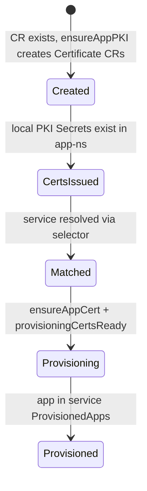
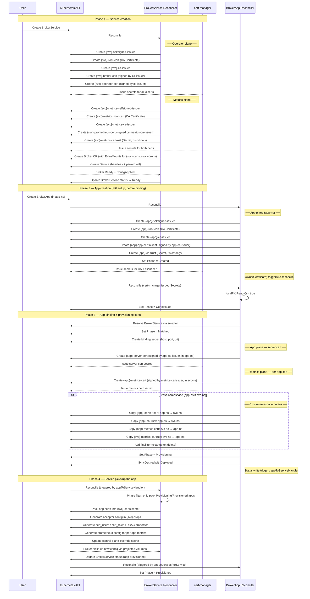
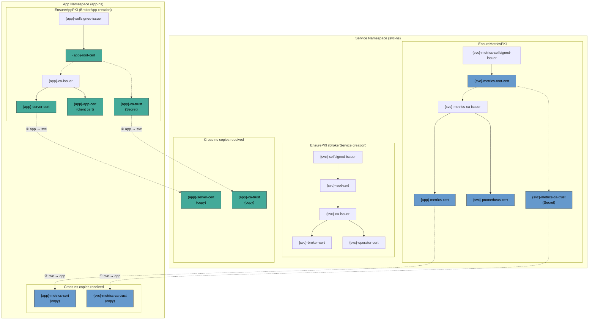

# Three-Plane PKI Architecture

## Problem
Previously, deploying a BrokerService with TLS required users to know internal

naming conventions and to place cert-manager ClusterIssuers, Certificates, and

CA bundles at the correct spots before any service or app could be deployed.

This was a cluster-admin task — clusterwide resources were involved, and the

admin had to coordinate certificate distribution manually between service

owners and app teams before they could work together.

Now, all PKI is fully operator-managed and namespace-scoped. There are no

clusterwide resources involved. RBAC can grant one team the right to create

BrokerServices and another team the right to create BrokerApps. They do not

need to exchange certificates manually — the operator handles the full chain

of trust automatically.

**Tradeoff.** cert-manager is now a hard startup dependency — the operator

crashes if it is absent, and a runtime watcher degrades BrokerService status

if cert-manager disappears post-boot. All conditional `hasCertManager` logic

has been removed; the operator always assumes cert-manager is present.

## Overview
The operator provisions three independent PKI domains, each with its own

self-signed root CA, namespace-scoped Issuers, and leaf certificates. Every TLS

connection in the system stays within a single CA domain — no cross-CA trust is

required.

| Plane | Owner | CA | Leaves | Customization |
| --- | --- | --- | --- | --- |
| Operator | BrokerService | {svc}-root-cert | broker-cert, operator-cert | None (hardcoded) |
| Metrics | BrokerService | {svc}-metrics-root-cert | prometheus-cert, per-app metrics-cert | Optional via BrokerServiceSpec.PKI.Metrics |
| App | BrokerApp | {app}-root-cert | app-cert (client), server-cert (acceptor) | Full via BrokerAppSpec.PKI |

## Why three planes?
Each TLS connection has different security properties, lifecycle requirements,

and exposure levels. Conflating them under a single CA creates three problems:

**Blast radius.** A CA compromise affects all connections (management, metrics,

messaging). Three CAs contain compromise to a single domain.

**Lifecycle coupling.** Operator certs (long-lived, never tuned) would share

renewal with app certs (short-lived, compliance-driven). Changing one changes

all. Three planes give each domain independent lifecycle.

**API surface leakage.** Exposing customization for app certs also exposes it

for operator certs, creating misconfiguration risk on internal plumbing. The

three-plane model gives each domain exactly the API surface it needs: none for

operator, optional for metrics, full for app.

### Operator plane — hardcoded, no knobs
The operator-to-broker management connection (Jolokia mTLS) is internal

plumbing. Duration, algorithm, and rotation are implementation details. No API

surface is exposed. This prevents users from accidentally breaking management

connectivity.

### Metrics plane — optional customization, shared endpoint
Prometheus mTLS scraping may need shorter rotation for compliance. The metrics

CA and leaf templates are optionally configurable via

`BrokerServiceSpec.PKI.Metrics`.

The metrics plane uses a single shared CA — not per-app — because giving each

app its own metrics endpoint would require N Jolokia instances inside the

broker pod, which is unacceptable overhead. Instead, per-app certs

(CN=`{appName}`) are issued from the shared CA and mapped to per-app RBAC

roles, so each app can only scrape its own queue MBeans. One endpoint, per-app

isolation via certs + RBAC.

### App plane — full customization
App teams own their certificate lifecycle. Both CA and leaf templates are fully

configurable via `BrokerAppSpec.PKI`. The app's PKI is provisioned at

`BrokerApp` creation time, before provisioning to any service. This decouples

client configuration from binding — apps can pre-configure their TLS stack

without waiting for a service assignment.

## Why namespace-scoped Issuers, not ClusterIssuers
ClusterIssuers are cluster-wide singletons. They fail on every axis that

matters for a multi-tenant operator:

**No isolation.** All BrokerServices in all namespaces share one CA. Service A's

compromise is Service B's compromise.

**RBAC escalation.** Creating/managing ClusterIssuers requires cluster-admin.

The operator would need cluster-wide permissions, violating least-privilege for

namespace-scoped CRs.

**Lifecycle mismatch.** A ClusterIssuer outlives any single BrokerService.

Deleting a service doesn't clean up the issuer. Multiple services can't coexist

without naming collisions.

**No ownerRef.** ClusterIssuers can't be owned by a namespaced resource — no

garbage collection, manual cleanup required.

Namespace-scoped Issuers solve all of this: per-service isolation, namespace

RBAC, ownerRef GC, no cluster-admin required. Each BrokerService gets its own

CA chain, completely independent.

## Why not trust-manager
[trust-manager](https://cert-manager.io/docs/trust/trust-manager/) distributes

CA bundles across namespaces via Bundle CRs. It solves cross-namespace CA trust

distribution — which we also need. But it's the wrong tool here:

**Extra dependency.** trust-manager is a separate controller alongside

cert-manager. Adding it increases operational surface (install, upgrade,

monitor, debug).

**Wrong granularity.** trust-manager distributes bundles cluster-wide (or to

label-selected namespaces). We need selective, per-app copies — App1's CA trust

goes to Service X's namespace, not everywhere. trust-manager's model is

broadcast; ours is point-to-point.

**Wrong format.** trust-manager outputs ConfigMaps by default. We need Secrets

(for TLS volume mounts on the broker pod and client containers).

**Lifecycle coupling.** Copies must be tied to provisioning state — created on

bind, deleted on unbind. trust-manager distributes always-on and has no concept

of provisioning. We would still need custom reconcile logic to gate

distribution on app lifecycle, making trust-manager a pass-through dependency

that adds operational surface without reducing code.

In short: trust-manager is designed for "make this CA available everywhere." We

need "make this specific CA available to this specific namespace, only while

this specific app is provisioned, and clean it up on unbind."

## Why private PKI, not public CAs

mTLS security depends on a closed trust domain. The CA is private, so only
identities the operator has issued can authenticate to the broker. This is the
fundamental property that makes per-app isolation work: if you hold a cert
signed by app-alpha's CA, you are app-alpha — no one else can forge that
identity.

A public CA (Let's Encrypt, DigiCert) makes the trust domain the entire
internet. Anyone who can obtain a certificate from that CA — which is trivially
anyone — can present a valid client certificate. The CA doesn't just sign a
name; it vouches for identity within a trust domain. With a private CA, "this
cert is signed by my CA" means "I issued this identity." With a public CA,
"this cert is signed by Let's Encrypt" means "someone proved domain ownership"
— which says nothing about authorization to connect to a broker.

**Architecture rule:** public certs at the edge (server identity for browsers
and external clients), private PKI inside (mutual authentication and
authorization). These are different trust domains solving different problems.
Mixing them collapses the security boundary.

## External access

Clients outside the cluster can connect to the broker via SNI passthrough.
The Ingress does not terminate TLS — it reads the SNI header and routes the
raw TCP stream to the broker pod. The client does mTLS directly with the
broker using app-plane certs. No intermediate trust boundary, no double-TLS.

The only requirement is that the broker's server cert includes the external
hostname in its SAN list. `CertificateTemplate.additionalDNSNames` appends
extra SANs to the operator-generated base set without replacing them:

```yaml
apiVersion: broker.arkmq.org/v1beta2
kind: BrokerApp
metadata:
  name: my-app
spec:
  selector:
    matchLabels:
      myservice: "true"
  pki:
    leaf:
      additionalDNSNames:
        - broker.example.com
        - mqtt.example.com
  capabilities:
    - producerOf:
        - address: my-topic
```

With this configuration, the app-plane server cert will contain both the
cluster-internal DNS names (generated by the operator) and the external
hostnames. An Ingress or OpenShift Route configured for SSL passthrough will
route external TLS connections directly to the broker, and the client's TLS
verification will succeed.

**Input validation.** Each entry in `additionalDNSNames` must be a valid DNS
name (RFC 1123 subdomain). The CRD schema rejects malformed input at admission
time via a kubebuilder regex pattern. cert-manager performs additional
validation when issuing the certificate.

This pattern is strictly superior to TLS termination + re-encryption for
broker protocols (AMQP, MQTT, STOMP) which don't need HTTP-level routing.

## Future: non-mTLS client support

Some clients cannot present a client certificate (browsers, SaaS webhooks,
legacy applications). Since SNI passthrough requires mTLS end-to-end, these
clients need a different path.

The natural pattern is a **bridge broker**: a second BrokerService + BrokerApp
pair deployed as a consumer-facing frontend. The external-facing acceptor uses
plain TLS (or relaxed authentication — API keys, SASL, etc.), while the
internal-facing connector uses standard app-plane mTLS to the target broker.
Artemis supports this natively via AMQP bridge connectors (store-and-forward
or passthrough).

From the operator's perspective, the bridge is just another BrokerApp — the
operator provisions its PKI automatically, and the bridge connects to the
target broker through the standard mTLS path. Two trust domains, clean
separation, no operator changes required.

A future enhancement could formalize this as a dedicated CRD kind (e.g.
`BrokerGateway` or a `mode: bridge` on BrokerApp) that auto-generates the
bridge broker configuration, connector wiring, and external-facing acceptor
with configurable authentication. This would make the pattern a first-class
operator feature rather than a manual deployment.

## Trust verification matrix
Every TLS handshake stays within a single CA domain:

| Connection | Client cert | Server cert | CA domain | Truststore on server |
| --- | --- | --- | --- | --- |
| App → Broker (AMQP) | {app}-app-cert | {app}-server-cert | App CA | {app}-ca-trust in svc ns |
| Operator → Broker (Jolokia) | {svc}-operator-cert | {svc}-broker-cert | Operator CA | {svc}-root-cert-secret |
| Scraper → Broker (Prometheus) | {app}-metrics-cert | {svc}-prometheus-cert | Metrics CA | {svc}-metrics-root-cert-secret |

## BrokerApp provisioning state machine

BrokerApp uses an explicit `Phase` field on its status to drive provisioning
through a deterministic sequence of gates. Each phase has a clear entry
condition and a guaranteed event-driven wake-up to advance to the next.



| Phase | Meaning | Entry condition | Wake-up source |
|---|---|---|---|
| Created | Certificate CRs exist but cert-manager has not yet issued Secrets | `ensureAppPKI` returns without error | `Owns(&cmv1.Certificate{})` — cert-manager issues Secret, triggering owner update |
| CertsIssued | Root CA and client cert Secrets exist in app-ns | `localPKIReady()` returns true (app root-cert-secret + app-cert exist) | Immediate (same reconcile) |
| Matched | BrokerService resolved via selector | `resolveBrokerService()` succeeds | Immediate (same reconcile) |
| Provisioning | All cross-ns copies confirmed, BrokerService can pack certs | `ensureAppCert()` returns nil AND `provisioningCertsReady()` returns true | `appToServiceHandler` enqueues BrokerService on BrokerApp status change |
| Provisioned | App appears in BrokerService `ProvisionedApps` | `setDeployedCondition` finds app in provisioned list | `enqueueAppsForService` watch |

**BrokerApp is the sole Phase writer.** BrokerService never writes to BrokerApp
status. The `Matched → Provisioning` transition is a BrokerApp status write,
which fires the existing `appToServiceHandler` watch on BrokerService — this is
the guaranteed wake-up.

**BrokerService Phase filter.** `processAppSecrets` only packs apps in
`Provisioning` or `Provisioned` phase. Apps in earlier phases are skipped. This
eliminates the skip-and-hope pattern where `packAppCertData` would silently
fail because Secrets were not yet available.

## Provisioning lifecycle
The full sequence from service creation to app provisioned, showing every

cert-manager resource and secret involved.


Phase 2 is the key design decision: app PKI is created *before* binding to any

service. The app's CA, client cert, and CA trust are ready the moment the

BrokerApp exists. This means consuming applications can pre-configure their TLS

stack without waiting for provisioning to complete.

## Cross-namespace copy mechanism
When a BrokerApp lives in a different namespace than its BrokerService, secrets

cannot be shared through ownerRef or direct volume mounts. The operator copies

secrets between namespaces during provisioning, with each plane flowing in the

direction needed by its consumer.


Green = app plane, blue = metrics plane. The operator plane has no copies — it

never leaves the service namespace. Dashed arrows (①–④) are the four

cross-namespace copies.

| Copy | Direction | Plane | Why |
| --- | --- | --- | --- |
| {app}-server-cert | app-ns → svc-ns | App | Broker mounts it for the app's dedicated acceptor |
| {app}-ca-trust | app-ns → svc-ns | App | Broker trusts the app CA to verify client certs on that acceptor |
| {app}-metrics-cert | svc-ns → app-ns | Metrics | App authenticates when scraping the prometheus endpoint |
| {svc}-metrics-ca-trust | svc-ns → app-ns | Metrics | App trusts the metrics CA to verify the prometheus TLS endpoint |

**Ownership and cleanup.** Copies into the app namespace are ownerRef'd to the

BrokerApp — Kubernetes garbage-collects them when the app is deleted. Copies

into the service namespace cannot use ownerRef for two reasons:

1. Kubernetes rejects cross-namespace ownerRefs (owner and owned must share anamespace).
2. OwnerRef'ing them to the BrokerService would not help either: the serviceoutlives the app, so GC would never delete them — they would leak until theentire service is removed.
The solution is a **finalizer** on the BrokerApp. Before the BrokerApp

deletion completes, the finalizer runs `CleanupAppProvisioningSecrets`, which

explicitly deletes the orphaned copies and the `{app}-metrics-cert` Certificate

CR in svc-ns. Only after cleanup succeeds does the finalizer remove itself,

allowing the BrokerApp to be garbage-collected. This gives the app ownership of

its own cleanup lifecycle without requiring cluster-scoped resources or polling.

For same-namespace apps, no copies or finalizers are needed — both the

BrokerService and BrokerApp share a namespace, so cert-manager creates all

Certificates locally with ownerRefs and the broker pod mounts them directly.

## Pod restart avoidance
Adding new secrets to `ExtraMounts.Secrets` changes the pod spec, triggering a

StatefulSet rolling restart. This is unacceptable on app provisioning.

**Solution:** A dedicated `{svc}-certs` secret is pre-mounted alongside

`{svc}-props` at service creation. Both entries are in `ExtraMounts.Secrets`

from day one — no changes on provisioning.

Kubernetes Secret data keys must match `[-._a-zA-Z0-9]+` (no `/`). The cert

secret uses `{namespace}--{app}--{type}--{file}` flat keys (e.g.

`test--my-app--broker-cert--tls.key`). When kubelet mounts the secret, each key

becomes a flat file at the mount root. Broker config paths reference these flat

filenames. `processAppSecrets()` regenerates `{svc}-certs` data from scratch

every reconcile. Deprovisioned apps' cert data vanishes naturally.

## Scale ceiling: 150 apps per BrokerService
Each provisioned app adds approximately 6KB of cert material to the `{svc}-certs`

secret (server key, server cert, CA cert, PEMCFG config — all packed as data

keys under `{namespace}/{app}/...` paths). The Kubernetes Secret size limit is

1MB (etcd value size). At 6KB per app, the theoretical ceiling is ~170, with a

conservative safety margin of **150** (`MaxAppsPerCertsSecret` in

`pkg/chain-of-trust/types.go`).

The E2E scale-ceiling test provisions 150 total apps and verifies:

- The `{svc}-certs` secret stays under 1MB.
- Provisioning time for the last app is not drastically slower than the first(tests print the ratio for CI visibility).
- Continuous messaging (producer/consumer on the primary app) survives theentire provisioning and deprovisioning storm without interruption.
- Metrics scraping continues to work throughout.
- The secret shrinks correctly after bulk deprovisioning.
**Future evolution:** A `spec.expectedAppCount` field on `BrokerService` could

allow the operator to pre-provision the `{svc}-certs` secret with placeholder

keys, spreading the reconcile load. Alternatively, if the ceiling needs to be

raised, the operator could shard cert data across multiple secrets

(`{svc}-certs-0`, `{svc}-certs-1`, ...) with each mounted independently.

## Resource ownership
| Resource | Owner | GC mechanism |
| --- | --- | --- |
| Operator-plane root CA, issuer, broker cert, operator cert | BrokerService | ownerRef |
| Metrics-plane root CA, issuer, prometheus cert, metrics-ca-trust | BrokerService | ownerRef |
| Control-plane override secret (props, RBAC, jolokia config) | BrokerService | ownerRef |
| Broker CR | BrokerService | ownerRef |
| App-plane CA issuer, client cert, server cert, ca-trust | BrokerApp | ownerRef |
| Per-app metrics cert (in svc-ns, same-ns case) | BrokerApp | ownerRef |
| Cross-ns copies in svc-ns (server-cert, ca-trust) | None | BrokerApp finalizer |
| Per-app metrics cert CR (in svc-ns, cross-ns case) | None | BrokerApp finalizer |
| Cross-ns copies in app-ns (metrics-cert, metrics-ca-trust) | BrokerApp | ownerRef |

## Multi-tenant metrics RBAC
Each app's metrics cert CN is mapped in `cert_users.properties` to a unique

role. That role is granted `queryMBeans` + `read` access only to its own

queue MBeans via `aa_rbac.properties`. This ensures that each scraper can

only see metrics for the queues its app owns.

Role names containing dots are quoted in the properties file to prevent the

Artemis property parser from interpreting dots as path separators.

## PKI clash detection
If the service namespace contains cert-manager Certificate or Issuer

resources with names the operator would auto-generate but without the

`managed-by` label, the BrokerService refuses to reconcile and reports

`Valid=False(PKINameClash)` with a message listing every conflicting

resource. This prevents silent collisions between manually created PKI

and operator-managed resources.

## Jolokia status client
`StatusClient` (`pkg/broker/jolokia/`) resolves TLS dynamically: when the

Broker CR is owned by a BrokerService, it uses the operator-plane cert +

root CA for mTLS; otherwise falls back to legacy global operator secrets.

This replaces the previous multi-endpoint approach.

## Stable PKCS12 generation
PKCS12 encoding uses random salts and IVs — regenerating a keystore from

the same certificate on every reconcile produces different bytes, which the

comparator detects as a "change," thrashing the override secret and

triggering continuous broker config reloads. `stableP12()` caches keystores

by certificate fingerprint, only regenerating when the underlying cert

actually changes.

## Event-driven provisioning wake-ups
The BrokerApp controller watches cert-manager Certificate events via
`Owns(&cmv1.Certificate{})`. When cert-manager issues a Secret (Certificate
status changes), the owning BrokerApp is re-reconciled, advancing through the
Phase state machine.

Cross-namespace provisioning is reactive through the Phase state machine:
the `Matched → Provisioning` status write on BrokerApp triggers
`appToServiceHandler` on BrokerService, which is the sole mechanism for
BrokerService to discover newly-provisioned apps. There is no direct
Certificate-to-Service mapper — the Phase gate guarantees that by the time
BrokerService processes an app, all required Secrets exist.

## Renewal sync
- **App client cert renews**: in app ns, kubelet refreshes volumes. No cross-ns action.
- **App server cert renews (same-ns)**: broker mounts directly, kubelet refreshes.
- **App server cert renews (cross-ns)**: BrokerApp reconciler re-copies to service ns.
- **Metrics cert renews**: cert-manager re-issues (under metrics CA). Cross-ns copy re-synced by BrokerService reconciler.
- **Prometheus cert renews**: cert-manager re-issues. Broker mounts directly.
- **Operator certs renew**: cert-manager re-issues. No cross-ns involvement.